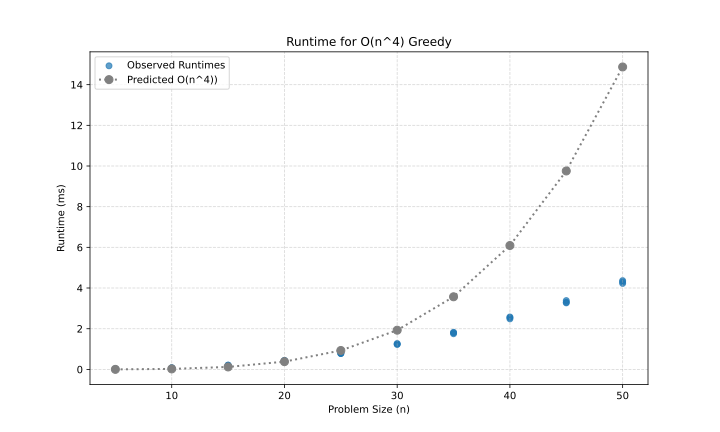
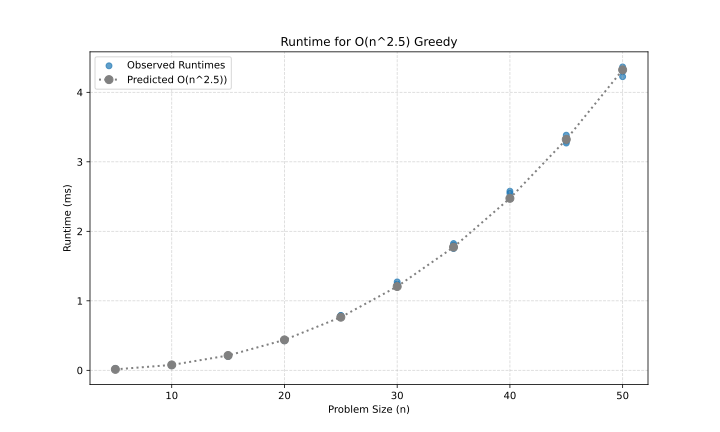
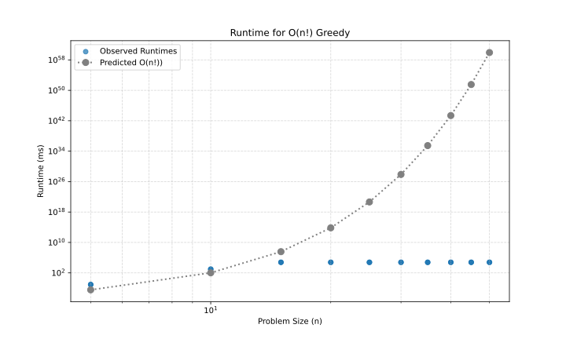
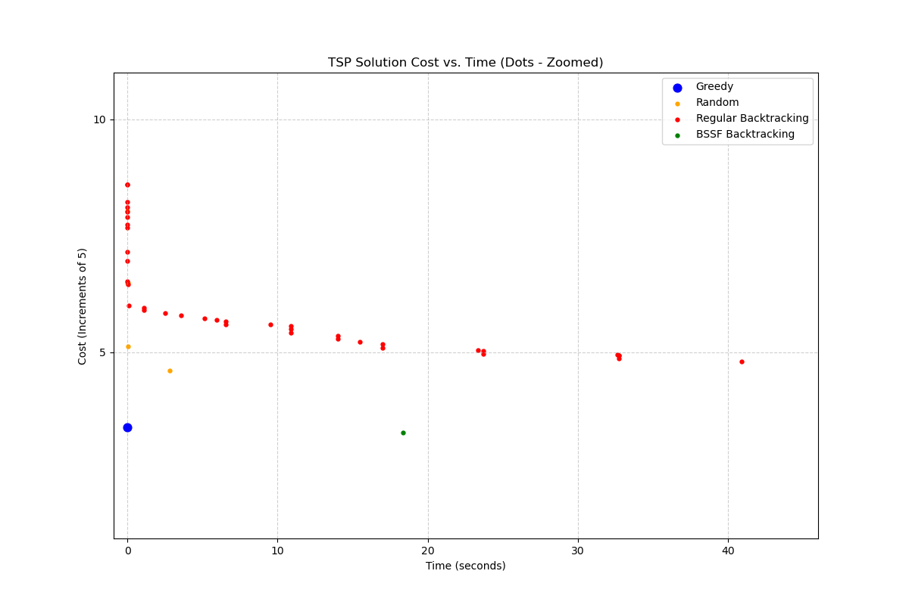
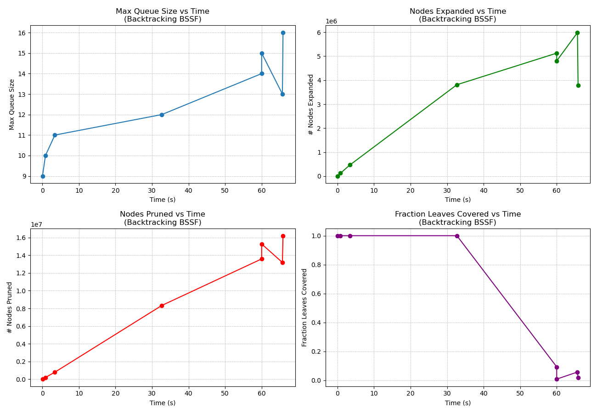

# Project Report - Backtracking

## Baseline

### Design Experience

*I talked to Kyle Mak and Collin and we walked through a couple homework problems and slides. Then we explained it to each
other. Some edge cases we discussed were empty input and single item input and no solutions. Greedy fails when the optimal
choice is not the globally optimal test. *

### Theoretical Analysis - Greedy

#### Time

```python
class MySolutionStats:
    def __init__(self):
        self.solutionList = []                                  # O(1) constant
        self.lowest = math.inf                                  # O(1) constant

    def return_list(self):
        return self.solutionList                                # O(1) returns constant

    def add(self, tour, cost, time, max_q, n_exp, n_prun, n_leaves, frac_leaves):
        if cost < self.lowest:                                  # O(1) constant
            self.lowest = cost                                  # O(1) constant
            new_solution_stat = SolutionStats(                  # O(n) Append to list n length
                tour=tour,
                score=cost,
                time=time,
                max_queue_size=max_q,
                n_nodes_expanded=n_exp,
                n_nodes_pruned=n_prun,
                n_leaves_covered=n_leaves,
                fraction_leaves_covered=frac_leaves
            )
            self.solutionList.append(new_solution_stat)          # O(1) append to list
            
def greedy_tour(edges: list[list[float]], timer: Timer) -> list[SolutionStats]:
    solution = MySolutionStats()                                 # O(1) Create a new variable class 
    n_nodes_expanded = 0                                         # O(1) Constant
    n_nodes_pruned = 0                                           # O(1) constant
    for i in range(len(edges)):                                  # O(n) loops all edges
        if timer.time_out():                                     # O(1) Constant
            return solution.return_list()                        # O(1) constant
        current_node = i                                         # O(1) constant
        tour = [i]                                               # O(1) constant   
        visited = {i}                                            # O(1) constant
        current_cost = 0.0                                       # O(1) constant
        n_nodes_expanded += 1                                    # O(1) constant
        while len(visited) < len(edges):                         # O(n) runs edges - 1 times
            best_distance = math.inf                             # O(1) constant set var
            next_node = -1                                       # O(1) constant set var
            for neighbor in range(len(edges)):                   # O(n) loops number of edge times
                if neighbor not in visited:                      # O(1) compare constants
                    distance = edges[current_node][neighbor]     # O(1) check constants
                    if distance < best_distance:                 # O(1) compare constants
                        best_distance = distance                 # O(1) set constant
                        next_node = neighbor                     # O(1) set constant 
            if next_node == -1:                                  # O(1) set constant
                break                                            # O(1) constant

            tour.append(next_node)                               # O(1) add to list constant
            visited.add(next_node)                               # O(1) add to list constant 
            current_cost += best_distance                        # O(1) simple math constant
            current_node = next_node                             # O(1) set constant
            n_nodes_expanded += 1                                # O(1) simple math constant

        if len(tour) == len(edges):                              # O(1) set constant
            cost_to_start = edges[current_node][i]               # O(1) pull constant
            if cost_to_start == math.inf:                        # O(1) compare constant
                continue                                         # O(1) constant

            current_cost += cost_to_start                        # O(1) simple math
            final_tour = tour                                    # O(1) set constant
            solution.add(                                        # O(n) create new object 
                tour=final_tour,
                cost=current_cost,
                time=timer.time(),                               # O(1) constant
                max_q=1,
                n_exp=n_nodes_expanded,
                n_prun=n_nodes_pruned,
                n_leaves=0,
                frac_leaves=0.0
            )
    return solution.return_list()                                # O(1) constant
```

*The time complexity of the Greedy Algorithm is O(n^4) because of the outer for loop with a while loop with a nested 
inner loop plus the creating a new object n long makes the time complexity n^4.*

#### Space

```python
class MySolutionStats:
    def __init__(self):
        self.solutionList = []                                  # O(n) grows to n large
        self.lowest = math.inf                                  # O(1) space constant

    def return_list(self):
        return self.solutionList                                # O(1) space constant

    def add(self, tour, cost, time, max_q, n_exp, n_prun, n_leaves, frac_leaves):
        if cost < self.lowest:                                  # O(1) space constant
            self.lowest = cost                                  # O(1) space constant
            new_solution_stat = SolutionStats(                  # O(N) grows to n long
                tour=tour,
                score=cost,
                time=time,
                max_queue_size=max_q,
                n_nodes_expanded=n_exp,
                n_nodes_pruned=n_prun,
                n_leaves_covered=n_leaves,
                fraction_leaves_covered=frac_leaves
            )
            self.solutionList.append(new_solution_stat)          # O(1) space constant

def greedy_tour(edges: list[list[float]], timer: Timer) -> list[SolutionStats]:

    solution = MySolutionStats()                                 # O(1) space constant
    n_nodes_expanded = 0                                         # O(1) space constant
    n_nodes_pruned = 0                                           # O(1) space constant
    for i in range(len(edges)):                                  # O(1) space constant
        if timer.time_out():                                     # O(1) space constant
            return solution.return_list()                        # O(1) space constant
        current_node = i                                         # O(1) space constant
        tour = [i]                                               # O(n) worst case grows to n long
        visited = {i}                                            # O(n) worst case grows to n long
        current_cost = 0.0                                       # O(1) space constant
        n_nodes_expanded += 1                                    # O(1) space constant

        while len(visited) < len(edges):                         # O(1) Constant overhead
            best_distance = math.inf                             # O(1) space constant
            next_node = -1                                       # O(1) space constant

            for neighbor in range(len(edges)):                   # O(1) constant overhead
                if neighbor not in visited:
                    distance = edges[current_node][neighbor]     # O(1) space constant
                    if distance < best_distance:
                        best_distance = distance                 # O(1) space constant
                        next_node = neighbor                     # O(1) space constant

            if next_node == -1:
                break                                            # O(1) space constant

            tour.append(next_node)                               # O(1) add space constant
            visited.add(next_node)                               # O(1) add to list space constant
            current_cost += best_distance                        # O(1) space constant
            current_node = next_node                             # O(1) space constant
            n_nodes_expanded += 1                                # O(1) space constant

        if len(tour) == len(edges):
            cost_to_start = edges[current_node][i]               # O(1) space constant
            if cost_to_start == math.inf:
                continue                                         # O(1) space constant

            current_cost += cost_to_start                        # O(1) space constant
            final_tour = tour                                    # O(1) space constant
            
            solution.add(                                        # O(n) goes to n long
                tour=final_tour,
                cost=current_cost,
                time=timer.time(),
                max_q=1,
                n_exp=n_nodes_expanded,
                n_prun=n_nodes_pruned,
                n_leaves=0,
                frac_leaves=0.0
            )

    return solution.return_list()                               # O(1) space constant
```

*My space complexity is O(n^2) because of the 2 objects that grow to n length.*

### Empirical Data - Greedy


| N  | Time (ms) |
|----|-----------|
| 5  | 0.0208    |
| 10 | 0.0743    |
| 15 | 0.205     |
| 20 | 0.4323    |
| 25 | 0.7853    |
| 30 | 1.2464    |
| 35 | 1.7921    |
| 40 | 2.5356    |
| 45 | 3.317     |
| 50 | 4.2963    |


### Comparison of Theoretical and Empirical Results - Greedy

- Theoretical order of growth: O(n^4)

- Empirical order of growth (if different from theoretical): O(2.5)


## Core

### Design Experience

*I talked to Kyle Mak and Collin about Core guidelines and we review backtracking algorithm again and when through how 
the data would need to be stored. We decided we would use a partial path and a set of visited nodes. We talked about the 
Node plot which is a 2D scatter plot and the xy represents a node. The tour is drawn on top of the node plot and has the 
final and best path.*

### Theoretical Analysis - Backtracking

#### Time 

```python
def backtracking(edges: list[list[float]], timer: Timer) -> SolutionStats | SolutionStats:
    stat = MySolutionStats()                                    # O(1) constant
    stack = []                                                  # O(1) constant
    num_nodes = set(range(len(edges)))                          # O(n) constant
    stack.append([0])                                           # O(1) constant
    while stack and not timer.time_out():                       # O(n!) iteration on stack and timer

        current_path = stack.pop()                              # O(1) constant
        current_node = current_path[-1]                         # O(1) constant
        unvisited = num_nodes - set(current_path)               # O(n) Set difference
        
        if unvisited == set():                                  # O(1) constant
            tour = list(current_path)                           # O(n) current_path has n elements
            cost = score_tour(tour, edges)                      # O(n) n length tour
            stat.add(tour, cost, timer.time(), 0, 0, 0, 0, 0.0) # O(n) add n length
            
        for i in unvisited:                                     # O(n) worst case n
            if edges[current_node][i] != math.inf:              # O(1) constant
                copy_temp = current_path.copy()                 # O(n) copy function
                copy_temp.append(i)                             # O(1) constant
                stack.append(copy_temp)                         # O(1) constant
    return stat.return_list()                                   # O(1)
```

*My time complexity is O(n!) because it is exploring every possible permutation of nodes.*

#### Space

```python
def backtracking(edges: list[list[float]], timer: Timer) -> SolutionStats | SolutionStats:
    stat = MySolutionStats()                                    # O(n^2) grows to worst case n*n growth
    stack = []                                                  # O(n^3) total contribution
    num_nodes = set(range(len(edges)))                          # O(n) set stores n items
    stack.append([0])                                           # O(1) operation
    while stack and not timer.time_out():                       # O(1) for loop control
        current_path = stack.pop()                              # O(1) operation
            current_node = current_path[-1]                     # O(1) operation
        unvisited = num_nodes - set(current_path)               # O(n) Max size n
        if unvisited == set():                                  # O(1) operation
            tour = list(current_path)                           # O(N) list of size n
            cost = score_tour(tour, edges)                      # O(1) no new space
            stat.add(tour, cost, timer.time(), 0, 0, 0, 0, 0.0) # O(n) adds an O(n) tour
            
        for i in unvisited:                         # O(1) space constant
            if edges[current_node][i] != math.inf:  # O(1) operation
                copy_temp = current_path.copy()     # O(n) max size n
                copy_temp.append(i)                 # O(1) operation
                stack.append(copy_temp)             # O(1) operation
    return stat.return_list()                       # O(1) space constant
```

*My space complexity is O(n^3) because the stack at the worst stores O(N^2) and each of those paths is a list that can 
be up to O(N) long.*

### Empirical Data - Backtracking

| N  | Time (ms)  |
|----|------------|
| 5  | 0.0833     |
| 10 | 931.807    |
| 15 | 60000.0334 |
| 20 | 60000.0147 |
| 25 | 60000.0235 |
| 30 | 60000.036  |
| 35 | 60000.0651 |
| 40 | 60000.0458 |
| 45 | 60000.0459 |
| 50 | 60000.0483 |

### Comparison of Theoretical and Empirical Results - Backtracking

- Theoretical order of growth: O(n!)
- Empirical order of growth (if different from theoretical): 




*The backtracking times out at 60 seconds and can no longer continue.*

### Greedy v Backtracking

*The Greedy algorithm is fast but not optimal because makes the best choice at each step and never looks back. The 
Backtracking algorithm is slow optimal becuase it exhaustively explores all possible solutions and finds the best and optimal path
The backtracking algorithm is unusable for large problems because of the heavy processing time. *

### Water Bottle Scenario 

#### Scenario 1

**Algorithm:Backtracking** 

*A backtracking algorithm is the best choice because although the algorithm has a factorial runtime O(N!).
The algorithm will be instantaneous and will take a fraction of a millisecond. The Backtracking algorithm
guarantees the best solution and the small problem size makes its slow complexity irrelevant.*

#### Scenario 2

**Algorithm: Greedy** 

*The Greedy algorithm is the best choice because the backtracking algorithm will have a runtime of O(N!). For a large input
like N=100, the algorithm would time out. A Greedy algorithm is the only choice that can run very quickly on N=100 and 
it satisfies the requirement of providing a reasonable non-random solution.*

#### Scenario 3

**Algorithm: Backtracking** 

*A greedy algorithm is the wrong choice because it only finds the nearest choice at each step which results in a final 
path that is not the best solution. Backtracking algorithm is the best choice because it search and explores all 
possible paths. Then the algorithm guaranteeing it will find the optimal solution. This approach is runs better with smaller
problems (N=8) and can be factored to run better with medium size problems.*

## Stretch 1

### Design Experience

*I talked to Kyle Mak and Collin about implementing the Best Solution So far by calling the greedy function first. Then
taking its cost and store it in a shared variable. Then checking the distance before you add a new path to the stack. We 
all though that the space and time complexity would not change.*

### Demonstrate BSSF Backtracking Works Better than No-BSSF Backtracking 

*
Seed: 42
Size (N): 15
Runtime Limit: 60 Seconds
Regular Backtracking Final Score: 4.8
BSSF Backtracking Final Score: 3.272
*

### BSSF Backtracking v Backtracking Complexity Differences

*These result show that both algorithms when given the same graph and the same 60-second time limit. The BSSF 
Backtracking algorithm found an initial Best Solution So Far or BSSF of 3.272. The algorithm then used this value as an 
upper bound rejecting any partial path that could not possibly result in a final tour better than 3.272. The regular 
Backtracking algorithm started with an upper bound of infinity and spent its 60 seconds exploring high-cost branches of 
the search tree that the BSSF version simply ignored. This demonstrates that BSSF Backtracking finds significantly 
better solutions in the same amount of time.*

### Time v Solution Cost

## Time Complexity 
```python
def backtracking_bssf(edges: list[list[float]], timer: Timer) -> list[SolutionStats]: 
    num_nodes = len(edges)                                                           # O(1) assignment
    greedy_solution_list = greedy_tour(edges, timer)                                 # O(n^2) greedy
    if greedy_solution_list:                                                         # O(1) compare constant
        initial_bssf = greedy_solution_list[-1]                                      # O(1) call to memort
        bssf = SolutionStats(                                                        # O(n) copy 
            tour=initial_bssf.tour,                                                  
            score=initial_bssf.score,                                                
            time=initial_bssf.time,                                                  
            max_queue_size=initial_bssf.max_queue_size,                              
            n_nodes_expanded=initial_bssf.n_nodes_expanded,                          
            n_nodes_pruned=initial_bssf.n_nodes_pruned,                              
            n_leaves_covered=initial_bssf.n_leaves_covered,                          
            fraction_leaves_covered=initial_bssf.fraction_leaves_covered             
        )                                                                            
    else:                                                                            # O(1) else
        bssf = SolutionStats(                                                        # O(1) constant
            tour=[],                                                                 
            score=math.inf,                                                          
            time=timer.time(),                                                       
            max_queue_size=1,                                                        
            n_nodes_expanded=0,                                                      
            n_nodes_pruned=0,                                                        
            n_leaves_covered=0,                                                      
            fraction_leaves_covered=0.0                                              
        )                                                                            
                                                                                     
    stack = [(0, 0.0, 0)]                                                            # O(1) creation of a constant
    path = [0]                                                                       # O(1) creation of a constant
    visited = {0}                                                                    # O(1) creation of a constant
                                                                                     
    bssf.max_queue_size = max(1, bssf.max_queue_size)                                # O(1) constant
                                                                                     #
    while stack:                                                                     # O(n!) worst case grows to n! times
        bssf.max_queue_size = max(bssf.max_queue_size, len(stack))                   # O(1) constant
                                                                                     
        if timer.time_out():                                                         # O(1) check constant
            bssf.time = timer.time()                                                 # O(1) aset constant
            return [bssf]                                                            # O(1) return
                                                                                     
        current_node, current_cost, neighbor_index = stack[-1]                       # O(1) call access
                                                                                     
        if current_cost >= bssf.score:                                               # O(1) check constant
            bssf.n_nodes_pruned += 1                                                 # O(1) math increment
            stack.pop()                                                              # O(1) stack pop
            visited.remove(current_node)                                             # O(1) remove
            path.pop()                                                               # O(1) list pop
            continue                                                                 # O(1) continue
                                                                                     
        found_next_node = False                                                      # O(1) assignment
        for i in range(neighbor_index, num_nodes):                                   # O(N) inner loop
            neighbor = i                                                             # O(1) assignment
            cost_to_neighbor = edges[current_node][neighbor]                         # O(1) access
                                                                                     
            stack[-1] = (current_node, current_cost, i + 1)                          # O(1) assignment
                                                                                     #
            if neighbor not in visited and cost_to_neighbor != math.inf:             # O(1) average
                                                                                     #
                new_cost = current_cost + cost_to_neighbor                           # O(1) assignment
                                                                                     #
                if new_cost >= bssf.score:                                           # O(1) check
                    bssf.n_nodes_pruned += 1                                         # O(1) increment
                    continue                                                         # O(1) continue
                                                                                     #
                if len(path) + 1 == num_nodes:                                       # O(1) check
                    bssf.n_nodes_expanded += 1                                       # O(1) increment
                    cost_to_start = edges[neighbor][0]                               # O(1) access
                                                                                     #
                    if cost_to_start != math.inf:                                    # O(1) check
                        total_cost = new_cost + cost_to_start                        # O(1) assignment
                                                                                     #
                        if total_cost < bssf.score:                                  # O(1) check
                            bssf.tour = path.copy() + [neighbor]                     # O(N) copy tour
                            bssf.score = total_cost                                  # O(1) assignment
                            bssf.time = timer.time()                                 # O(1) assignment
                                                                                     #
                else:                                                                # O(1) branch
                    visited.add(neighbor)                                            # O(1) average
                    path.append(neighbor)                                            # O(1) constant
                    stack.append((neighbor, new_cost, 0))                            # O(1) constant
                    found_next_node = True                                           # O(1) assignment
                    break                                                            # O(1) break
        if not found_next_node:                                                      # O(1) check
            stack.pop()                                                              # O(1) stack pop
            visited.remove(current_node)                                             # O(1) average
            path.pop()                                                               # O(1) list pop
                                                                                     #
    bssf.time = timer.time()                                                         # O(1) assignment
    return [bssf]                                                                    # O(1) return
```
*The Time Complexity was O(n!) which was the same as regular Backtracking*



*This plot compares the solution cost for each algorithm over a 60-second runtime on the same graph (N=50). The random 
tour algorithm performs the worst becuase it finds a single solution almost instantly but it doesn't find the best solution
and does not improve the cost. The greedy algorithm finds a single solution with a better cost than random algorithm. The 
basic backtracking algorithm starts with no solution with the cost being infinity. However for a large graph like N=50, 
the basic backtracking algorithm is extremely slow and must explore a massive number of paths before finding its first 
valid tour. The BSSF Backtracking algorithm is the best algorithm and starts with the solution cost provided by the greedy
algorithm. From there its cost is used to search and finds better tours. The algorithm consistently finds the best 
solution of all four algorithms within the given time limit.*

## Stretch 2

### Design Experience

*I talked to Kyle Mak and Collin about Stretch 2 and what each metric means. The max_queue_size measures the peak memory 
usage by tracking the largest the stack or queue ever became during the search. The n_nodes_expanded counts the total 
number of partial paths the algorithm actually explored by generating their children. The n_nodes_pruned shows the 
effectiveness by counting how many paths were discarded early because they couldn't possibly beat the best-known solution. 
The n_leaves_covered counts the total number of unique and complete tours or nodes that the algorithm actually found 
and evaluated. The fraction_leaves_covered represents the tiny percentage of the total possible solutions which is (N−1)!
that the algorithm managed to explore.*

### Cut Tree

*The cuttree class estimates the percentage of the (N−1)! search space explored by tracking pruned branches within the 
tree. When the algorithm discards a partial path, the cut method traverses this tree to the specific node and ensures 
through redundancy checks that this branch hasn't already been counted. Once a unique cut point is identified at depth,
the class calculates the number of skipped solutions using the factorial of the remaining cities. This value is then 
put back up the tree to the root and updated the count of cut leaves. Lastly, the overall coverage is determined by 
dividing this total count of pruned leaves by the total number of possible tours and yielding a completion fraction 
between 0.0 and 1.0.*

### Plots 



*The graph above shows the vertical alignment of points at 60. The Nodes Expanded count drops as the problems get larger
because the calculations required is reduced as the matrices requires significantly more CPU processing power per node. 
This creates a physical limit where the computer cannot process as many complex nodes within that fixed window. 
The Fraction Leaves Covered chart shows a shift from 100% completion on small problems to nearly 0% on large ones. 
This drop shows the exponential growth of the search space O(N!). This proves that once the problem hits the time limit,
the algorithm has only found a small part of possible solutions.*

## Project Review

*In conclusion, I reviewed this backtracking project with Kyle and Collin. We talked about all we did for the project and what 
we learned. This project we successfully explored the Traveling Salesperson Problem by implementing and analyzing the 
Greedy, Basic Backtracking, and BSSF-enhanced Backtracking algorithms. The Greedy approach demonstrated O(n^4) and
providing fast sub-optimal solutions. The Backtracking algorithm showed a time complexity of O(N!) exponential growth
and hit a wall around N=15 where the 60-second time limit prevented a close to infinite search. Then we used the Greedy 
solution as an initial Best Solution So Far (BSSF) significantly improved performance by enabling pruning of high-cost 
branches early in the search tree. We implemented the CutTree to visualize the dramatic drop in search space coverage
from 100% to near 0% as problem magnitude increased. The empirical data validated the theoretical complexity models and
proving that while exact solutions are intractable for large N, backtracking algorithm offers a balance between runtime 
and solution quality.*
