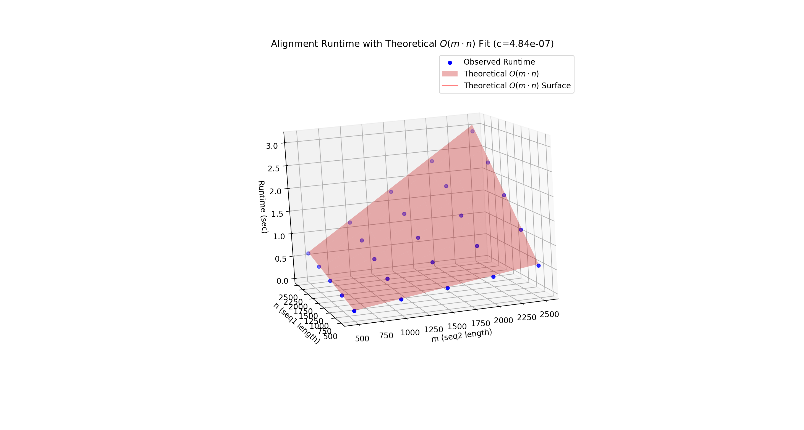
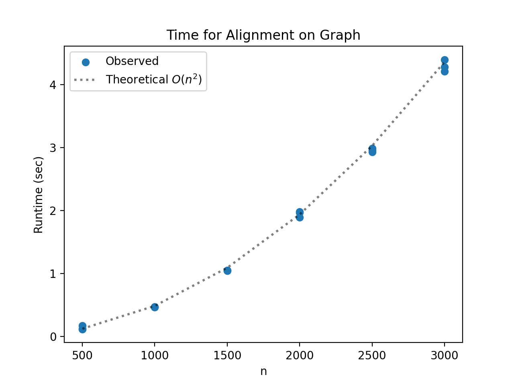

# Project Report - Alignment

## Baseline

### Design Experience

*For my baseline design experience, I talked to Kyle Mak and Collin Verbanatz about Unrestricted Alignment algorithm by 
walking through a problem by hand. We used the example from the slides to walk through the base cases of "THARS" vs 
"OTHER". I will create 2 arrays for and loop through both and then create a dictionary to control the cost values. For 
dynamic programming will use more data structure increasing the space complexity of the function.*

### Theoretical Analysis - Unrestricted Alignment

#### Time 

```python
import numpy as np

def align(
        seq1: str,
        seq2: str,
        match_award=-3,
        indel_penalty=5,
        sub_penalty=1,
        banded_width=-1,
        gap_open_penalty=0,
        gap='-',
) -> tuple[float, str | None, str | None]:
    penalty: dict = {"sub": 0, "match": 0, "insert_delete": 0}                      # O(1) set up dict
    row = len(seq2) + 1                                                             # O(1) set row varible 
    col = len(seq1) + 1                                                             # O(1) set col varible 
    matrix = np.empty((row, col), dtype=object)                                     # O(m*n) creating a matrix base on the col and row
    matrix[0, 0] = (0, "START")                                                     # O(1) setting the start
    for i in range(1, row):                                                         # O(m) runs m times
        score = matrix[i - 1, 0][0] + indel_penalty                                 # O(1) set matrix
        matrix[i, 0] = (score, "UP")                                                # O(1) set matrix
    for j in range(1, col):                                                         # O(n) runs n times
        score = matrix[0, j - 1][0] + indel_penalty                                 # O(1) create varible
        matrix[0, j] = (score, "LEFT")                                              # O(1) set constant

    for i in range(1, row):                                                         # O(m) runs m times
        for j in range(1, col):                                                     # O(n) runs n times 
            diag_score, direction_string = matrix[i - 1, j - 1]                     # O(1) calling location in matrix
            up_score, direction_string = matrix[i - 1, j]                           # O(1) calling up
            left_score, direction_string = matrix[i, j - 1]                         # O(1) calling score and up or left
            if seq2[i - 1] == seq1[j - 1]:                                          # O(1) comparing constants
                diag_cost = diag_score + match_award                                # O(1) set varible
            else:                                                                   # O(1) comparing constants
                diag_cost = diag_score + sub_penalty                                # O(1) set varible

            up_cost = up_score + indel_penalty                                      # O(1) set varible
            left_cost = left_score + indel_penalty                                  # O(1) set varible
            min_cost = min(diag_cost, up_cost, left_cost)                           # O(1) find the min of 3 variables
            if min_cost == diag_cost:                                               # O(1) compare 2 constants
                matrix[i, j] = (min_cost, "DIAG")                                   # O(1) set a variable 
            elif min_cost == up_cost:                                               # O(1) compare 2 constants
                matrix[i, j] = (min_cost, "UP")                                     # O(1) set a variable 
            else:                                                                   # O(1) else 
                matrix[i, j] = (min_cost, "LEFT")                                   # O(1) set a variable 

    aligned_seq1 = ""                                                               # O(1) create an empty string
    aligned_seq2 = ""                                                               # O(1) create an empty string

    i, j = row - 1, col - 1                                                         # O(1) setting the new row and col

    final_score, _ = matrix[i, j]                                                   # O(1) call a constant
    while i > 0 or j > 0:                                                           # O(m+n) runs m and n times
        direction_string, direction = matrix[i, j]                                  # O(1) set a variable 
        if direction == "DIAG":                                                     # O(1) compare constants
            aligned_seq1 = seq1[j - 1] + aligned_seq1                               # O(1) simple addition and constant
            aligned_seq2 = seq2[i - 1] + aligned_seq2                               # O(1) add to the string
            if seq2[i - 1] == seq1[j - 1]:                                          # O(1) compare constant
                penalty["match"] += 1                                               # O(1) add to the dictionary
            else:                                                                   # O(1) else
                penalty["sub"] += 1                                                 # O(1) add to the dictionary
            i -= 1                                                                  # O(1) simple subtraction
            j -= 1                                                                  # O(1) simple subtraction
        elif direction == "UP":                                                     # O(1) compare constants
            aligned_seq1 = gap + aligned_seq1                                       # O(1) add to string
            aligned_seq2 = seq2[i - 1] + aligned_seq2                               # O(1) add to string
            penalty["insert_delete"] += 1                                           # O(1) add to the dictionary
            i -= 1                                                                  # O(1) simple subtraction
        elif direction == "LEFT":                                                   # O(1) compare constants
            aligned_seq1 = seq1[j - 1] + aligned_seq1                               # O(1) add to string
            aligned_seq2 = gap + aligned_seq2                                       # O(1) add to string
            penalty["insert_delete"] += 1                                           # O(1) add to the dictionary
            j -= 1                                                                  # O(1) simple subtraction
    return final_score, aligned_seq1, aligned_seq2                                  # O(1)
```

*I found the total time complexity to be O(m*n) because I have 1 for loop what runs n and another for loop that 
runs m times then I have my nested loop which is O(m*n) then my last while loop is m+n because it goes through both.*

#### Space

```python
import numpy as np

def align(
        seq1: str,
        seq2: str,
        match_award=-3,
        indel_penalty=5,
        sub_penalty=1,
        banded_width=-1,
        gap_open_penalty=0,
        gap='-',
) -> tuple[float, str | None, str | None]:
    penalty: dict = {"sub": 0, "match": 0, "insert_delete": 0}                      # O(1) small dict constant space 
    row = len(seq2) + 1                                                             # O(1) constant space 
    col = len(seq1) + 1                                                             # O(1) constant integer
    matrix = np.empty((row, col), dtype=object)                                     # O(m*n) grows to m*n
    matrix[0, 0] = (0, "START")                                                     # O(1) edit tuple 
    for i in range(1, row):                                                         # O(1) loop constant
        score = matrix[i - 1, 0][0] + indel_penalty                                 # O(1) set variable
        matrix[i, 0] = (score, "UP")                                                # O(1) set variable
    for j in range(1, col):                                                         # O(1) loop constant
        score = matrix[0, j - 1][0] + indel_penalty                                 # O(1) set variable 
        matrix[0, j] = (score, "LEFT")                                              # O(1) set tuple variable
    for i in range(1, row):                                                         # O(1) loop constant
        for j in range(1, col):                                                     # O(1) loop constant
            diag_score, _ = matrix[i - 1, j - 1]                                    # O(1) set variable
            up_score, _ = matrix[i - 1, j]                                          # O(1) set variable
            left_score, _ = matrix[i, j - 1]                                        # O(1) set variable
            if seq2[i - 1] == seq1[j - 1]:                                          # O(1) compare constant
                diag_cost = diag_score + match_award                                # O(1) set variable
            else:                                                                   # O(1) else
                diag_cost = diag_score + sub_penalty                                # O(1) set variable
            up_cost = up_score + indel_penalty                                      # O(1) set variable
            left_cost = left_score + indel_penalty                                  # O(1) set variable
            min_cost = min(diag_cost, up_cost, left_cost)                           # O(1) set variable
            if min_cost == diag_cost:                                               # O(1) compare constant
                matrix[i, j] = (min_cost, "DIAG")                                   # O(1) set tuple 
            elif min_cost == up_cost:                                               # O(1) compare constant
                matrix[i, j] = (min_cost, "UP")                                     # O(1) set tuple 
            else:                                                                   # O(1) else
                matrix[i, j] = (min_cost, "LEFT")                                   # O(1) set tuple 
    aligned_seq1 = ""                                                               # O(1) empty string
    aligned_seq2 = ""                                                               # O(1) empty string
    i, j = row - 1, col - 1                                                         # O(1) set variables
    final_score, _ = matrix[i, j]                                                   # O(1) set variable
    while i > 0 or j > 0:                                                           # O(1) loop constant overhead
        _, direction = matrix[i, j]                                                 # O(1) call variable
        if direction == "DIAG":                                                     # O(1) compare variable 
            aligned_seq1 = seq1[j - 1] + aligned_seq1                               # O(n+m) max it can grow n+m length
            aligned_seq2 = seq2[i - 1] + aligned_seq2                               # O(n+m) max it can grow n+m length
            if seq2[i - 1] == seq1[j - 1]:                                          # O(1) compare constant
                penalty["match"] += 1                                               # O(1) add to dictionary
            else:                                                                   # O(1) next
                penalty["sub"] += 1                                                 # O(1) add to dictionary
            i -= 1                                                                  # O(1) subtraction
            j -= 1                                                                  # O(1) subtraction

        elif direction == "UP":                                                     # O(1) compare constant
            aligned_seq1 = gap + aligned_seq1                                       # O(n+m) max it can grow n+m length
            aligned_seq2 = seq2[i - 1] + aligned_seq2                               # O(n+m) max it can grow n+m length
            penalty["insert_delete"] += 1                                           # O(1) add to dictionary
            i -= 1                                                                  # O(1) subtraction

        elif direction == "LEFT":                                                   # O(1) compare constant
            aligned_seq1 = seq1[j - 1] + aligned_seq1                               # O(n+m) max it can grow n+m length
            aligned_seq2 = gap + aligned_seq2                                       # O(n+m) max it can grow n+m length
            penalty["insert_delete"] += 1                                           # O(1) add to dictionary
            j -= 1                                                                  # O(1) subtraction
            
    return final_score, aligned_seq1, aligned_seq2                                  # O(1) - Returns pointers to existing objects
```
*The total space is dominated by matrix (O(m*n)) because the matrix is m+1 times n+1 size.*

### Empirical Data - Unrestricted Alignment

| N    | time (ms) |
|------|-----------|
| 500  | 135       |
| 1000 | 465       |
| 1500 | 1045      |
| 2000 | 1946      |
| 2500 | 2954      |
| 3000 | 4296      |


### Comparison of Theoretical and Empirical Results - Unrestricted Alignment

- Theoretical order of growth: O(m*n)
- Empirical order of growth (if different from theoretical): 4.841313827920842e-07




*The theoretical model best fits the observed data for both graphs which means that there was no reason to find a empirical 
order of growth. The 2D plot confirms that runtime grows O(n*m) perfectly matching the theoretical O(n*m).
The 3D plot shows that the observed runtimes for all combinations of m and n follow the theoretical O(m*n) predicted.*

## Core

### Design Experience

*For my core design experience, I talked to Kyle Mak and Collin Verbanatz about the alignment banded algorithm and walked
the homework problem. The alignment algorithm computes the scores in a narrow diagonal strip of the matrix and assumes
the best alignment is close to the main diagonal. The alignment algorithm cuts the complexity by ignoring the cells that
are on the outside. A limitation is that is can fail to find the optimal alignment if it falls outside the strip. We talked 
about using a matrix and then restricting the columns.*


### Theoretical Analysis - Banded Alignment

#### Time 

```python
def align(
        seq1: str,
        seq2: str,
        match_award=-3,
        indel_penalty=5,
        sub_penalty=1,
        banded_width=-1,
        gap_open_penalty=0,
        gap='-',
) -> tuple[float, str | None, str | None]:
    penalty: dict = {"sub": 0, "match": 0, "insert_delete": 0}					                            # O(1) create a dictionary to count penalties
    row = len(seq2) + 1					                                                                    # O(1) matrix rows count
    col = len(seq1) + 1					                                                                    # O(1) matrix columns count
    banded = (banded_width != -1)					                                                        # O(1) alignment is banded

    if banded and abs(len(seq1) - len(seq2)) > banded_width:					                            # O(1) compare constant if a banded alignment is impossible 
        return float('inf'), None, None					                                                    # O(1) return infinity and None if alignment is impossible
    matrix: list[list[tuple[float, str]]]					                                                # O(1) create the matrix 
    if banded:					                                                                            # O(1) check if banded alignment
        bandwidth = 2 * banded_width + 1					                                                # O(1) find the total width of the band 
        matrix = [[(float('inf'), "NULL") for _ in range(bandwidth)] for _ in range(row)]					# O(n*m) create the O(n*m) matrix 

        def get_val(row_i, col_j) -> tuple[float, str]:					                                    # O(1) get values 
            j_band = col_j - row_i + banded_width					                                        # O(1) simple math
            if row_i < 0 or col_j < 0 or j_band < 0 or j_band >= bandwidth:					                # O(1) compare constants
                return float('inf'), "NULL"					                                                # O(1) return constant
            return matrix[row_i][j_band]					                                                # O(1) constant

        def set_val(row_i, col_j, val: tuple[float, str]):					                                # O(1) set value
            j_band = col_j - row_i + banded_width					                                        # O(1) simple math
            if 0 <= row_i < row and 0 <= j_band < bandwidth:					                            # O(1) compare constant coordinates
                matrix[row_i][j_band] = val					                                                # O(1) set the value 

    else:					                                                                                # O(1) else
        matrix = [[(float('inf'), "NULL") for _ in range(col)] for _ in range(row)]					        # O(n*m) create the O(n*m) matrix

        def get_val(row_i, col_j) -> tuple[float, str]:					                                    # O(1) get values 
            if row_i < 0 or col_j < 0:					                                                    # O(1) compare constant
                return float('inf'), "NULL"					                                                # O(1) return constant
            if row_i >= row or col_j >= col:					                                            # O(1) compare constant
                return float('inf'), "NULL"					                                                # O(1) infinity if out of bounds
            return matrix[row_i][col_j]					                                                    # O(1) call the full matrix call

        def set_val(row_i, col_j, val: tuple[float, str]):					                                # O(1) set values
            matrix[row_i][col_j] = val					                                                    # O(1) set the value in matrix 

    set_val(0, 0, (0, "START"))					                                                            # O(1) set base case
    for i in range(1, row):					                                                                # O(n) loops runs n times
        if not banded or i <= banded_width:					                                                # O(1) compares constants
            score = get_val(i - 1, 0)[0] + indel_penalty					                                # O(1) simple math score above and gap extend penalty
            if i > 1:					                                                                    # O(1) compared the is not the first gap
                score += gap_open_penalty					                                                # O(1) addition gap open penalty
            set_val(i, 0, (score, "UP"))					                                                # O(1) see above

    for j in range(1, col):					                                                                # O(m) loop runs m times
        if not banded or j <= banded_width:					                                                # O(1) compares if this cell is within the band 
            score = get_val(0, j - 1)[0] + indel_penalty					                                # O(1) simple math score left and gap extend penalty
            if j > 1:					                                                                    # O(1) compare constant
                score += gap_open_penalty					                                                # O(1) simple math
            set_val(0, j, (score, "LEFT"))					                                                # O(1) set left

    for i in range(1, row):					                                                                # O(n*m) outer loop runs n times
        start = 1					                                                                        # O(1) set constant
        end = col					                                                                        # O(1) set constant			
        if banded:					                                                                        # O(1) compares constant
            start = max(1, i - banded_width)					                                            # O(1) set constant
            end = min(col, i + banded_width + 1)					                                        # O(1) set constant

        for j in range(start, end):					                                                        # O(m) inner loop runs m times
            diag_score, _ = get_val(i - 1, j - 1)					                                        # O(1) set scores
            up_score, up_dir = get_val(i - 1, j)					                                        # O(1) set scores
            left_score, left_dir = get_val(i, j - 1)					                                    # O(1) set scores

            if seq2[i - 1] == seq1[j - 1]:					                                                # O(1) compares equal
                diag_cost = diag_score + match_award					                                    # O(1) set constants
            else:					                                                                        # O(1) else
                diag_cost = diag_score + sub_penalty					                                    # O(1) set constants

            if up_dir == "UP":					                                                            # O(1) compare constants
                up_cost = up_score + indel_penalty					                                        # O(1) set constants
            else:					                                                                        # else
                up_cost = up_score + indel_penalty + gap_open_penalty					                    # O(1) set constants

            if left_dir == "LEFT":					                                                        # O(1) compare constants
                left_cost = left_score + indel_penalty					                                    # O(1) set constants
            else:					                                                                        # O(1) else
                left_cost = left_score + indel_penalty + gap_open_penalty					                # O(1) set constants

            min_cost = min(diag_cost, up_cost, left_cost)					                                # O(1) set constants

            if min_cost == diag_cost:					                                                    # O(1) compare constants
                set_val(i, j, (min_cost, "DIAG"))					                                        # O(1) set constants
            elif min_cost == up_cost:					                                                    # O(1) compare constants
                set_val(i, j, (min_cost, "UP"))					                                            # O(1) set constants
            else:					                                                                        # O(1) else
                set_val(i, j, (min_cost, "LEFT"))					                                        # O(1) set constants

    aligned_seq1 = ""					                                                                    # O(1) set constants
    aligned_seq2 = ""					                                                                    # O(1) set constants
    i, j = row - 1, col - 1					                                                                # O(1) set constants

    final_score, _ = get_val(i, j)					                                                        # O(1) set constants

    if final_score == float('inf'):					                                                        # O(1) compare constants
        return float('inf'), None, None					                                                    # O(1) return 

    while i > 0 or j > 0:					                                                                # O(n+m) runs n+m string length
        score, direction = get_val(i, j)					                                                # O(1) set constants

        if direction == "DIAG":					                                                            # O(1) compare constants
            aligned_seq1 = seq1[j - 1] + aligned_seq1					                                    # O(1) set constants
            aligned_seq2 = seq2[i - 1] + aligned_seq2					                                    # O(1) set constants
            if seq2[i - 1] == seq1[j - 1]:					                                                # O(1) compare constants
                penalty["match"] += 1					                                                    # O(1) add to dictionary
            else:					                                                                        # O(1) else
                penalty["sub"] += 1					                                                        # O(1) add to dictionary
            i -= 1					                                                                        # O(1) subtract
            j -= 1					                                                                        # O(1) subtract
        elif direction == "UP":					                                                            # O(1) compare constants
            aligned_seq1 = gap + aligned_seq1					                                            # O(1) set constants
            aligned_seq2 = seq2[i - 1] + aligned_seq2					                                    # O(1) set constants
            penalty["insert_delete"] += 1					                                                # O(1) add to dictionary
            i -= 1					                                                                        # O(1) subtract
        elif direction == "LEFT":					                                                        # O(1) compare constants
            aligned_seq1 = seq1[j - 1] + aligned_seq1					                                    # O(1) set constants
            aligned_seq2 = gap + aligned_seq2					                                            # O(1) set constants
            penalty["insert_delete"] += 1					                                                # O(1) add to dictionary
            j -= 1					                                                                        # O(1) subtract
        elif direction == "START":					                                                        # O(1) compare constants
            break					                                                                        # O(1) break
        elif direction == "NULL":					                                                        # O(1) compare constants
            break					                                                                        # O(1) break

    return final_score, aligned_seq1, aligned_seq2					                                        # O(1) constant time
```

*The time complexity was O(m*n) because it is controlled by the length of the 2 strings and the nested for loops. There 
is an outer loop that runs n times and inner loop that runs m times.*

#### Space

```python
def align(
        seq1: str,
        seq2: str,
        match_award=-3,
        indel_penalty=5,
        sub_penalty=1,
        banded_width=-1,
        gap_open_penalty=0,
        gap='-',
) -> tuple[float, str | None, str | None]:
    penalty: dict = {"sub": 0, "match": 0, "insert_delete": 0}					                            # O(1) creation of a dictionary to count penalties
    row = len(seq2) + 1					                                                                    # O(1) addition
    col = len(seq1) + 1					                                                                    # O(1) addition
    banded = (banded_width != -1)					                                                        # O(1) set a boolean 

    if banded and abs(len(seq1) - len(seq2)) > banded_width:					                            # O(n) if a banded alignment is impossible then it is n
        return float('inf'), None, None					                                                    # O(1) constant space

    matrix: list[list[tuple[float, str]]]					                                                # O(n) grows n space
    if banded:					                                                                            # O(n) worst case if branch is skipped
        bandwidth = 2 * banded_width + 1					                                                # O(1) constant space
        matrix = [[(float('inf'), "NULL") for _ in range(bandwidth)] for _ in range(row)]					# O(n) grows to n length space 

        def get_val(row_i, col_j) -> tuple[float, str]:					                                    # O(1) constant space
            j_band = col_j - row_i + banded_width					                                        # O(1) constant space
            if row_i < 0 or col_j < 0 or j_band < 0 or j_band >= bandwidth:					                # O(1) constant space
                return float('inf'), "NULL"					                                                # O(1) constant space
            return matrix[row_i][j_band]					                                                # O(1) constant space

        def set_val(row_i, col_j, val: tuple[float, str]):					                                # O(1) constant space
            j_band = col_j - row_i + banded_width					                                        # O(1) constant space
            if 0 <= row_i < row and 0 <= j_band < bandwidth:					                            # O(1) constant space
                matrix[row_i][j_band] = val					                                                # O(1) constant space

    else:					                                                                                # O(n*m) matrix grows to n length times m length
        matrix = [[(float('inf'), "NULL") for _ in range(col)] for _ in range(row)]					        # O(n*m) matrix grows to n length times m length

        def get_val(row_i, col_j) -> tuple[float, str]:					                                    # O(1) constant space
            if row_i < 0 or col_j < 0:					                                                    # O(1) constant space
                return float('inf'), "NULL"					                                                # O(1) constant space
            if row_i >= row or col_j >= col:					                                            # O(1) constant space
                return float('inf'), "NULL"					                                                # O(1) constant space
            return matrix[row_i][col_j]					                                                    # O(1) constant space

        def set_val(row_i, col_j, val: tuple[float, str]):					                                # O(1) constant space
            matrix[row_i][col_j] = val					                                                    # O(1) constant space

    set_val(0, 0, (0, "START"))					                                                            # O(1) constant space

    for i in range(1, row):					                                                                # O(1) constant overhead
        if not banded or i <= banded_width:					                                                # O(1) constant space
            score = get_val(i - 1, 0)[0] + indel_penalty					                                # O(1) constant space
            if i > 1:					                                                                    # O(1) constant space
                score += gap_open_penalty					                                                # O(1) constant space
            set_val(i, 0, (score, "UP"))					                                                # O(1) constant space

    for j in range(1, col):					                                                                # O(1) constant space
        if not banded or j <= banded_width:					                                                # O(1) constant space
            score = get_val(0, j - 1)[0] + indel_penalty					                                # O(1) constant space
            if j > 1:					                                                                    # O(1) constant space
                score += gap_open_penalty					                                                # O(1) constant space
            set_val(0, j, (score, "LEFT"))					                                                # O(1) constant space

    for i in range(1, row):					                                                                # O(1) constant space
        start = 1					                                                                        # O(1) constant space
        end = col					                                                                        # O(1) constant space
        if banded:					                                                                        # O(1) constant space
            start = max(1, i - banded_width)					                                            # O(1) constant space
            end = min(col, i + banded_width + 1)					                                        # O(1) constant space

        for j in range(start, end):					                                                        # O(1) constant space
            diag_score, _ = get_val(i - 1, j - 1)					                                        # O(1) constant space
            up_score, up_dir = get_val(i - 1, j)					                                        # O(1) constant space
            left_score, left_dir = get_val(i, j - 1)					                                    # O(1) constant space

            if seq2[i - 1] == seq1[j - 1]:					                                                # O(1) constant space
                diag_cost = diag_score + match_award					                                    # O(1) constant space
            else:					                                                                        # O(1) constant space
                diag_cost = diag_score + sub_penalty					                                    # O(1) constant space

            if up_dir == "UP":					                                                            # O(1) constant space
                up_cost = up_score + indel_penalty					                                        # O(1) constant space
            else:					                                                                        # O(1) constant space
                up_cost = up_score + indel_penalty + gap_open_penalty					                    # O(1) constant space

            if left_dir == "LEFT":					                                                        # O(1) constant space
                left_cost = left_score + indel_penalty					                                    # O(1) constant space
            else:					                                                                        # O(1) constant space
                left_cost = left_score + indel_penalty + gap_open_penalty					                # O(1) constant space

            min_cost = min(diag_cost, up_cost, left_cost)					                                # O(1) constant space

            if min_cost == diag_cost:					                                                    # O(1) constant space
                set_val(i, j, (min_cost, "DIAG"))					                                        # O(1) constant space
            elif min_cost == up_cost:					                                                    # O(1) constant space
                set_val(i, j, (min_cost, "UP"))					                                            # O(1) constant space
            else:					                                                                        # O(1) constant space
                set_val(i, j, (min_cost, "LEFT"))					                                        # O(1) constant space

    aligned_seq1 = ""					                                                                    # O(1) constant space
    aligned_seq2 = ""					                                                                    # O(1) constant space
    i, j = row - 1, col - 1					                                                                # O(1) constant space

    final_score, _ = get_val(i, j)					                                                        # O(1) constant space

    if final_score == float('inf'):					                                                        # O(1) constant space
        return float('inf'), None, None					                                                    # O(1) constant space

    while i > 0 or j > 0:					                                                                # O(n+m) strings grow to length m and length n
        score, direction = get_val(i, j)					                                                # O(1) constant space

        if direction == "DIAG":					                                                            # O(1) constant space
            aligned_seq1 = seq1[j - 1] + aligned_seq1					                                    # O(n+m) strings grow to length m and length n
            aligned_seq2 = seq2[i - 1] + aligned_seq2					                                    # O(n+m) strings grow to length m and length n
            if seq2[i - 1] == seq1[j - 1]:					                                                # O(1) constant space
                penalty["match"] += 1					                                                    # O(n+m) grows to m+n length
            else:					                                                                        # O(1) constant space
                penalty["sub"] += 1					                                                        # O(n+m) grows to m+n length
            i -= 1					                                                                        # O(1) constant space
            j -= 1					                                                                        # O(1) constant space
        elif direction == "UP":					                                                            # O(1) constant space
            aligned_seq1 = gap + aligned_seq1					                                            # O(1) constant space
            aligned_seq2 = seq2[i - 1] + aligned_seq2					                                    # O(1) constant space
            penalty["insert_delete"] += 1					                                                # O(m+n) grows to m+n length
            i -= 1					                                                                        # O(1) constant space
        elif direction == "LEFT":					                                                        # O(1) constant space
            aligned_seq1 = seq1[j - 1] + aligned_seq1					                                    # O(1) constant space
            aligned_seq2 = gap + aligned_seq2					                                            # O(1) constant space
            penalty["insert_delete"] += 1					                                                # O(m+n) grows to m+n length
            j -= 1					                                                                        # O(1) constant space
        elif direction == "START":					                                                        # O(1) constant space
            break					                                                                        # O(1) constant space
        elif direction == "NULL":					                                                        # O(1) constant space
            break					                                                                        # O(1) constant space

    return final_score, aligned_seq1, aligned_seq2					                                        # O(1) constant space
```

*The space complexity is O(n+m) and is controlled by the matrix which is controlled by the n rows and m columns.*

### Empirical Data - Banded Alignment

| N     | time (ms) |
|-------|-----------|
| 100   |           |
| 1000  |           |
| 5000  |           |
| 10000 |           |
| 15000 |           |
| 20000 |           |
| 25000 |           |
| 30000 |           |

### Comparison of Theoretical and Empirical Results - Banded Alignment

- Theoretical order of growth: 
- Empirical order of growth (if different from theoretical): 


*Fill me in*

### Relative Performance Of Unrestricted Alignment versus Banded Alignment

*Fill me in*


## Stretch 1

### Design Experience

*Fill me in*

### Code

```python
# Fill me in
```

### Alignment Scores

*Fill me in*

## Stretch 2

### Design Experience

*Fill me in*

### Empirical Data - Using Affine Penalties

| N    | time (ms) |
|------|-----------|
| 500  |           |
| 1000 |           |
| 1500 |           |
| 2000 |           |
| 2500 |           |
| 3000 |           |

### Empirical Outcome Comparisons

*Fill me in*

### Alignment Outcome Comparisons

##### Sequences and Alignments

*Fill me in*

##### Chosen Parameters and Better Alignments Discussion

*Fill me in*

## Project Review

*Fill me in*
