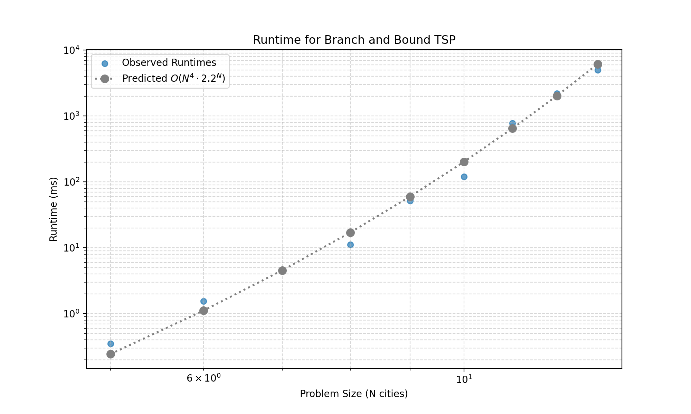
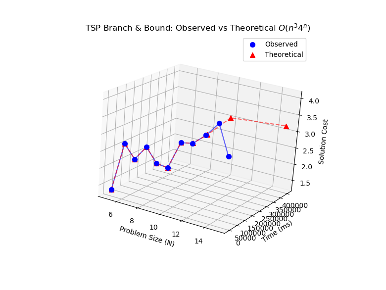
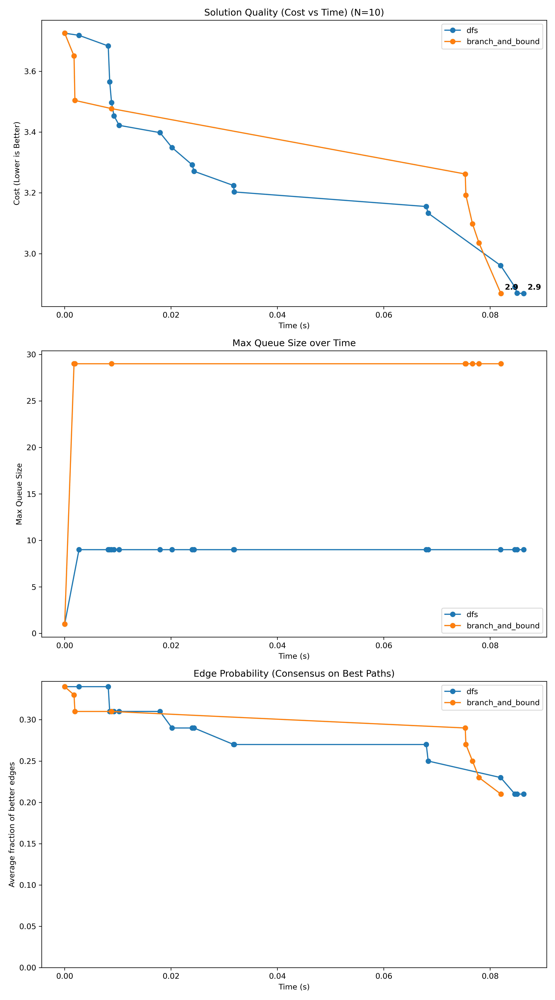
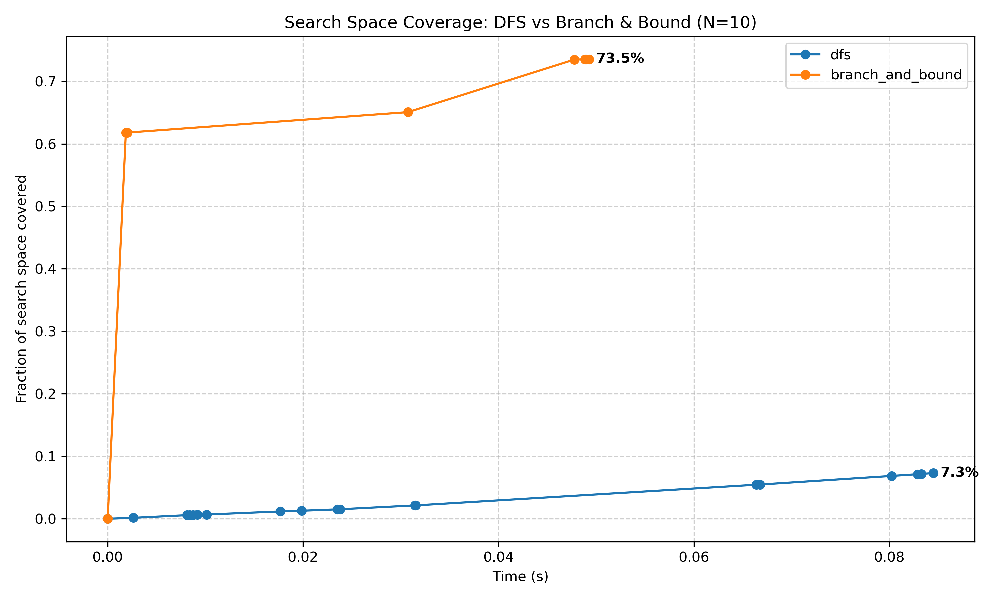

# Project Report - Branch and Bound

## Baseline

### Design Experience

*I talked with Kyle Mak and Collin V about the baseline by going over the search homework. Row reduction works by making 
sure every row has at least one 0 then if not it finds the minimum value in that row and if min_val is greater than 0,
it subtracts that value from every element in that row. For Column reduction, it makes sure the is at least one 0 in the 
column then it finds the minimum value in each column. Then if the minimum value is less than 0, then it subtracts it 
from the column.*

### Theoretical Analysis - Reduced Cost Matrix

#### Time 

```python
class MatrixClass:
    __slots__ = ['matrix', 'lower_bound', 'path', 'unvisited', 'actual_cost']

    def __init__(self, matrix, lower_bound, path, unvisited, actual_cost=0.0):
        self.matrix = matrix                                                # O(1) Constant
        self.lower_bound = lower_bound                                      # O(1) Constant
        self.path = path                                                    # O(1) Constant
        self.unvisited = unvisited                                          # O(1) Constant
        self.actual_cost = actual_cost                                      # O(1) Constant

    def reduce_matrix(self):
        reduction_cost = 0                                                  # O(1) Constant set 0
        n = len(self.matrix)                                                # O(1) Constant set
        for r in range(n):                                                  # O(n) runs for each row
            row = self.matrix[r]                                            # O(1) Constant calling a row
            min_val = math.inf                                              # O(1)
            has_vals = False                                                # O(1)
            for val in row:                                                 # O(n) loop through n columns
                if val < min_val:                                           # O(1) Compare constants
                    min_val = val                                           # O(1) set constants
                if val != math.inf:                                         # O(1) compare constants 
                    has_vals = True                                         # O(1) set boolean Constant
            if not has_vals:                                                # O(1) Call constant
                continue
            if min_val == math.inf:                                         # O(1) Constant
                return math.inf
            if min_val > 0:                                                 # O(1) constant
                reduction_cost += min_val                                   # O(1) constant
                for c in range(n):                                          # O(n) runs n columns times
                    if self.matrix[r][c] != math.inf:                       # O(1) constant
                        self.matrix[r][c] -= min_val                        # O(1) constant
        for c in range(n):                                                  # O(n) runs n times for each column
            min_val = math.inf                                              # O(1) constant
            has_vals = False                                                # O(1) constant
            for r in range(n):                                              # O(N) iterating through N rows
                val = self.matrix[r][c]                                     # O(1) constant
                if val < min_val:                                           # O(1) constant
                    min_val = val                                           # O(1) constant
                if val != math.inf:                                         # O(1) constant 
                    has_vals = True                                         # O(1) constant

            if not has_vals:                                                # O(1) constant
                continue
            if min_val == math.inf:                                         # O(1) constant
                return math.inf
            if min_val > 0:                                                 # O(1) constant
                reduction_cost += min_val                                   # O(1) constant
                for r in range(n):                                          # O(n) iterating rows 
                    if self.matrix[r][c] != math.inf:                       # O(1) constant
                        self.matrix[r][c] -= min_val                        # O(1) math
        self.lower_bound += reduction_cost                                  # O(1) constant
        return reduction_cost                                               # O(1) constant

    def update_matrix(self, city_index, edges):
        current_city = self.path[-1]                                        # O(1) constant
        new_matrix = [row[:] for row in self.matrix]                        # O(n^2) iterating n rows and copying N items each

        reduced_edge_cost = self.matrix[current_city][city_index]           # O(1) constant
        if reduced_edge_cost == math.inf:                                   # O(1) constant
            return MatrixClass(new_matrix, math.inf, self.path + [city_index], set(), math.inf) 
        actual_edge_cost = edges[current_city][city_index]                  # O(1) constant
        if actual_edge_cost == math.inf:                                    # O(1) constant
            return MatrixClass(new_matrix, math.inf, self.path + [city_index], set(), math.inf)

        n = len(new_matrix)                                                 # O(1) constant
        for i in range(n):                                                  # O(n) loop runs n times
            new_matrix[current_city][i] = math.inf                          # O(1) constant
            new_matrix[i][city_index] = math.inf                            # O(1) constant

        start_city = self.path[0]                                           # O(1) constant
        new_matrix[city_index][start_city] = math.inf                       # O(1) constant
        new_path = self.path + [city_index]                                 # O(n) initlization of new list
        new_unvisited = self.unvisited.copy()                               # O(n) initlization of a new set
        new_unvisited.remove(city_index)                                    # O(1) set removal
        child_state = MatrixClass(new_matrix, self.lower_bound +            # O(1) input creation 
                                  reduced_edge_cost, new_path, new_unvisited, self.actual_cost + actual_edge_cost)
        reduction_cost = child_state.reduce_matrix()                        # O(n^2) Calls the function above
        
        if reduction_cost == math.inf:                                      # O(1)
            child_state.lower_bound = math.inf                              # O(1)
            child_state.actual_cost = math.inf                              # O(1)
        return child_state                                                  # Time: O(1)
```
*The time complexity for the reduction algorithm took O(n^2) because we iterate through every cell twice once by row and
once by column.*

#### Space

```python
class MatrixClass:
    __slots__ = ['matrix', 'lower_bound', 'path', 'unvisited', 'actual_cost']

    def __init__(self, matrix, lower_bound, path, unvisited, actual_cost=0.0):
        self.matrix = matrix                                                # O(n^2) grows to n by n matrix
        self.lower_bound = lower_bound                                      # O(1) Constant Space
        self.path = path                                                    # O(n) stores visited cities
        self.unvisited = unvisited                                          # O(n) stores unvisited cities
        self.actual_cost = actual_cost                                      # O(1) Constant

    def reduce_matrix(self):
        reduction_cost = 0                                                  # O(1) Constant Space
        n = len(self.matrix)                                                # O(1) Constant Space
        for r in range(n):                                                  # O(1) overhead
            row = self.matrix[r]                                            # O(1) Constant call
            min_val = math.inf                                              # O(1) Constant Space
            has_vals = False                                                # O(1) Constant Space
            for val in row:                                                 # O(1) overhead
                if val < min_val:                                           # O(1) Constant Space
                    min_val = val                                           # O(1) Constant Space
                if val != math.inf:                                         # O(1) Constant Space
                    has_vals = True                                         # O(1) Constant Space
            
            if not has_vals:                                                # O(1) Constant Space
                continue

            if min_val == math.inf:                                         # O(1) Constant Space
                return math.inf
            if min_val > 0:                                                 # O(1) Constant Space
                reduction_cost += min_val                                   # O(1) Constant Space
                for c in range(n):                                          # O(1) Constant Space
                    if self.matrix[r][c] != math.inf:                       # O(1) Constant Space
                        self.matrix[r][c] -= min_val                        # O(1) Constant Space
        for c in range(n):                                                  # O(1) Constant Space
            min_val = math.inf                                              # O(1) Constant Space
            has_vals = False                                                # O(1) Constant Space
            for r in range(n):                                              # O(1) Constant Space
                val = self.matrix[r][c]                                     # O(1) Constant Space
                if val < min_val:                                           # O(1) Constant Space
                    min_val = val                                           # O(1) Constant Space
                if val != math.inf:                                         # O(1) Constant Space
                    has_vals = True                                         # O(1) Constant Space
            if not has_vals:                                                # O(1) Constant Space
                continue
            if min_val == math.inf:                                         # O(1) Constant Space
                return math.inf
            if min_val > 0:                                                 # O(1) Constant Space
                reduction_cost += min_val                                   # O(1) Constant Space
                for r in range(n):                                          # O(1) Constant Space
                    if self.matrix[r][c] != math.inf:                       # O(1) Constant Space
                        self.matrix[r][c] -= min_val                        # O(1) Constant Space
        self.lower_bound += reduction_cost                                  # O(1) Constant Space
        return reduction_cost                                               # O(1) Constant Space
        
    def update_matrix(self, city_index, edges):
        current_city = self.path[-1]                                        # O(1) Constant Space
        new_matrix = [row[:] for row in self.matrix]                        # O(n^2) copying N items each

        reduced_edge_cost = self.matrix[current_city][city_index]           # O(1) Constant Space
        if reduced_edge_cost == math.inf:                                   # O(1) Constant Space
            return MatrixClass(new_matrix, math.inf, self.path + [city_index], set(), math.inf) 
        actual_edge_cost = edges[current_city][city_index]                  # O(1) Constant Space
        if actual_edge_cost == math.inf:                                    # O(1) Constant Space
            return MatrixClass(new_matrix, math.inf, self.path + [city_index], set(), math.inf)

        n = len(new_matrix)                                                 # O(1) Constant Space
        for i in range(n):                                                  # O(1) Constant Space
            new_matrix[current_city][i] = math.inf                          # O(1) Constant Space
            new_matrix[i][city_index] = math.inf                            # O(1) Constant Space

        start_city = self.path[0]                                           # O(1) Constant Space
        new_matrix[city_index][start_city] = math.inf                       # O(1) Constant Space

        new_path = self.path + [city_index]                                 # O(n) new list can grow to n
        new_unvisited = self.unvisited.copy()                               # O(n) new set can grow to n
        new_unvisited.remove(city_index)                                    # O(1) Constant Space
        child_state = MatrixClass(new_matrix, self.lower_bound + reduced_edge_cost, new_path, new_unvisited, self.actual_cost + actual_edge_cost)        
        reduction_cost = child_state.reduce_matrix()                     
        
        if reduction_cost == math.inf:                                      # O(1) Constant Space
            child_state.lower_bound = math.inf                              # O(1) Constant Space
            child_state.actual_cost = math.inf                              # O(1) Constant Space
        return child_state                                                  # O(1) Constant Space
```

*The Space Complexity was O(n^2) because of the algorithm creates a full copy of the matrix for the child.*

## Core

### Design Experience

*I talked to Kyle Mak and Collin V about core instructions and the Branch and Bound algorithm. The branch and bound algorithm
finds the lower bound and uses it as a sorting key. The algorithm always expands the node while immediately discarding 
inefficient branches. We talked about making a n by n matrix for every state and it guarantees that the optimal solution 
will be found without exploring the entire tree.*

### Theoretical Analysis - Branch and Bound TSP

#### Time 

```python
class MySolutionStats:
    def __init__(self):
        self.solutionList = []                                  # O(1) constant
        self.lowest = math.inf                                  # O(1) constant

    def return_list(self):
        return self.solutionList                                # O(1) returns constant

    def add(self, tour, cost, time, max_q, n_exp, n_prun, n_leaves, frac_leaves):
        if cost < self.lowest:                                  # O(1) constant
            self.lowest = cost                                  # O(1) constant
            new_solution_stat = SolutionStats(                  # O(n) Append to list n length
                tour=tour,
                score=cost,
                time=time,
                max_queue_size=max_q,
                n_nodes_expanded=n_exp,
                n_nodes_pruned=n_prun,
                n_leaves_covered=n_leaves,
                fraction_leaves_covered=frac_leaves
            )
            self.solutionList.append(new_solution_stat)          # O(1) append to list
            
def greedy_tour(edges: list[list[float]], timer: Timer) -> list[SolutionStats]:
    solution = MySolutionStats()                                 # O(1) Create a new variable class 
    n_nodes_expanded = 0                                         # O(1) Constant
    n_nodes_pruned = 0                                           # O(1) constant
    for i in range(len(edges)):                                  # O(n) loops all edges
        if timer.time_out():                                     # O(1) Constant
            return solution.return_list()                        # O(1) constant
        current_node = i                                         # O(1) constant
        tour = [i]                                               # O(1) constant   
        visited = {i}                                            # O(1) constant
        current_cost = 0.0                                       # O(1) constant
        n_nodes_expanded += 1                                    # O(1) constant
        while len(visited) < len(edges):                         # O(n) runs edges - 1 times
            best_distance = math.inf                             # O(1) constant set var
            next_node = -1                                       # O(1) constant set var
            for neighbor in range(len(edges)):                   # O(n) loops number of edge times
                if neighbor not in visited:                      # O(1) compare constants
                    distance = edges[current_node][neighbor]     # O(1) check constants
                    if distance < best_distance:                 # O(1) compare constants
                        best_distance = distance                 # O(1) set constant
                        next_node = neighbor                     # O(1) set constant 
            if next_node == -1:                                  # O(1) set constant
                break                                            # O(1) constant

            tour.append(next_node)                               # O(1) add to list constant
            visited.add(next_node)                               # O(1) add to list constant 
            current_cost += best_distance                        # O(1) simple math constant
            current_node = next_node                             # O(1) set constant
            n_nodes_expanded += 1                                # O(1) simple math constant

        if len(tour) == len(edges):                              # O(1) set constant
            cost_to_start = edges[current_node][i]               # O(1) pull constant
            if cost_to_start == math.inf:                        # O(1) compare constant
                continue                                         # O(1) constant

            current_cost += cost_to_start                        # O(1) simple math
            final_tour = tour                                    # O(1) set constant
            solution.add(                                        # O(n) create new object 
                tour=final_tour,
                cost=current_cost,
                time=timer.time(),                               # O(1) constant
                max_q=1,
                n_exp=n_nodes_expanded,
                n_prun=n_nodes_pruned,
                n_leaves=0,
                frac_leaves=0.0
            )
    return solution.return_list() 

def branch_and_bound(edges: list[list[float]], timer: Timer) -> list[SolutionStats]:
    n = len(edges)                                              # O(1) Constant 
    initial_matrix = [row[:] for row in edges]                  # O(n^2) copy matrix
    greedy_solutions = greedy_tour(edges, timer)                # O(n^3) run greedy
    if greedy_solutions:                                        # O(1) check constant greedy
        initial_best = greedy_solutions[-1]                     # O(1) get best
        bssf = initial_best.score                               # O(1) set bound
        best_solution_path = initial_best.tour                  # O(1) set path
    else:                                                       # O(1) constant 
        bssf = math.inf                                         # O(1) set infinite bound
        best_solution_path = []                                 # O(1) empty path

    root_state = MatrixClass(                                   # O(n^2) init state
        initial_matrix,                                         # O(1) pass matrix
        0,                                                      # O(1) start node
        [0],                                                    # O(1) path list
        set(range(1, n)),                                       # O(N) unvisited set
        0                                                       # O(1) constant cost
    )                                                           # O(1) close init
    root_state.reduce_matrix()                                  # O(n^2) reduce rows
    stack = [root_state]                                        # O(1) init stack
    count = 0                                                   # O(1) init counter
    pruned = 0                                                  # O(1) pruned
    max_queue_size = 0                                          # O(1) init max
    k = 4                                                       # O(1) beam width

    while stack and not timer.time_out():                       # O(4^n) tree traversal
        if len(stack) > max_queue_size:                         # O(1) check size
            max_queue_size = len(stack)                         # O(1) update max

        current_state = stack.pop()                             # O(1) pop node
        if current_state.lower_bound >= bssf:                   # O(1) check bound
            pruned += 1                                         # O(1) increment pruned
            continue                                            # O(1) skip iteration
        if not current_state.unvisited:                         # O(1) check leaf
            last_city = current_state.path[-1]                  # O(1) last city
            start_city = current_state.path[0]                  # O(1) start city
            return_cost = edges[last_city][start_city]          # O(1) return cost

            if return_cost < math.inf:                          # O(1) valid return
                total_cost = current_state.actual_cost + return_cost # O(1) Calc total
                if total_cost < bssf:                           # O(1) check best
                    bssf = total_cost                           # O(1) update best
                    best_solution_path = current_state.path     # O(1) update path
            continue                                            # O(1) next loop
        current_city = current_state.path[-1]                   # O(1) current city
        candidate_cities = list(current_state.unvisited)        # O(n) copy list

        potential_children = []                                 # O(1) init list

        for next_city in candidate_cities:                      # O(n) loop candidates
            child = current_state.update_matrix(next_city, edges) # O(N^2) Matrix reduce
            if child.lower_bound < bssf:                        # O(1) check bound
                potential_children.append(child)                # O(1) add child
            else:                                               # O(1) else block
                pruned += 1                                     # O(1) increment pruned
        potential_children.sort(key=lambda x: x.lower_bound)    # O(nlogn) sort children
        if len(potential_children) > k:                         # O(1) check width
            pruned += (len(potential_children) - k)             # O(1) constant
            best_children = potential_children[:k]              # O(K) constant
        else:                                                   # O(1) else block
            best_children = potential_children                  # O(1) keep all
        stack.extend(reversed(best_children))                   # O(K) push stack

        count += 1                                              # O(1) increment count
    return [SolutionStats(                                      # O(1) constant
        tour=best_solution_path,                                # O(1) set tour
        score=bssf,                                             # O(1) set score
        time=timer,                                             # O(1) set time
        max_queue_size=max_queue_size,                          # O(1) set max
        n_nodes_expanded=count,                                 # O(1) set expanded
        n_nodes_pruned=pruned,                                  # O(1) set pruned
        n_leaves_covered=0,                                     # O(1) set leaves
        fraction_leaves_covered=0.0                             # O(1) set fraction
    )]                                                          # O(1) close return
```

*The time complexity was O(n^34^n) because we restrict the search to a 4 where each tree has every node has max 4 children.*

#### Space

```python
class MySolutionStats:
    def __init__(self):
        self.solutionList = []                                  # O(n) grows to n large
        self.lowest = math.inf                                  # O(1) space constant

    def return_list(self):
        return self.solutionList                                # O(1) space constant

    def add(self, tour, cost, time, max_q, n_exp, n_prun, n_leaves, frac_leaves):
        if cost < self.lowest:                                  # O(1) space constant
            self.lowest = cost                                  # O(1) space constant
            new_solution_stat = SolutionStats(                  # O(N) grows to n long
                tour=tour,
                score=cost,
                time=time,
                max_queue_size=max_q,
                n_nodes_expanded=n_exp,
                n_nodes_pruned=n_prun,
                n_leaves_covered=n_leaves,
                fraction_leaves_covered=frac_leaves
            )
            self.solutionList.append(new_solution_stat)          # O(1) space constant

def greedy_tour(edges: list[list[float]], timer: Timer) -> list[SolutionStats]:

    solution = MySolutionStats()                                 # O(1) space constant
    n_nodes_expanded = 0                                         # O(1) space constant
    n_nodes_pruned = 0                                           # O(1) space constant
    for i in range(len(edges)):                                  # O(1) space constant
        if timer.time_out():                                     # O(1) space constant
            return solution.return_list()                        # O(1) space constant
        current_node = i                                         # O(1) space constant
        tour = [i]                                               # O(n) worst case grows to n long
        visited = {i}                                            # O(n) worst case grows to n long
        current_cost = 0.0                                       # O(1) space constant
        n_nodes_expanded += 1                                    # O(1) space constant

        while len(visited) < len(edges):                         # O(1) Constant overhead
            best_distance = math.inf                             # O(1) space constant
            next_node = -1                                       # O(1) space constant

            for neighbor in range(len(edges)):                   # O(1) constant overhead
                if neighbor not in visited:
                    distance = edges[current_node][neighbor]     # O(1) space constant
                    if distance < best_distance:
                        best_distance = distance                 # O(1) space constant
                        next_node = neighbor                     # O(1) space constant

            if next_node == -1:
                break                                            # O(1) space constant

            tour.append(next_node)                               # O(1) add space constant
            visited.add(next_node)                               # O(1) add to list space constant
            current_cost += best_distance                        # O(1) space constant
            current_node = next_node                             # O(1) space constant
            n_nodes_expanded += 1                                # O(1) space constant

        if len(tour) == len(edges):
            cost_to_start = edges[current_node][i]               # O(1) space constant
            if cost_to_start == math.inf:
                continue                                         # O(1) space constant

            current_cost += cost_to_start                        # O(1) space constant
            final_tour = tour                                    # O(1) space constant
            
            solution.add(                                        # O(n) goes to n long
                tour=final_tour,
                cost=current_cost,
                time=timer.time(),
                max_q=1,
                n_exp=n_nodes_expanded,
                n_prun=n_nodes_pruned,
                n_leaves=0,
                frac_leaves=0.0
            )

    return solution.return_list()                               # O(1) space constant

def branch_and_bound(edges: list[list[float]], timer: Timer) -> list[SolutionStats]:
    n = len(edges)                                              # O(1) assign N
    initial_matrix = [row[:] for row in edges]                  # O(n^2) copy matrix
    greedy_solutions = greedy_tour(edges, timer)                # O(n^2) greedy
    if greedy_solutions:                                        # O(1) check greedy
        initial_best = greedy_solutions[-1]                     # O(1) get best
        bssf = initial_best.score                               # O(1) set bound
        best_solution_path = initial_best.tour                  # O(1) set path
    else:                                                       # O(1) else block
        bssf = math.inf                                         # O(1) enfinite bound
        best_solution_path = []                                 # O(1) empty path

    root_state = MatrixClass(                                   # O(n^2) init state
        initial_matrix,                                         # O(1) pass matrix
        0,                                                 # O(1) start node
        [0],                                               # O(1) path list
        set(range(1, n)),                                  # O(N) unvisited set
        0                                                  # O(1) zero cost
    )                                                      # O(1) close init
    root_state.reduce_matrix()                             # O(N^2) reduce rows
    stack = [root_state]                                   # O(1) init stack

    count = 0                                              # O(1) init count
    pruned = 0                                             # O(1) init pruned
    max_queue_size = 0                                     # O(1) init max
    k = 4                                                  # O(1) beam width

    while stack and not timer.time_out():                  # O(1) constant
        if len(stack) > max_queue_size:                    # O(1) check size
            max_queue_size = len(stack)                    # O(1) update max

        current_state = stack.pop()                        # O(1) pop node
        if current_state.lower_bound >= bssf:              # O(1) check bound
            pruned += 1                                    # O(1) count prune
            continue                                       # O(1) skip loop
        
        if not current_state.unvisited:                    # O(1) check leaf
            last_city = current_state.path[-1]             # O(1) last city
            start_city = current_state.path[0]             # O(1) start city
            return_cost = edges[last_city][start_city]     # O(1) return cost

            if return_cost < math.inf:                     # O(1) valid path
                total_cost = current_state.actual_cost + return_cost  # O(1) calc total
                if total_cost < bssf:                      # O(1)      Check best
                    bssf = total_cost                      # O(1)      Update best
                    best_solution_path = current_state.path           # O(1) Update path
            continue                                       # O(1)      Next loop

        current_city = current_state.path[-1]              # O(1)      Current city
        candidate_cities = list(current_state.unvisited)   # O(n)      Copy list
        potential_children = []                            # O(1) init list

        for next_city in candidate_cities:                 # O(N) loop cities
            child = current_state.update_matrix(next_city, edges)     # O(n^2) reduce matrix
            if child.lower_bound < bssf:                   # O(1) check bound
                potential_children.append(child)           # O(1) add child
            else:                                          # O(1) else block
                pruned += 1                                # O(1) count prune
        
        potential_children.sort(key=lambda x: x.lower_bound)          # O(nlogn) sort list
        if len(potential_children) > k:                    # O(1) check width
            pruned += (len(potential_children) - k)        # O(1) count prune
            best_children = potential_children[:k]         # O(K) slice list
        else:                                              # O(1) else block
            best_children = potential_children             # O(1) keep all
            
        stack.extend(reversed(best_children))              # O(K) push stack
        count += 1                                         # O(1) increment count

    return [SolutionStats(                                 # O(1) return stats
        tour=best_solution_path,                           # O(1) set tour
        score=bssf,                                        # O(1) set score
        time=timer,                                        # O(1) set time
        max_queue_size=max_queue_size,                     # O(1) set max
        n_nodes_expanded=count,                            # O(1) set expanded
        n_nodes_pruned=pruned,                             # O(1) set pruned
        n_leaves_covered=0,                                # O(1) set leaves
        fraction_leaves_covered=0.0                        # O(1) set fraction
    )]                                                     # O(1) close return
```

*The Space complexity for my branch and bound algorithm was O(n^3) because n×n matrix and maximum recursion stack depth of n.*

### Empirical Data

| N  | Seed | Solution | time (ms)       |
|----|------|----------|-----------------|
| 5  | 40   | 2.39     | 0.4             |
| 10 | 40   | 3.43     | 123.27          |
| 15 | 40   | 3.67     | 34951.68        |
| 20 | 40   | 4.53     | > 120000 (T.O.) |
| 30 | 40   | 5.91     | > 120000 (T.O.) |
| 50 | 40   | 7.67     | > 120000 (T.O.) |

### Comparison of Theoretical and Empirical Results

- Empirical order of growth: O(n^3 4^n)
- Measured constant of proportionality: 1.1134e-10

## Theoretical Graph


## Empirical Graph


## 3d graph


*In the first graph the observed was a bit off so I found a Empirical order of growth at O(n^3 2^n) was closer to the 
observed data. I noticed that the Branch and Bound algorithm follows an exponential growth pattern as the observed
runtimes blue dots form a linear trend that tracks closely with the theoretical predictions. The actual performance 
consistently remains slightly faster than the theoretical upper bounds (both O(N4⋅4N) and O(N4⋅2.2N)) which shows 
that the pruning or beam search strategies effectively reduce the search space. The 3D visualization further highlights 
this divergence at larger problem sizes around N=14. The theoretical computation time red triangles rise beyond the 
- observed time blue circles because the algorithm time out.*

## Stretch 1 

### Design Experience

*I talked to Kyle Mak and Collin V about stretch 1. We read the instructions and discussed the cuttree class which 
estimates the percentage of the (N−1)! search space explored by tracking pruned branches within the tree. When the 
algorithm discards a partial path, the cut method traverses this tree to the specific node and ensures 
through redundancy checks that this branch hasn't already been counted. Once a unique cut point is identified at depth,
the class calculates the number of skipped solutions using the factorial of the remaining cities. This value is then 
put back up the tree to the root and updated the count of cut leaves. Lastly, the overall coverage is determined by 
dividing this total count of pruned leaves by the total number of possible tours and yielding a completion fraction 
between 0.0 and 1.0. We discussed we need to track score, time, and nodes to create graphs.*

### Search Space Over Time



*The Solution Quality graph confirms that the Branch and Bound algorithm and dfs successfully finds the same optimal tour 
cost 2.9 and Branch and Bound finds it fast after aggressive pruning. The Max Queue Size plot shows the space complexity
increases to 30 to store the matrix whereas DFS maintains a linear memory size  of around 9 by only storing the current 
path. The Edge Probability graph shows both algorithms following similar downward trends which show that as each algorithm
prunes the search space. Both correctly converge on the same set of high probability edges that make up the optimal tour.*



*This plot compares the efficiency of your DFS and Branch and Bound algorithms by tracking the fraction of the total 
search tree each method covers by visiting or pruning nodes. The orange line shows your Branch and Bound algorithm achieved
73.2% coverage which shows that the tree being pruned by the cost bounds and limits. While the blue DFS line stays nearly 
flat at 7.3% which shows that standard backtracking approach is forced to explore the tree incrementally and cannot rule 
out large suboptimal sections as quickly. This shows the Branch and Bound algorithm eliminates the majority of the 
search space in whereas DFS is stuck performing a near-exhaustive search.*

## Stretch 2

### Design Experience

*I talked to Kyle Mak and Collin V about stretch 2. We read the instructions and talked about how we were going to implement
the priority queue. We talked about using the lower bound as the priority key and creating a metric that balances low 
cost with high depth to encourage reaching leaf nodes quickly while favoring good paths. This approach effectively 
combines the ability to prune bad branches with the speed of finding valid solutions early to update your Best So Far 
BSSF score.*

### Selected PQ Key

*Branch and Bound Smart used Cost per City or Normalized Cost as the priority key. This approach was chosen to stop using the
raw Lower Bound as a priority and use a normalized cost instead. Without normalization, a Priority Queue would be bias 
towards shallow nodes simply because they have fewer edges added to their total sum.*

### Branch and Bound versus Smart Branch and Bound

*The Branch and Bound algorithm relies on a stack data structure to implement a Depth-First Search and then aggressively 
explore other branches to its limit before backtracking. This approach is memory-efficient and finds an initial solution 
quickly. the algorithm often wastes time by searching high-cost subtrees simply because the trees were next in line. 
The Smart Branch and Bound utilizes a priority queue to implement a Best-First Search which works by selecting the most 
promising node from the entire tree. Then uses a key as the lower bound cost minus a bonus for depth the algorithm 
balances the need for low cost with the need to dive deep to find valid tours. This ordering allows the Smart version to
jump around the tree and pause more expensive paths to focus on branches that are mathematically more likely to contain
the optimal solution. Although Smart Branch and Bound consumes more memory to store the priority queue. It typically 
converges on the optimal solution and prunes the search space much faster than the standard approach.*

## Project Report 

*I talked with Kyle Mak and Collin V about the project and all that we learned. In this project, we learned the 
effectiveness of the Branch and Bound algorithm in solving the Traveling Salesperson Problem by utilizing matrix 
reduction to establish lower bounds for aggressive pruning. Through theoretical and empirical analysis, I observed that 
while the worst-case time complexity remains exponential (O(n34n)). By graphing the search space coverage showed that 
Branch and Bound prunes sections of the tree much earlier than standard Depth-First Search which resulted in 
significantly faster convergence on optimal solutions. Implementing "Smart" Branch and Bound shifted the strategy from 
a stack-based approach to a Best-First Search using a priority queue and used a normalized cost to balance exploration 
depth with path quality. I learned that normalizing the lower bound by depth is crucial to prevent the priority queue 
from reverting to a breadth-first search behavior and ensuring the algorithm finds valid tours quickly to update the 
Best So Far BSSF. In conclusion, this project showed that  pruning strategies are essential for solving NP-hard 
optimization problems efficiently.*

