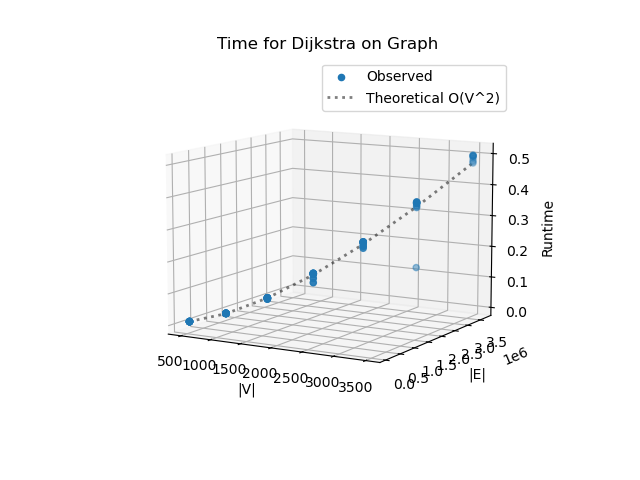
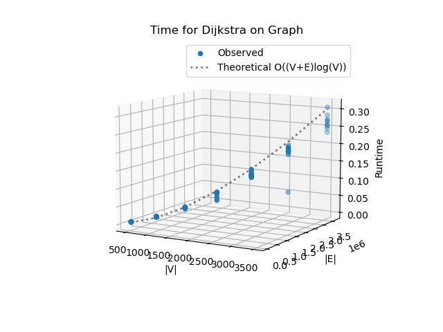
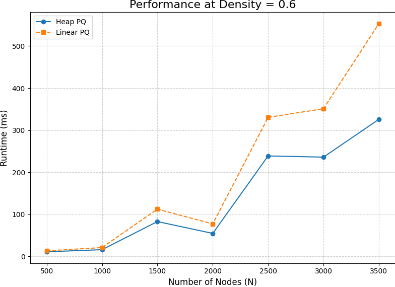
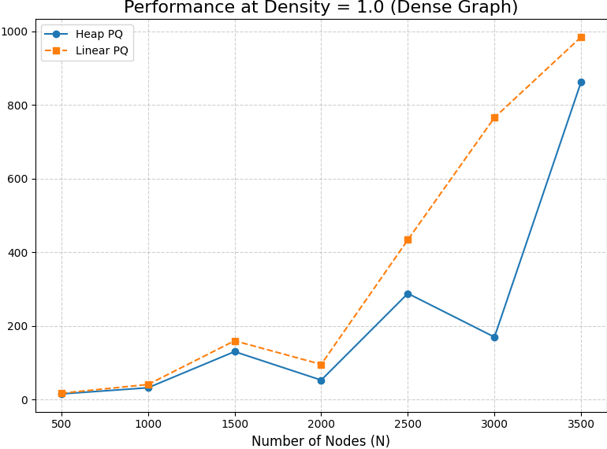

# Project Report - Network Routing

## Baseline

### Design Experience

*I talked to Kyle Mak and Collin Verbanatz about the Dijkstra algorithm. We when through the homework again and the graph.
Then we took a look at the sudo code and code. The graph is a dictionary representing the network. The keys are integer 
IDS nodes and the values are another dictionary where keys are neighboring node IDs and values are the floating-point 
costs of the edges or the weights. The source is the integer ID of the starting node and the target is the integer ID 
of the destination node. The function must return a list of integers representing the nodes in the shortest path from 
source to target. If no path exists, this should be an empty list [] and a float representing the total cost of that path. 
If no path exists, this should be float('inf').*

### Theoretical Analysis - Dijkstra's With Linear PQ

#### Time 

```python

def find_shortest_path_with_linear_pq(...):                       # O(V^2) 
    distance = {}                                                 # O(1) Constant
    previous = {}                                                 # O(1) Constant
    priority_queue = {}                                           # O(1) Constant
    for node in graph:                                            # O(V) loop of all vertex
        if node == source:                                        # O(1) inside loop constant
            distance[node] = 0                                    # O(1) inside loop constant 
            priority_queue[node] = 0                              # O(1) inside loop constant
        else:                                                     # O(1) constant
            distance[node] = float('inf')                         # O(1) constant
            priority_queue[node] = float('inf')                   # O(1) constant
        previous[node] = None                                     # O(1) constant
    while priority_queue:                                         # O(V) loop until all vertexes are looked through
        current_node = min(priority_queue, key=lambda n: distance[n]) # O(V) looking through all vertex find lowest 
        priority_queue.pop(current_node)                          # O(1) remove vertex
        if current_node == target:                                # O(1) checking a constant
            break                                                 # O(1) break
                                                                  # Runs for each neighbor and across all outer loops is O(E)
        for neighbor, weight in graph.get(current_node, {}).items():  # O(V) but for the total work including the while loop is O(E)
            new_distance = distance[current_node] + weight        # O(1) addition
            if new_distance < distance[neighbor]:                 # O(1) comparing constants
                distance[neighbor] = float(new_distance)          # O(1) updating constants
                previous[neighbor] = float(current_node)          # O(1) updating constant
    if distance[target] == float('inf'):                          # O(1) comparing constants
        return [], float('inf')                                   # O(1) constant
    path = []                                                     # O(1) constant
    current = target                                              # O(1) constant
    while current is not None:                                    # O(k) worst case O(V) going through all vertex
        path.insert(0, current)                                   # O(k) constant
        current = previous[current]                               # O(1) updating constant
    return path, distance[target]                                 # O(1)

```
*Dijkstra's algorithm is different for Depth-First Search because it has an extra step in finding the unvisited node 
with the smallest distance. This determines the final time complexity which is O(V^2)*

#### Space
```python
def find_shortest_path_with_linear_pq(...):                       # O(V) 
    distance = {}                                                 # O(V) will get vertex big
    previous = {}                                                 # O(1) will get as big as the vertexes
    priority_queue = {}                                           # O(1) will get as big as the vertexes
    for node in graph:                                            # O(V) loops through vertex times
        if node == source:                                        # O(1) inside loop constant
            distance[node] = 0                                    # O(1) constant add value
            priority_queue[node] = 0                              # O(1) constant give value
        else:                                                     # O(1) constant
            distance[node] = float('inf')                         # O(1) constant assign value
            priority_queue[node] = float('inf')                   # O(1) constant assign value
        previous[node] = None                                     # O(1) constant assign value
    while priority_queue:                                         # O(1) loop 
        current_node = min(priority_queue, key=lambda n: distance[n]) # O(1) space
        priority_queue.pop(current_node)                          # O(1) remove vertex
        if current_node == target:                                # O(1) checking a constant
            break                                                 # O(1) break
                                                                 
        for neighbor, weight in graph.get(current_node, {}).items():  # O(1) loop
            new_distance = distance[current_node] + weight        # O(1) addition
            if new_distance < distance[neighbor]:                 # O(1) comparing constants
                distance[neighbor] = float(new_distance)          # O(1) updating constants
                previous[neighbor] = float(current_node)          # O(1) updating constant
    if distance[target] == float('inf'):                          # O(1) comparing constants
        return [], float('inf')                                   # O(1) constant
    path = []                                                     # O(1) constant
    current = target                                              # O(1) constant
    while current is not None:                                    # O(1) constant
        path.insert(0, current)                                   # O(k) constant
        current = previous[current]                               # O(1) updating constant
    return path, distance[target]                                 # O(1)

```
*The dijkstra algorithm uses four main data structures which are distance, previous, priority_queue, and path. Each one 
requires O(V) space because the size depends on the input of vertexes. Therefore, i conclude that the Space Complexity is 
O(V).*

### Empirical Data - Dijkstra's With Linear PQ
| V    | E         | Time (sec) |
|------|-----------|------------|
| 500  | 75000.0   | 0.009      |
| 1000 | 300000.0  | 0.039      |
| 1500 | 675000.0  | 0.086      |
| 2000 | 1200000.0 | 0.154      |
| 2500 | 1875000.0 | 0.243      |
| 3000 | 2700000.0 | 0.337      |
| 3500 | 3675000.0 | 0.489      |

### Comparison of Theoretical and Empirical Results - Dijkstra's With Linear PQ

- Theoretical order of growth: O(V^2) 
- Empirical order of growth (if different from theoretical): 3.856836644345053e-08
- 


*My theoretical order of growth was O(v^2) which fit my observed data. There was an outlier however most of the data fit
my theoretical order of growth therefore i saw no reason to find a empirical order of growth*

## Core

### Design Experience

*I talked to Kyle Mak and Collin Verbanatz about the implementing dijkstra's algorithm by using heaps. We looked at professor 
bean's slides and explained the data structure and the different functions needed. We decided we needed insert, delete min,
decrease key, bubble up, and bubble down. The code for dijkstra's algorithm will probably remain close to the same as baseline 
but we will need to implement the new data structure.*

### Theoretical Analysis - Dijkstra's With Heap PQ

#### Time 
```python
class HeapPriorityQueue:                                               # O(log n)                                                                                                                                               
    def __init__(self):                                                # O(1) initiation of my map and list
        self.map_of_distance = {}                                      # O(1) map initiation
        self.position = {}                                             # O(1) map initiation
        self.nodes = []                                                # O(1) list initiation

    def insert(self, node, distance_to_target: float):                 # O(log n)
        self.nodes.append(node)                                        # O(1) add to list
        new_index = len(self.nodes) - 1                                # O(1) get length subtract
        self.position[node] = new_index                                # O(1) insertion
        self.map_of_distance[node] = distance_to_target                # O(1) insertion
        self.bubble_up(new_index)                                      # O(log n) heappush

    def delete_min(self):                                              # O(log n)
        if not self.nodes:                                             # O(1) check list is empty
            return None
        min_node = self.nodes[0]                                       # O(1) List index access
        last_node = self.nodes.pop()                                   # O(1) get rid of end of the list
        if not self.nodes:                                             # O(1) check if list is empty
            self.position.pop(min_node)                                # O(1) dictionary pop
            self.map_of_distance.pop(min_node)                         # O(1) dictionary pop
            return min_node
        self.nodes[0] = last_node                                      # O(1) change list
        self.position[last_node] = 0                                   # O(1) position dictionary update
        self.shift_down(0)                                             # O(log n) heap  downwards
        self.position.pop(min_node)                                    # O(1) dictionary delete
        self.map_of_distance.pop(min_node)                             # O(1) dictionary delete
        return min_node

    def decrease_key(self, node, new_distance):                        # O(log n) 
        self.map_of_distance[node] = new_distance                      # O(1) update
        position_of_node = self.position[node]                         # O(1)  lookup
        self.bubble_up(position_of_node)                               # O(log n) upwards movement

    def bubble_up(self, index):                                        # O(log n)
        parent_index = (index - 1) // 2                                # O(1) calculation
                                                                       # loop runs the height of the heap
        while index > 0 and self.map_of_distance[self.nodes[index]] < self.map_of_distance[self.nodes[parent_index]]: # O(log n)
            child_node = self.nodes[index]                             # O(1) list access
            parent_node = self.nodes[parent_index]                     # O(1) dictionary access
            self.nodes[index], self.nodes[parent_index] = parent_node, child_node # O(1) swap
            self.position[child_node] = parent_index                   # O(1) update
            self.position[parent_node] = index                         # O(1) dictionary update
            index = parent_index                                       # O(1) update variable
            parent_index = (index - 1) // 2                            # O(1) update variable

    def shift_down(self, index):                                       # O(log n) 
        heap_size = len(self.nodes)                                    # O(1) get length constant
        while (2 * index + 1) < heap_size:                             # O(log n) loop runs the height of the heap
            left_child_index = 2 * index + 1                           # O(1) math
            right_child_index = 2 * index + 2                          # O(1) math
            smallest_child_index = left_child_index                    # O(1) math
            if (right_child_index < heap_size and                      # O(1) comparing constants
                    self.map_of_distance[self.nodes[right_child_index]] < self.map_of_distance[
                        self.nodes[left_child_index]]):
                smallest_child_index = right_child_index               # O(1) setting variables

            if self.map_of_distance[self.nodes[index]] <= self.map_of_distance[self.nodes[smallest_child_index]]: # O(1) comparing constants
                break
            parent_node = self.nodes[index]                            # O(1) setting variables
            child_node = self.nodes[smallest_child_index]              # O(1) setting variables
            self.nodes[index], self.nodes[smallest_child_index] = child_node, parent_node # O(1) swap
            self.position[parent_node] = smallest_child_index          # O(1) updates
            self.position[child_node] = index                          # O(1) setting variables

            index = smallest_child_index                               # O(1) setting variables

def find_shortest_path_with_heap(                                      # O((V+E)logV)
        graph: dict[int, dict[int, float]],
        source: int,
        target: int
) -> tuple[list[int], float]:

    dist = {}                                                          # O(1) constant dictionary
    prev = {}                                                          # O(1) constant dictionary
    pq = HeapPriorityQueue()                                           # O(1) data structure
    for node in graph:                                                 # O(v) loop runs V times
        dist[node] = float('inf')                                      # O(1) creating key and item
        prev[node] = None                                              # O(1) creating key and item
    dist[source] = 0                                                   # O(1) setting source to constant
    for node, distance in dist.items():                                # Loop runs V times
        pq.insert(node, distance)                                      # O(log V) heap size is Vertex
    while pq.nodes:                                                    # O(V * log V) loop runs vertex times 
        current_node = pq.delete_min()                                 # O(log V) finds min from heap
        if current_node == target:                                     # O(1) comparing constant
            break
        if dist[current_node] == float('inf'):                         # O(1) set inf node
            continue
        for neighbor, weight in graph.get(current_node, {}).items():   # O(E) travels through all edges
            new_dist = dist[current_node] + weight                     # O(1) addition
            if new_dist < dist[neighbor]:                              # O(1) compare constants
                dist[neighbor] = new_dist                              # O(1) update dictionary
                prev[neighbor] = current_node                          # O(1) update dictionary
                pq.decrease_key(neighbor, new_dist)                    # O(log V) update pq
    if dist.get(target) is None or dist[target] == float('inf'):       # O(1) compare constants
        return [], float('inf')

    path = []                                                          # O(1) new list
    current = target                                                   # O(1) set variables
    while current is not None:                                         # O(1) iterations
        path.insert(0, current)                                        # O(1) inserting into list
        current = prev[current]                                        # O(1) set variables
    if path[0] == source:                                              # O(1) compare constant
        return path, dist[target]
    else:
        return [], float('inf')
```

*I found my time complexity to be O((V+E)logV) becuase the overall complexity is dominated by the main while loop, 
which processes each vertex and its edges.*

#### Space

```python
class HeapPriorityQueue:
    def __init__(self):                                                # O(1) constant space.
        self.map_of_distance = {}                                      # O(n) initiate map
        self.position = {}                                             # O(n) initiate map
        self.nodes = []                                                # O(n) initiate map

    def insert(self, node, distance_to_target: float):                 # O(1) variables
        self.nodes.append(node)                                        # O(n) adding node
        new_index = len(self.nodes) - 1                                # O(1) local variable
        self.position[node] = new_index                                # O(n) dictionary grows
        self.map_of_distance[node] = distance_to_target                # O(n) dictionary grows
        self.bubble_up(new_index)                                      # O(1) changing the data structure

    def delete_min(self):                                              # O(1) constant
        if not self.nodes:
            return None
        min_node = self.nodes[0]                                       # O(1) local variable
        last_node = self.nodes.pop()                                   # O(1) local variable
        if not self.nodes:                                             # O(n) shrink dictionary
            self.position.pop(min_node)
            self.map_of_distance.pop(min_node)
            return min_node
        self.nodes[0] = last_node
        self.position[last_node] = 0
        self.shift_down(0)                                             
        self.position.pop(min_node)
        self.map_of_distance.pop(min_node)
        return min_node

    def decrease_key(self, node, new_distance):                        # O(1) adding distance
        self.map_of_distance[node] = new_distance
        position_of_node = self.position[node]                         # O(1) local variable
        self.bubble_up(position_of_node)                               # O(1) adding space

    def bubble_up(self, index):                                        # O(1) constant space
        parent_index = (index - 1) // 2                                # O(1) local variable
        while index > 0 and self.map_of_distance[self.nodes[index]] < self.map_of_distance[self.nodes[parent_index]]:
            child_node = self.nodes[index]                             # O(1) local variable
            parent_node = self.nodes[parent_index]                     # O(1) local variable
            self.nodes[index], self.nodes[parent_index] = parent_node, child_node
            self.position[child_node] = parent_index
            self.position[parent_node] = index
            index = parent_index
            parent_index = (index - 1) // 2

    def shift_down(self, index):                                       # O(1) constant space
        heap_size = len(self.nodes)                                    # O(1) local variable
        while (2 * index + 1) < heap_size:
            left_child_index = 2 * index + 1                           # O(1) local variable space
            right_child_index = 2 * index + 2
            smallest_child_index = left_child_index
            if (right_child_index < heap_size and
                    self.map_of_distance[self.nodes[right_child_index]] < self.map_of_distance[
                        self.nodes[left_child_index]]):
                smallest_child_index = right_child_index

            if self.map_of_distance[self.nodes[index]] <= self.map_of_distance[self.nodes[smallest_child_index]]:
                break
            parent_node = self.nodes[index]
            child_node = self.nodes[smallest_child_index]
            self.nodes[index], self.nodes[smallest_child_index] = child_node, parent_node
            self.position[parent_node] = smallest_child_index
            self.position[child_node] = index

            index = smallest_child_index
            
def find_shortest_path_with_heap(                                      # O(V + E) graph input space
        graph: dict[int, dict[int, float]],
        source: int,
        target: int
) -> tuple[list[int], float]:
    dist = {}                                                          # O(V) grow to vertex space
    prev = {}                                                          # O(V) grow to vertex space
    pq = HeapPriorityQueue()                                           # O(V) grow to vertex object
    for node in graph:                                                
        dist[node] = float('inf')                                      
        prev[node] = None                                              
    dist[source] = 0
    for node, distance in dist.items():                               
        pq.insert(node, distance)                                      

    while pq.nodes:
        current_node = pq.delete_min()                                
        if current_node == target:
            break
        if dist[current_node] == float('inf'):
            continue
        for neighbor, weight in graph.get(current_node, {}).items():
            new_dist = dist[current_node] + weight                     
            if new_dist < dist[neighbor]:
                dist[neighbor] = new_dist
                prev[neighbor] = current_node
                pq.decrease_key(neighbor, new_dist)
    if dist.get(target) is None or dist[target] == float('inf'):
        return [], float('inf')

    path = []                                                           # O(V) grow to vertex long at worst
    current = target                                                   
    while current is not None:
        path.insert(0, current)                                       
        current = prev[current]
    if path[0] == source:
        return path, dist[target]
    else:
        return [], float('inf')
```

*The total Space complexity is O(V) because he storage needed for distances, predecessors, the priority queue, and the 
final path, all of which is defined by the number of vertices.*

### Empirical Data - Dijkstra's With Heap PQ

| V    | E         | Time (sec) |
|------|-----------|------------|
| 500  | 75000.0   | 0.007      |
| 1000 | 300000.0  | 0.023      |
| 1500 | 675000.0  | 0.049      |
| 2000 | 1200000.0 | 0.083      |
| 2500 | 1875000.0 | 0.132      |
| 3000 | 2700000.0 | 0.181      |
| 3500 | 3675000.0 | 0.263      |


### Comparison of Theoretical and Empirical Results - Dijkstra's With Heap PQ

- Theoretical order of growth: O((V+E)logV)
- Empirical order of growth (if different from theoretical): 1.0031591352652217e-08



*In my graph you can see that the theoretical order of growth correctly predicted my observed order fo growth. Because the 
graph was so close there was no need to find an empirical order of growth.*

### Relative Performance Of Linear versus Heap PQ Performance

*The difference between Heap Priority Queue and Linear Priority Queue version is that the heap performance gap widens 
considerably as the graph size increases. As you can see, for a graph with 3,500 vertices and nearly 3.7 million edges, 
the heap implementation is almost twice as fast. This is becuase the Heap PQ is finding and removing the node with the 
smallest distance is very efficient, taking O(log(V)) time. This is because a heap is a specialized tree-like data 
structure designed for this exact purpose.*

## Stretch 1

### Design Experience

*I talked to Kyle Mak and Collin Verbanatz about the different parameters we are going to use to measure the runtime of 
two different shortest path algorithm implements. I used graph size, graph density meaning how many edges in the graph.
The more dense is 1.0 and the less densely connected is 0.6. I will test both heap PQ and linear PQ and I predict that the Heap
PQ will be faster than linear PQ in the sparser graph and high graph size.*

### Empirical Data

| N    | Density | heap time (ms) | linear PQ time (ms) |
|------|---------|----------------|---------------------|
| 500  | .6      | 10.86          | 13.03               |
| 1000 | .6      | 15.88          | 20.87               |
| 1500 | .6      | 82.75          | 112.30              |
| 2000 | .6      | 54.57          | 77.14               |
| 2500 | .6      | 238.74         | 330.47              |
| 3000 | .6      | 235.94         | 351.02              |
| 3500 | .6      | 325.76         | 553.26              |


| N    | Density | heap time (ms) | linear PQ time (ms) |
|------|---------|----------------|---------------------|
| 500  | 1       | 15.60          | 17.55               |
| 1000 | 1       | 32.31          | 41.19               |
| 1500 | 1       | 130.45         | 159.88              |
| 2000 | 1       | 53.09          | 95.87               |
| 2500 | 1       | 288.39         | 434.05              |
| 3000 | 1       | 170.00         | 765.96              |
| 3500 | 1       | 862.75         | 984.73              |

### Plot

*Fill me in*

### Discussion

*Fill me in*

## Stretch 2

### Design Experience

*Fill me in*

### Provided Graph Generation Algorithm Explanation

*Fill me in*

### Selected Graph Generation Algorithm Explanation

*Fill me in*

#### Screenshots of Working Graph Generation Algorithm


## Project Review

*Fill me in*

