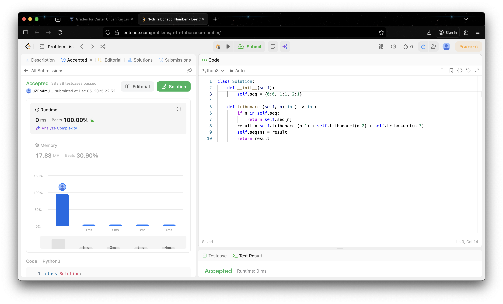
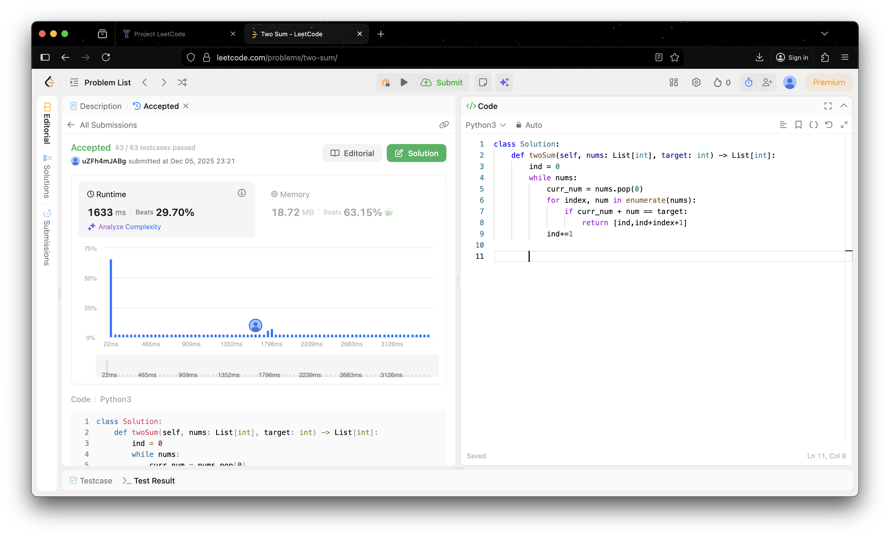
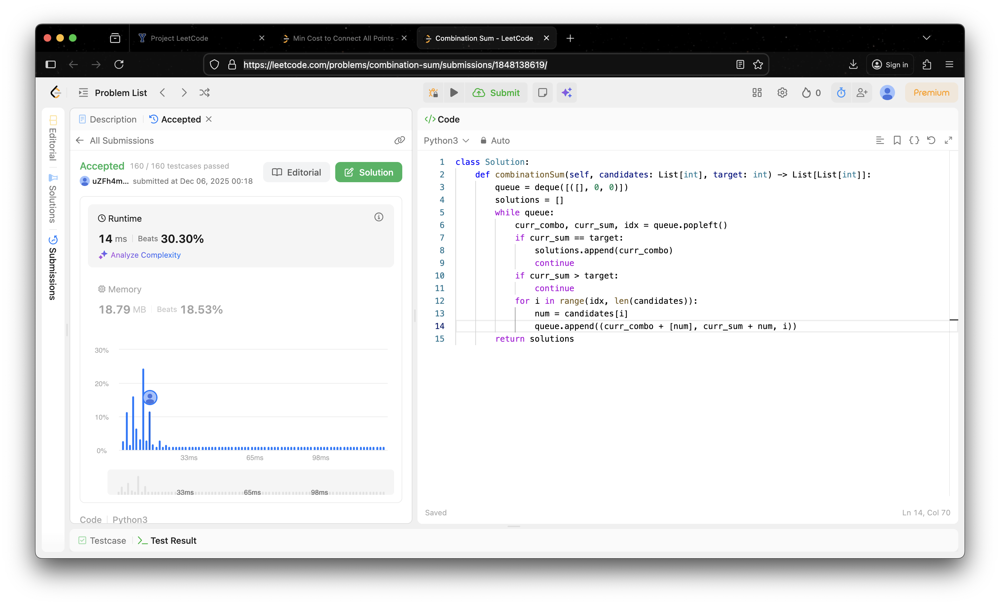
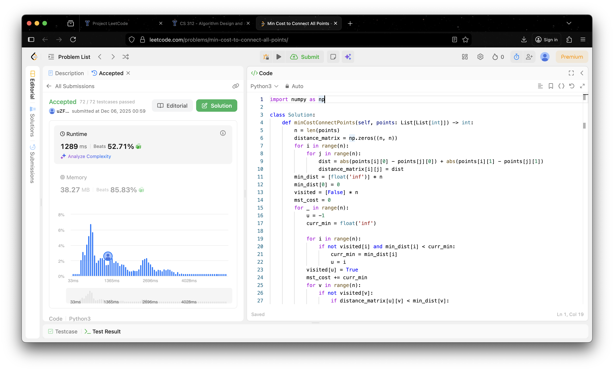
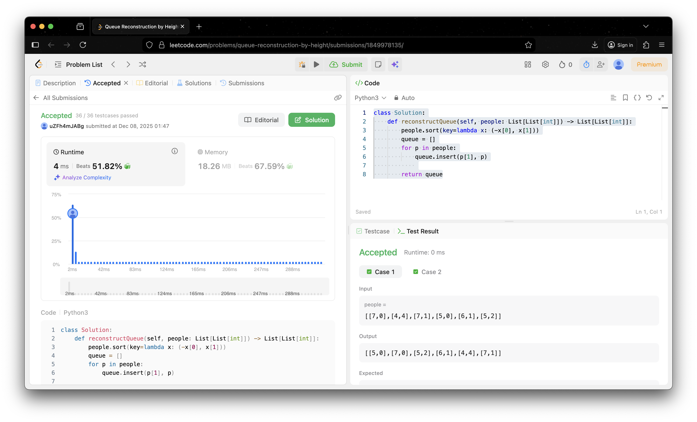

# Project Leetcode

## Baseline 

### Baseline Problem 1

#### Problem Information

Problem Name: *102. Binary Tree Level Order Traversal*

[Submission Link](https://leetcode.com/problems/binary-tree-level-order-traversal/submissions/1847972188/)


#### Time Complexity

```python
class Solution:
    def levelOrder(self, root) -> List[List[int]]:
        output = []                                  # O(1) Constant
        count = TreeNode                             # O(1) unused variable
        queue = deque([root])                        # O(1) initialize queue with root
        while queue:                                 
            level_nodes = []                         # O(1) new list for current level
            level_size = len(queue)                  # O(1) check current width
            for _ in range(level_size):              # O(n) time n time
                curr = queue.popleft()               # O(1) constant time
                if curr is not None:                 # O(1) check
                    level_nodes.append(curr.val)     # O(1) append to list
                    if curr.left:                    # O(1) check child
                        queue.append(curr.left)      # O(1) add to queue
                    if curr.right:                   # O(1) check child
                        queue.append(curr.right)     # O(1) add to queue
            if len(level_nodes) == 0:                # O(1) edge case check
                break                                # O(1) exit
            else:                                    
                output.append(level_nodes)           # O(1) add level list to output
        return output                                # O(1) return result
```

*The time complexity is O(n) because each node is visited once.*

#### Space Complexity

```python
class Solution:
    def levelOrder(self, root) -> List[List[int]]:
        output = []                                  # O(n) can grow to n length
        count = TreeNode                             # O(1) space constant
        queue = deque([root])                        # O(n) can grow to n length
        while queue:                                 
            level_nodes = []                         # O(n/2) can store up to half
            level_size = len(queue)                  # O(1) space constant
            for _ in range(level_size):              # O(n) n time
                curr = queue.popleft()               # O(1) constant time
                if curr is not None:                 # O(1) space constant
                    level_nodes.append(curr.val)     # O(1) space constant
                    if curr.left:                    # O(1) space constant
                        queue.append(curr.left)      # O(1) space constant
                    if curr.right:                   # O(1) space constant
                        queue.append(curr.right)     # O(1) space constant
            if len(level_nodes) == 0:                # O(1) space constant
                break                                # O(1) space constant
            else:                                    
                output.append(level_nodes)           # O(1) space constant
        return output                                # O(1) space constant
```

*The space complexity is O(n) because the output list store n values.*

----

### Baseline Problem 2

#### Problem Information

Problem Name: *547. Number of Provinces*

[Submission Link](https://leetcode.com/problems/number-of-provinces/submissions/1847985668/)


#### Time Complexity

```python
class Solution:
    def findCircleNum(self, isConnected: List[List[int]]) -> int:
        n = len(isConnected)
        connections = set()                   # O(1) runs once
        visited = set()                       # O(1) constant time
        provinces = 0                         # O(1) Constant time
        for i in range(n):                    # O(n) loop iterates n times
            if i not in visited:              # O(1) Constant time
                provinces += 1                # O(1) Constant time
                visited.add(i)                # O(1) adds to set
                stack = [i]                   # O(1) Constant time
                
                while stack:                  # O(n) iterations across entire program is n
                    curr = stack.pop()        # O(1) constant time
                    
                    for j in range(n):        # O(n) runs n times 
                        if isConnected[curr][j] == 1 and j not in visited: 
                            visited.add(j)    # O(1) add to set
                            stack.append(j)   # O(1) push to stack
        return provinces                      # O(1) return result
```

*The time complexity is O(n^2) because for the 2 nested for loops.*

#### Space Complexity

```python
class Solution:
    def findCircleNum(self, isConnected: List[List[int]]) -> int:
        n = len(isConnected)
        connections = set()                   # O(1) allocates empty set 
        visited = set()                       # O(n) stores up to n 
        provinces = 0                         # O(1) single integer variable
        for i in range(n):                    # O(1) constant space
            if i not in visited:              # O(1) constant space
                provinces += 1                # O(1) constant space
                visited.add(i)                # O(1) constant space
                stack = [i]                   # O(n) stack can grow up to O(n) in worst case
                while stack:                  # O(1) constant space
                    curr = stack.pop()        # O(1) constant space
                    for j in range(n):        # O(1) constant space
                        if isConnected[curr][j] == 1 and j not in visited:
                            visited.add(j)    # O(1) constant space
                            stack.append(j)   # O(1) constant space
        return provinces                      # O(1) constant space
```

*The space complexity is O(n^2) because using an adjacency Matrix*

----

### Baseline Problem 3

#### Problem Information

Problem Name: *120. Triangle*

[Submission Link](https://leetcode.com/problems/triangle/submissions/1847991928/)


#### Time Complexity

```python
class Solution:
    def minimumTotal(self, triangle: List[List[int]]) -> int:
        for row in range(1, len(triangle)):                                    # O(n) outer loop runs n-1 times
            for col in range(len(triangle[row])):                              # O(N) inner loop runs n times
                if col == 0:                                                   # O(1) constant check
                    triangle[row][col] += triangle[row-1][col]                 # O(1) constant addition
                elif col == len(triangle[row]) - 1:                            # O(1) constant check
                    triangle[row][col] += triangle[row-1][col-1]               # O(1) constant addition
                else:                                                          # O(1) constant time
                    triangle[row][col] += min(triangle[row-1][col-1], triangle[row-1][col]) 
        return min(triangle[-1])                                               # O(n) find min
```

*The time complexity is O(n^2) because number of rows in the triangle and the algorithm visits every single number 
in the triangle once.*

#### Space Complexity

```python
class Solution:
    def minimumTotal(self, triangle: List[List[int]]) -> int:
        for row in range(1, len(triangle)):                                    # O(1) loop variable 
            for col in range(len(triangle[row])):                              # O(1) loop variable 
                if col == 0:                                                   # O(1) constant space
                    triangle[row][col] += triangle[row-1][col]                 # O(1) constant space
                elif col == len(triangle[row]) - 1:                            # O(1) constant space
                    triangle[row][col] += triangle[row-1][col-1]               # O(1) constant space
                else:                                                          # O(1) constant space
                    triangle[row][col] += min(triangle[row-1][col-1], triangle[row-1][col]) 
                return min(triangle[-1])                                       # O(1) returns a single integer
```

*The space complexity is O(1) because the algorithm is creating a new DP table.*

----


## Core

### Core Problem 1

#### Problem Information

Problem Name: *279. Perfect Squares*

[Submission Link](https://leetcode.com/problems/perfect-squares/submissions/1848007048/)


#### Time Complexity

```python
class Solution:
    def numSquares(self, n: int) -> int:
        squares = []                                      # O(1) constant time
        i = 1                                             # O(1) constant time
        while i * i <= n:                                 # O(sqrt(n)) loop 
            squares.append(i * i)                         # O(1) constant time
            i += 1                                        # O(1) constant time
        queue = deque([(n, 0)])                           # O(1) constant time
        visited = {n}                                     # O(1) constant time
        while queue:                                      # O(n) outer loop 
            curr, step = queue.popleft()                  # O(1) constant time
            for sq in squares:                            # O(n) inner loop
                remainder = curr - sq                     # O(1) constant time
                if remainder == 0:                        # O(1) constant time
                    return step + 1                       # O(1) constant time
                
                if remainder > 0 and remainder not in visited: # O(1) constant time
                    visited.add(remainder)                # O(1) constant time
                    queue.append((remainder, step + 1))   # O(1) constant time
        return n                                          # O(1) constant time
```

*The time complexity was O(n * sqrt(n)) because BFS visits every node and checks every edge.*

#### Space Complexity

```python
class Solution:
    def numSquares(self, n: int) -> int:
        squares = []                                      # O(sqrt(n)) grows to n
        i = 1                                             # O(1) constant space
        while i * i <= n:                                 # O(1) constant space
            squares.append(i * i)                         # O(1) constant space
            i += 1                                        # O(1) constant space
        queue = deque([(n, 0)])                           # O(n) grows to n
        visited = {n}                                     # O(n) grows to n size
        while queue:                                      # O(1) constant space
            curr, step = queue.popleft()                  # O(1) constant space
            for sq in squares:                            # O(1) constant space
                remainder = curr - sq                     # O(1) constant space
                if remainder == 0:                        # O(1) constant space
                    return step + 1                       # O(1) constant space
                if remainder > 0 and remainder not in visited:
                    visited.add(remainder)                # O(1) constant space
                    queue.append((remainder, step + 1))   # O(1) constant space
        return n                                          # O(1) constant space
```

*The space complexity is O(n) because visited set and the queue can store up to n.*

----

### Core Problem 2

#### Problem Information

Problem Name: *1042. Flower Planting With No Adjacent*

[Submission Link](https://leetcode.com/problems/flower-planting-with-no-adjacent/submissions/1848054416/)


#### Time Complexity

```python
import numpy as np
class Solution:
    def gardenNoAdj(self, n: int, paths: List[List[int]]) -> List[int]:
        garden_matrix = np.zeros((n, n), dtype=np.int8)      # O(n^2) n by n matrix
        for x, y in paths:                                   # O(e) iterates paths
            garden_matrix[x-1, y-1] = 1                      # O(1) constant time
            garden_matrix[y-1, x-1] = 1                      # O(1) constant time
        answer = np.zeros(n, dtype=np.int8)                  # O(n) grows size n
        for i in range(n):                                   # O(n) loop n times
            row = garden_matrix[i]                           # O(1) constant time
            neighbors = np.where(row == 1)[0]                # O(n) scan per row
            used_colors = set()                              # O(1) constant time
            for neighbor_idx in neighbors:                   # O(n) iterates neighbors
                if answer[neighbor_idx] != 0:                # O(1) constant time
                    used_colors.add(answer[neighbor_idx])    # O(1) constant time
            for color in range(1, 5):                        # O(1) constant time
                if color not in used_colors:                 # O(1) check set
                    answer[i] = color                        # O(1) assignment
                    break                                    # O(1) exit
        return answer.tolist()                               # O(n) convert to list
```

*The time complexity is O(n^2) because the algorithm entire row is size n for every single garden.*

#### Space Complexity

```python
import numpy as np
class Solution:
    def gardenNoAdj(self, n: int, paths: List[List[int]]) -> List[int]:
        garden_matrix = np.zeros((n, n), dtype=np.int8)      # O(n^2) n by n matrix
        for x, y in paths:                                   # O(1) loop variables
            garden_matrix[x-1, y-1] = 1                      # O(1) constant space
            garden_matrix[y-1, x-1] = 1                      # O(1) constant space
        answer = np.zeros(n, dtype=np.int8)                  # O(n) output array
        
        for i in range(n):                                   # O(1) constant space
            row = garden_matrix[i]                           # O(1) constant space
            neighbors = np.where(row == 1)[0]                # O(n) worst case size n
            used_colors = set()                              # O(1) constant space
            for neighbor_idx in neighbors:                   # O(1) constant space
                if answer[neighbor_idx] != 0:                # O(1) constant space
                    used_colors.add(answer[neighbor_idx])    # O(1) constant space
            for color in range(1, 5):                        # O(1) constant space
                if color not in used_colors:                 # O(1) constant space
                    answer[i] = color                        # O(1) constant space
                    break                                    # O(1) constant space
        return answer.tolist()                               # O(n) new python list
```

*The space complexity is O(n^2) because the algorithm stores dense matrix stores n by n integers.*

----

### Core Problem 3

#### Problem Information

Problem Name: *1137. N-th Tribonacci Number*

[Submission Link](https://leetcode.com/problems/n-th-tribonacci-number/submissions/1848087698/)



#### Time Complexity

```python
class Solution:
    def __init__(self):
        self.seq = {0:0, 1:1, 2:1}            # O(1) runs once per instance
    def tribonacci(self, n: int) -> int:
        if n in self.seq:                     # O(1) constant time
            return self.seq[n]                # O(1) constant time
        result = self.tribonacci(n-1) + self.tribonacci(n-2) + self.tribonacci(n-3) # O(n) recursive call for each number
        self.seq[n] = result                  # O(1) constant time
        return result                         # O(1) constant time
```

*The time complexity is O(n) becuase the lines run exactly once for each number from 3 to n.*

#### Space Complexity

```python
class Solution:
    def __init__(self):
        self.seq = {0:0, 1:1, 2:1}            # O(n) map grows to n-1

    def tribonacci(self, n: int) -> int:
        if n in self.seq:                     # O(1) constant space
            return self.seq[n]                # O(1) constant space
        result = self.tribonacci(n-1) + self.tribonacci(n-2) + self.tribonacci(n-3) # O(n) stack Depth
        
        self.seq[n] = result                  # O(1) constant space
        return result                         # O(1) constant space
```

*The space complexity is O(n) because the map grows to n length.*

----

## Stretch 1

### Stretch 1 Problem 1

#### Problem Information

Problem Name: *1. Two Sum*

[Submission Link](https://leetcode.com/problems/two-sum/submissions/1848105539/)



#### Time Complexity

```python
class Solution:
    def twoSum(self, nums: List[int], target: int) -> List[int]:
        ind = 0                                          # O(1) init variable
        while nums:                                      # O(n) outer Loop
            curr_num = nums.pop(0)                       # O(n) linear Shift 
            for index, num in enumerate(nums):           # O(N) inner Loop average n/2
                if curr_num + num == target:             # O(1) constant time
                    return [ind, ind+index+1]            # O(1) constant time
            ind += 1                                     # O(1) constant time
        return []
```

*The time complexity is O(n^2) because the outer loop and inner loop.*

#### Space Complexity

```python
class Solution:
    def twoSum(self, nums: List[int], target: int) -> List[int]:
        ind = 0                                          # O(1) constant space
        while nums:                                      # O(1) constant space
            curr_num = nums.pop(0)                       # O(1) constant space
            for index, num in enumerate(nums):           # O(1) constant space
                if curr_num + num == target:             # O(1) constant space
                    return [ind, ind+index+1]            # O(1) constant space
            ind += 1                                     # O(1) constant space
        return []
```

*The space complexity is O(1) because there are no new auxiliary space*

----

## Stretch 2

### Stretch 2 Problem 1

#### Problem Information

Problem Name: *39. Combination Sum*

[Submission Link](https://leetcode.com/problems/combination-sum/submissions/1848138619/)



#### Time Complexity

```python
class Solution:
    def combinationSum(self, candidates: List[int], target: int) -> List[List[int]]:
        queue = deque([([], 0, 0)])                              # O(1) constant time
        solutions = []                                           # O(1) constant time
        while queue:                                             # O(n) runs n time
            curr_combo, curr_sum, idx = queue.popleft()          # O(1) Pop
            if curr_sum == target:                               # O(1) check
                solutions.append(curr_combo)                     # O(1) constant time
                continue
            if curr_sum > target:                                # O(1) constant time
                continue
            for i in range(idx, len(candidates)):                # O(n) loops n times
                num = candidates[i]
                new_combo = curr_combo + [num]                   # O(n) copying
                queue.append((new_combo, curr_sum + num, i))     # O(1) append
        return solutions
```

*The time complexity is O(n^target) because search tree branches out.*

#### Space Complexity

```python
class Solution:
    def combinationSum(self, candidates: List[int], target: int) -> List[List[int]]:
        queue = deque([([], 0, 0)])                              # O(1) grows to n length
        solutions = []                                           # O(K) stores answers
        while queue:                                             
            curr_combo, curr_sum, idx = queue.popleft()          # O(1) remove from memory            
            for i in range(idx, len(candidates)):
                num = candidates[i]
                queue.append((curr_combo + [num], curr_sum + num, i)) # O(n) new allocation
        return solutions
```

*The space complexity is O(n^target) because queue must hold all partial combinations*

## Extra Credit

### Extra Credit Problem 1

#### Problem Information

Problem Name: *1584. Min Cost to Connect All Points*

[Submission Link](https://leetcode.com/problems/min-cost-to-connect-all-points/submissions/1848161211/)



#### Time Complexity

```python
import numpy as np
class Solution:
    def minCostConnectPoints(self, points: List[List[int]]) -> int:
        n = len(points)
        distance_matrix = np.zeros((n, n))                 # O(n^2) n by n matrix
        for i in range(n):                                 # O(n) outer loop
            for j in range(n):                             # O(n) inner loop
                dist = abs(points[i][0] - points[j][0]) + abs(points[i][1] - points[j][1])
                distance_matrix[i][j] = dist               # O(1) constant time
        min_dist = [float('inf')] * n                      # O(n) setup
        min_dist[0] = 0                                    # O(1) constant time
        visited = [False] * n                              # O(N) setup
        mst_cost = 0                                       # O(1) constant time
        for _ in range(n):                                 # O(n) loop
            u = -1
            curr_min = float('inf')
            
            for i in range(n):                             # O(n) linear scan
                if not visited[i] and min_dist[i] < curr_min:
                    curr_min = min_dist[i]                 # O(1) update
                    u = i
            
            visited[u] = True                              # O(1) visited
            mst_cost += curr_min                           # O(1) add cost
            for v in range(n):                             # O(n) scan
                if not visited[v]:
                    if distance_matrix[u][v] < min_dist[v]:
                        min_dist[v] = distance_matrix[u][v] # O(1) update
        return int(mst_cost)
```

*The time complexity is O(n^2) because the matrix setup and loop both have loops.*

#### Space Complexity

```python
import numpy as np
class Solution:
    def minCostConnectPoints(self, points: List[List[int]]) -> int:
        n = len(points)
        distance_matrix = np.zeros((n, n))                 # O(n^2) n by n matrix
        for i in range(n):                                 # O(1) constant space
            for j in range(n):                             # O(1) constant space
                distance_matrix[i][j] = dist               # O(1) constant space
        
        min_dist = [float('inf')] * n                      # O(n) array
        min_dist[0] = 0                                    # O(1) constant space
        visited = [False] * n                              # O(n) array
        mst_cost = 0                                       # O(1) constant space
        for _ in range(n):                                 # O(n) loop
            u = -1
            curr_min = float('inf')
            
            for i in range(n):                             # O(1) scan
                if not visited[i] and min_dist[i] < curr_min:
                    curr_min = min_dist[i]                 # O(1) update
                    u = i
            
            visited[u] = True                              # O(1) visited
            mst_cost += curr_min                           # O(1) add cost
            for v in range(n):                             # O(1) scan
                if not visited[v]:
                    if distance_matrix[u][v] < min_dist[v]:
                        min_dist[v] = distance_matrix[u][v] # O(1) update
        return int(mst_cost)
```

*The space complexity is O(n^2) becuase of the matrix.*

### Extra Credit Problem 2

#### Problem Information

Problem Name: *236. Lowest Common Ancestor of a Binary Tree*

[Submission Link](https://leetcode.com/problems/lowest-common-ancestor-of-a-binary-tree/submissions/1849957369/)


#### Time Complexity

```python
class Solution:
    def lowestCommonAncestor(self, root: 'TreeNode', p: 'TreeNode', q: 'TreeNode') -> 'TreeNode':
        stack = [root]                                    # O(1) constant stack
        parent = {root: None}                             # O(1) constant hash map
        while p not in parent or q not in parent:         # O(n) loop
            node = stack.pop()                            # O(1) pop
            
            if node.left:
                parent[node.left] = node                  # O(1) map
                stack.append(node.left)                   # O(1) add to list
            if node.right:
                parent[node.right] = node                 # O(1) map
                stack.append(node.right)                  # O(1) Constant time
                
        ancestors = set()                                 # O(1) constant time
        while p:                                          # O(n) travels n times
            ancestors.add(p)                              # O(1) add to set
            p = parent[p]                                 # O(1) move up pointer
        while q not in ancestors:                         # O(n) travels n time
            q = parent[q]                                 # O(1) constant time
        return q                                          # O(1) constant time
```

*The time complexity for the function is O(n) because worst goes to every node*

#### Space Complexity

```python
class Solution:
    def lowestCommonAncestor(self, root: 'TreeNode', p: 'TreeNode', q: 'TreeNode') -> 'TreeNode':
        stack = [root]                                    # O(n) grows to n size
        parent = {root: None}                             # O(n) grows to n size
        
        while p not in parent or q not in parent:         # O(1) constant space
            node = stack.pop()                            # O(1) constant space
            if node.left:
                parent[node.left] = node                  # grows list to n size 
                stack.append(node.left)                   # grows dict to n size
            if node.right:
                parent[node.right] = node                 # parent dict
                stack.append(node.right)                  # stack
        ancestors = set()                                 # O(n) grows to n size
        while p:                                          # O(1) constant space
            ancestors.add(p)                              # constant space
            p = parent[p]                                 # O(1) constant space
        while q not in ancestors:                         # O(1) constant space
            q = parent[q]                                 # O(1) constant space
        return q
```

*The space complexity is O(n) because of the parent dictionary stores a pointer for every node in the tree, and 
the recursion stack*

### Extra Credit Problem 3

#### Problem Information

Problem Name: *406. Queue Reconstruction by Height*

[Submission Link](https://leetcode.com/problems/queue-reconstruction-by-height/submissions/1849978135/)



#### Time Complexity

```python
class Solution:
    def reconstructQueue(self, people: List[List[int]]) -> List[List[int]]:
        people.sort(key=lambda x: (-x[0], x[1]))     # O(n log n) sorted time
        queue = []                                   # O(1) constant time
        for p in people:                             # O(n) loop n times
            queue.insert(p[1], p)                    # O(n) queue grows to n size 
        return queue
```

*The time complexity is O(n^2) because the sort takes n time and the loop takes n time.*

#### Space Complexity

```python
class Solution:
    def reconstructQueue(self, people: List[List[int]]) -> List[List[int]]:
        people.sort(key=lambda x: (-x[0], x[1]))     # O(n) sort temp space  
        queue = []                                   # O(n) storage
        for p in people:                             # O(1) variable
            queue.insert(p[1], p)                    # queue 
        return queue
```

*The space complexity is O(n) because space for the sorted list and the output queue.*

### Extra Credit Problem 4

#### Problem Information

Problem Name: *207. Course Schedule*

[Submission Link](https://leetcode.com/problems/course-schedule/submissions/1850318055/)


#### Time Complexity

```python
from collections import deque

class Solution:
    def canFinish(self, numCourses: int, prerequisites: List[List[int]]) -> bool:        
        adj = [[] for _ in range(numCourses)]              # O(v) create a list of lists
        indegree = [0] * numCourses                        # O(v) array
        for course, pre in prerequisites:                  # O(e) loop edges times
            adj[pre].append(course)                        # O(1) append
            indegree[course] += 1                          # O(1) increment
        queue = deque()                                    # O(1) create queue
        for i in range(numCourses):                        # O(v) look at all courses
            if indegree[i] == 0:                           # O(1) constant time   
                queue.append(i)                            # O(1) constant time        
        processed_count = 0                                # O(1) constant time   
        while queue:                                       # O(v) look at courses
            node = queue.popleft()                         # O(1) pop
            processed_count += 1                           # O(1) constant time   
            for neighbor in adj[node]:                     # O(e) look at all edges
                indegree[neighbor] -= 1                    # O(1) decrement
                if indegree[neighbor] == 0:                # O(1) constant time   
                    queue.append(neighbor)                 # O(1) constant time   
                    
        # Total Time: O(V) + O(E) + O(V) + O(E) -> O(V + E)
        return processed_count == numCourses               # O(1)      Comparison
```

*The time complexity is O(v+e) because v is numCourses and e is the number of prerequisites and the algorithm visits
every node and every dependency once.*

#### Space Complexity

```python
class Solution:
    def canFinish(self, numCourses: int, prerequisites: List[List[int]]) -> bool:
        adj = [[] for _ in range(numCourses)]              # O(v + e) adjacency list
        indegree = [0] * numCourses                        # O(v) array
        for course, pre in prerequisites:                  # O(1) constant space
            adj[pre].append(course)                        # O(1) constant space
            indegree[course] += 1                          # O(1) constant space
        queue = deque()                                    # O(v) grows to size v
        for i in range(numCourses):                        # O(1) constant space
            if indegree[i] == 0:                           # O(1) constant space  
                queue.append(i)                            # O(1) constant space
        processed_count = 0                                # O(1) constant space
        while queue:                                       # O(1) constant space
            node = queue.popleft()                         # O(1) constant space
            processed_count += 1                           # O(1) constant space
            for neighbor in adj[node]:                     # O(e) constant space
                indegree[neighbor] -= 1                    # O(1) constant space
                if indegree[neighbor] == 0:                # O(1) constant space 
                    queue.append(neighbor)                 # O(1) constant space 
        return processed_count == numCourses
```

*The space complexity is O(v+e) because the algorithm builds an adjacency list to represent the graph and storing all 
courses and their dependencies*

## Project Review

*In conclusion, I talked to Kyle Mak and Collin V about the leet code and how we need to start better preparing for the
leetcode problems for job searching. We also compared Breadth-First Search with Depth-First Search. Through problems 
like 'Combination Sum' and 'Perfect Squares', I learned that while BFS guarantees finding the shortest path. It can be 
much more memory-intensive than DFS because it has to store every partial solution in the queue at once. This helped me
understand how to choose the right algorithm based on whether memory or path optimality is the constraint*
