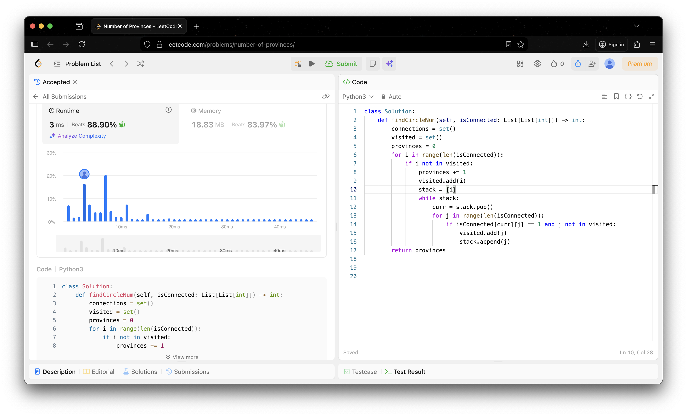
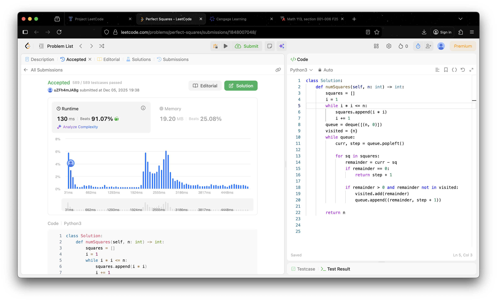
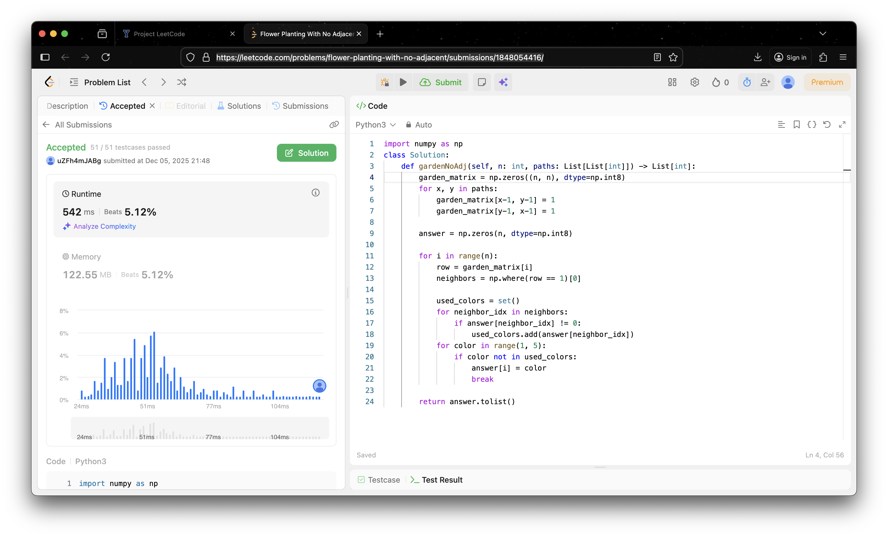

# Project Leetcode

## Baseline 

### Baseline Problem 1

#### Problem Information

Problem Name: *102. Binary Tree Level Order Traversal*

[Submission Link](https://leetcode.com/problems/binary-tree-level-order-traversal/submissions/1847972188/)


#### Time Complexity

```python
class Solution:
    def levelOrder(self, root) -> List[List[int]]:
        output = []                                  # O(1) Constant
        count = TreeNode                             # O(1) unused variable
        queue = deque([root])                        # O(1) initialize queue with root
        while queue:                                 
            level_nodes = []                         # O(1) new list for current level
            level_size = len(queue)                  # O(1) check current width
            for _ in range(level_size):              # O(n) time n time
                curr = queue.popleft()               # O(1) constant time
                if curr is not None:                 # O(1) check
                    level_nodes.append(curr.val)     # O(1) append to list
                    if curr.left:                    # O(1) check child
                        queue.append(curr.left)      # O(1) add to queue
                    if curr.right:                   # O(1) check child
                        queue.append(curr.right)     # O(1) add to queue
            if len(level_nodes) == 0:                # O(1) edge case check
                break                                # O(1) exit
            else:                                    
                output.append(level_nodes)           # O(1) add level list to output
        return output                                # O(1) return result
```

*The time complexity is O(n) because each node is visited once.*

#### Space Complexity

```python
class Solution:
    def levelOrder(self, root) -> List[List[int]]:
        output = []                                  # O(n) can grow to n length
        count = TreeNode                             # O(1) space constant
        queue = deque([root])                        # O(n) can grow to n length
        while queue:                                 
            level_nodes = []                         # O(n/2) can store up to half
            level_size = len(queue)                  # O(1) space constant
            for _ in range(level_size):              # O(n) n time
                curr = queue.popleft()               # O(1) constant time
                if curr is not None:                 # O(1) space constant
                    level_nodes.append(curr.val)     # O(1) space constant
                    if curr.left:                    # O(1) space constant
                        queue.append(curr.left)      # O(1) space constant
                    if curr.right:                   # O(1) space constant
                        queue.append(curr.right)     # O(1) space constant
            if len(level_nodes) == 0:                # O(1) space constant
                break                                # O(1) space constant
            else:                                    
                output.append(level_nodes)           # O(1) space constant
        return output                                # O(1) space constant
```

*The space complexity is O(n) because the output list store n values.*

----

### Baseline Problem 2

#### Problem Information

Problem Name: *547. Number of Provinces*

[Submission Link](https://leetcode.com/problems/number-of-provinces/submissions/1847985668/)



#### Time Complexity

```python
class Solution:
    def findCircleNum(self, isConnected: List[List[int]]) -> int:
        n = len(isConnected)
        connections = set()                   # O(1) runs once
        visited = set()                       # O(1) constant time
        provinces = 0                         # O(1) Constant time
        for i in range(n):                    # O(n) loop iterates n times
            if i not in visited:              # O(1) Constant time
                provinces += 1                # O(1) Constant time
                visited.add(i)                # O(1) adds to set
                stack = [i]                   # O(1) Constant time
                
                while stack:                  # O(n) iterations across entire program is n
                    curr = stack.pop()        # O(1) constant time
                    
                    for j in range(n):        # O(n) runs n times 
                        if isConnected[curr][j] == 1 and j not in visited: 
                            visited.add(j)    # O(1) add to set
                            stack.append(j)   # O(1) push to stack
        return provinces                      # O(1) return result
```

*The time complexity is O(n^2) because for the 2 nested for loops.*

#### Space Complexity

```python
class Solution:
    def findCircleNum(self, isConnected: List[List[int]]) -> int:
        n = len(isConnected)
        connections = set()                   # O(1) allocates empty set 
        visited = set()                       # O(n) stores up to n 
        provinces = 0                         # O(1) single integer variable
        for i in range(n):                    # O(1) constant space
            if i not in visited:              # O(1) constant space
                provinces += 1                # O(1) constant space
                visited.add(i)                # O(1) constant space
                stack = [i]                   # O(n) stack can grow up to O(n) in worst case
                while stack:                  # O(1) constant space
                    curr = stack.pop()        # O(1) constant space
                    for j in range(n):        # O(1) constant space
                        if isConnected[curr][j] == 1 and j not in visited:
                            visited.add(j)    # O(1) constant space
                            stack.append(j)   # O(1) constant space
        return provinces                      # O(1) constant space
```

*The space complexity is O(n^2) because using an adjacency Matrix*

----

### Baseline Problem 3

#### Problem Information

Problem Name: *120. Triangle*

[Submission Link](https://leetcode.com/problems/triangle/submissions/1847991928/)


#### Time Complexity

```python
class Solution:
    def minimumTotal(self, triangle: List[List[int]]) -> int:
        for row in range(1, len(triangle)):                                    # O(n) outer loop runs n-1 times
            for col in range(len(triangle[row])):                              # O(N) inner loop runs n times
                if col == 0:                                                   # O(1) constant check
                    triangle[row][col] += triangle[row-1][col]                 # O(1) constant addition
                elif col == len(triangle[row]) - 1:                            # O(1) constant check
                    triangle[row][col] += triangle[row-1][col-1]               # O(1) constant addition
                else:                                                          # O(1) constant time
                    triangle[row][col] += min(triangle[row-1][col-1], triangle[row-1][col]) 
        return min(triangle[-1])                                               # O(n) find min
```

*The time complexity is O(n^2) because number of rows in the triangle and the algorithm visits every single number 
in the triangle once.*

#### Space Complexity

```python
class Solution:
    def minimumTotal(self, triangle: List[List[int]]) -> int:
        for row in range(1, len(triangle)):                                    # O(1) loop variable 
            for col in range(len(triangle[row])):                              # O(1) loop variable 
                if col == 0:                                                   # O(1) constant space
                    triangle[row][col] += triangle[row-1][col]                 # O(1) constant space
                elif col == len(triangle[row]) - 1:                            # O(1) constant space
                    triangle[row][col] += triangle[row-1][col-1]               # O(1) constant space
                else:                                                          # O(1) constant space
                    triangle[row][col] += min(triangle[row-1][col-1], triangle[row-1][col]) 
                return min(triangle[-1])                                       # O(1) returns a single integer
```

*The space complexity is O(1) because the algorithm is creating a new DP table.*

----


## Core

### Core Problem 1

#### Problem Information

Problem Name: *279. Perfect Squares*

[Submission Link](https://leetcode.com/problems/perfect-squares/submissions/1848007048/)



#### Time Complexity

```python
class Solution:
    def numSquares(self, n: int) -> int:
        squares = []                                      # O(1) constant time
        i = 1                                             # O(1) constant time
        while i * i <= n:                                 # O(sqrt(n)) loop 
            squares.append(i * i)                         # O(1) constant time
            i += 1                                        # O(1) constant time
        queue = deque([(n, 0)])                           # O(1) constant time
        visited = {n}                                     # O(1) constant time
        while queue:                                      # O(n) outer loop 
            curr, step = queue.popleft()                  # O(1) constant time
            for sq in squares:                            # O(n) inner loop
                remainder = curr - sq                     # O(1) constant time
                if remainder == 0:                        # O(1) constant time
                    return step + 1                       # O(1) constant time
                
                if remainder > 0 and remainder not in visited: # O(1) constant time
                    visited.add(remainder)                # O(1) constant time
                    queue.append((remainder, step + 1))   # O(1) constant time
        return n                                          # O(1) constant time
```

*The time complexity was O(n * sqrt(n)) because BFS visits every node and checks every edge.*

#### Space Complexity

```python
class Solution:
    def numSquares(self, n: int) -> int:
        squares = []                                      # O(sqrt(n)) grows to n
        i = 1                                             # O(1) constant space
        while i * i <= n:                                 # O(1) constant space
            squares.append(i * i)                         # O(1) constant space
            i += 1                                        # O(1) constant space
        queue = deque([(n, 0)])                           # O(n) grows to n
        visited = {n}                                     # O(n) grows to n size
        while queue:                                      # O(1) constant space
            curr, step = queue.popleft()                  # O(1) constant space
            for sq in squares:                            # O(1) constant space
                remainder = curr - sq                     # O(1) constant space
                if remainder == 0:                        # O(1) constant space
                    return step + 1                       # O(1) constant space
                if remainder > 0 and remainder not in visited:
                    visited.add(remainder)                # O(1) constant space
                    queue.append((remainder, step + 1))   # O(1) constant space
        return n                                          # O(1) constant space
```

*The space complexity is O(n) because visited set and the queue can store up to n.*

----

### Core Problem 2

#### Problem Information

Problem Name: *1042. Flower Planting With No Adjacent*

[Submission Link](https://leetcode.com/problems/flower-planting-with-no-adjacent/submissions/1848054416/)



#### Time Complexity

```python
import numpy as np
class Solution:
    def gardenNoAdj(self, n: int, paths: List[List[int]]) -> List[int]:
        garden_matrix = np.zeros((n, n), dtype=np.int8)      # O(n^2) n by n matrix
        for x, y in paths:                                   # O(e) iterates paths
            garden_matrix[x-1, y-1] = 1                      # O(1) constant time
            garden_matrix[y-1, x-1] = 1                      # O(1) constant time
        answer = np.zeros(n, dtype=np.int8)                  # O(n) grows size n
        for i in range(n):                                   # O(n) loop n times
            row = garden_matrix[i]                           # O(1) constant time
            neighbors = np.where(row == 1)[0]                # O(n) scan per row
            used_colors = set()                              # O(1) constant time
            for neighbor_idx in neighbors:                   # O(n) iterates neighbors
                if answer[neighbor_idx] != 0:                # O(1) constant time
                    used_colors.add(answer[neighbor_idx])    # O(1) constant time
            for color in range(1, 5):                        # O(1) constant time
                if color not in used_colors:                 # O(1) check set
                    answer[i] = color                        # O(1) assignment
                    break                                    # O(1) exit
        return answer.tolist()                               # O(n) convert to list
```

*The time complexity is O(n^2) because the algorithm entire row is size n for every single garden.*

#### Space Complexity

```python
import numpy as np
class Solution:
    def gardenNoAdj(self, n: int, paths: List[List[int]]) -> List[int]:
        garden_matrix = np.zeros((n, n), dtype=np.int8)      # O(n^2) n by n matrix
        for x, y in paths:                                   # O(1) loop variables
            garden_matrix[x-1, y-1] = 1                      # O(1) constant space
            garden_matrix[y-1, x-1] = 1                      # O(1) constant space
        answer = np.zeros(n, dtype=np.int8)                  # O(n) output array
        
        for i in range(n):                                   # O(1) constant space
            row = garden_matrix[i]                           # O(1) constant space
            neighbors = np.where(row == 1)[0]                # O(n) worst case size n
            used_colors = set()                              # O(1) constant space
            for neighbor_idx in neighbors:                   # O(1) constant space
                if answer[neighbor_idx] != 0:                # O(1) constant space
                    used_colors.add(answer[neighbor_idx])    # O(1) constant space
            for color in range(1, 5):                        # O(1) constant space
                if color not in used_colors:                 # O(1) constant space
                    answer[i] = color                        # O(1) constant space
                    break                                    # O(1) constant space
        return answer.tolist()                               # O(n) new python list
```

*The space complexity is O(n^2) because the algorithm stores dense matrix stores n by n integers.*

----

### Core Problem 3

#### Problem Information

Problem Name: *fill me in*

[Submission Link]()


#### Time Complexity

*Fill me in*

#### Space Complexity

*Fill me in*

----

## Stretch 1

### Stretch 1 Problem 1

#### Problem Information

Problem Name: *fill me in*

[Submission Link]()


#### Time Complexity

*Fill me in*

#### Space Complexity

*Fill me in*

----

## Stretch 2

### Stretch 2 Problem 1

#### Problem Information

Problem Name: *fill me in*

[Submission Link]()


#### Time Complexity

*Fill me in*

#### Space Complexity

*Fill me in*

## Project Review

*Fill me in*
