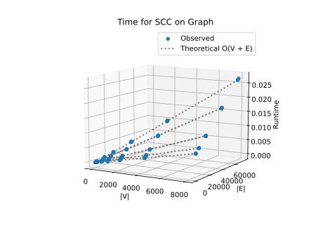
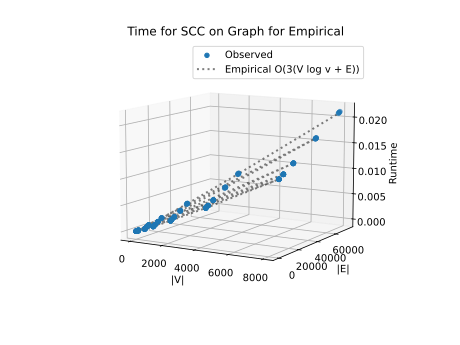

# Project Report - Network Analysis SCCs

## Baseline

### Design Experience

*I talked with Kyle Mak and Collin Verbanatz about baseline. We talked about the pros and cons of using a list compare to
a set for keeping track of visited nodes. A set is the best because it doesn't allow duplicates. You keep track of 
pre- and post-numbers by implementing some kind of counter. We walked through a few problems by hand and explained how it worked to each other.*

### Theoretical Analysis - Pre/Post Order Traversal

#### Time 

### Theoretical Time Analysis - Function prepost

```py
def prepost(graph: GRAPH) -> list[dict[str, list[int]]]:                               # O(V+E)

    counter: list[int] = [1]                                                           # O(1)Constant
    visited = set()                                                                    # O(1)Constant
    dfs_trees = []                                                                     # O(1)Constant
    for node in graph:                                                                 # O(V) increases linearly with the number of elements
        if node not in visited:                                                        # O(1) checking visited constant
            current_tree: dict[str, list[int]] = {}                                    # O(1) creating a dict
            prepost_helper(graph, node, visited, current_tree, counter)                # O(E) recursive call depends of the number of neighbors
            dfs_trees.append(current_tree)                                             # O(1) appending to the dict
    return dfs_trees
```

```py
def prepost_helper(graph: GRAPH, node: str, visited: set, current_tree: dict, counter: list[int]): #O(V+E)

    visited.add(node)                                                                  # O(1) add node 
    current_tree[node] = [counter[0], 0]                                               # O(1) constant
    counter[0] += 1                                                                    # O(1) contant
    for neighbor in graph[node]:                                                       # O(E) looks through the edges
        if neighbor not in visited:                                                    # O(E) see if edges are in visted
            prepost_helper(graph, neighbor, visited, current_tree, counter)            # O(E) reclursive call
    current_tree[node][1] = counter[0]                                                 # O(1) add to tree
    counter[0] += 1                                                                    # O(1) add to counter constant
```

*The time complexity is O(V+E) because it is linear growth and the work done per vertex from prepost loop and prepost_helper calls O(V)+O(V)=O(V)
 such that the work done per edge from the for neighbor loop is O(E). Therefore, Combining these gives a final time complexity of O(V+E)
because V stands for Vertices and E stands for Edges*

#### Space

### Theoretical Space Analysis - Function prepost
```py
def prepost(graph: GRAPH) -> list[dict[str, list[int]]]: O(V)
    counter: list[int] = [1]                                                           # O(1)Constant
    visited = set()                                                                    # O(v) empty set that should be equal to v at the end
    dfs_trees = []                                                                     # O(v) empty set that should be equal to v at the end
    for node in graph:                                                                 # O(1) loop iterator 
        if node not in visited:                                                        # O(1) checking visited constant
            current_tree: dict[str, list[int]] = {}                                    # O(V) creating a dict should be equal to V
            prepost_helper(graph, node, visited, current_tree, counter)                # O(V) recursive call depends of the number of neighbors
            dfs_trees.append(current_tree)                                             # O(1) appending to the dict
    return dfs_trees


def prepost_helper(graph: GRAPH, node: str, visited: set, current_tree: dict, counter: list[int]): #O)(V)

    visited.add(node)                                                                  # O(1) add one thing
    current_tree[node] = [counter[0], 0]                                               # O(1) constant
    counter[0] += 1                                                                    # O(1) contant
    for neighbor in graph[node]:                                                       # O(1) looks through the edges
        if neighbor not in visited:                                                    # O(1) see if edges are in visted
            prepost_helper(graph, neighbor, visited, current_tree, counter)            # O(V) call stack
    current_tree[node][1] = counter[0]                                                 # O(1) add to tree
    counter[0] += 1                                                                    # O(1) addded one to counter constant
```

*The Space Complexity is O(V) because V is the number of nodes and the space or memory is dependent and determined by the storage of visited nodes,
output data, and depth recursion*

### Empirical Data

| Density Factor | Size | V      | E       | Time (sec) |
|----------------|------|--------|---------|------------|
| 0.25           | 10   | 10.0   | 12.8    | 0.0        |
| 0.25           | 50   | 50.0   | 61.6    | 0.0        |
| 0.25           | 100  | 100.0  | 123.5   | 0.0        |
| 0.25           | 500  | 500.0  | 616.1   | 0.0        |
| 0.25           | 1000 | 1000.0 | 1242.3  | 0.0        |
| 0.25           | 2000 | 2000.0 | 2496.5  | 0.001      |
| 0.25           | 4000 | 4000.0 | 4982.6  | 0.002      |
| 0.25           | 8000 | 8000.0 | 9967.0  | 0.004      |
| 0.5            | 10   | 10.0   | 17.7    | 0.0        |
| 0.5            | 50   | 50.0   | 85.2    | 0.0        |
| 0.5            | 100  | 100.0  | 173.1   | 0.0        |
| 0.5            | 500  | 500.0  | 872.2   | 0.0        |
| 0.5            | 1000 | 1000.0 | 1770.4  | 0.0        |
| 0.5            | 2000 | 2000.0 | 3551.4  | 0.001      |
| 0.5            | 4000 | 4000.0 | 7147.2  | 0.002      |
| 0.5            | 8000 | 8000.0 | 14361.9 | 0.004      |
| 1              | 10   | 10.0   | 24.5    | 0.0        |
| 1              | 50   | 50.0   | 134.1   | 0.0        |
| 1              | 100  | 100.0  | 272.5   | 0.0        |
| 1              | 500  | 500.0  | 1429.5  | 0.0        |
| 1              | 1000 | 1000.0 | 2921.5  | 0.0        |
| 1              | 2000 | 2000.0 | 5928.1  | 0.001      |
| 1              | 4000 | 4000.0 | 12010.6 | 0.002      |
| 1              | 8000 | 8000.0 | 24327.1 | 0.004      |
| 2              | 10   | 10.0   | 36.1    | 0.0        |
| 2              | 50   | 50.0   | 239.4   | 0.0        |
| 2              | 100  | 100.0  | 499.2   | 0.0        |
| 2              | 500  | 500.0  | 2710.2  | 0.0        |
| 2              | 1000 | 1000.0 | 5589.5  | 0.001      |
| 2              | 2000 | 2000.0 | 11450.9 | 0.001      |
| 2              | 4000 | 4000.0 | 23462.8 | 0.003      |
| 2              | 8000 | 8000.0 | 47740.4 | 0.005      |
| 3              | 10   | 10.0   | 46.0    | 0.0        |
| 3              | 50   | 50.0   | 356.9   | 0.0        |
| 3              | 100  | 100.0  | 766.3   | 0.0        |
| 3              | 500  | 500.0  | 4321.3  | 0.0        |
| 3              | 1000 | 1000.0 | 8788.2  | 0.001      |
| 3              | 2000 | 2000.0 | 17810.6 | 0.001      |
| 3              | 4000 | 4000.0 | 36212.5 | 0.003      |
| 3              | 8000 | 8000.0 | 73442.4 | 0.006      |


### Comparison of Theoretical and Empirical Results

- Theoretical order of growth: *O(V+E)* 
- Measured constant of proportionality for theoretical order: 1.2253385372839187e-07


- Empirical order of growth (if different from theoretical): Same thing


*Our theoretical was close to my observed that there was no need to find a empirical. Both observed and theoretical 
were so close that when calculating the difference by finding the standard deviation and dividing it by the mean was 
close to no difference. Therefore, I declare that the theoretical correctly predicted the observed*

## Core

### Design Experience

*I talked to Kyle Mak and Collin Verbanatz about core by taking about homework and implementations. We talked about how 
to reverse the graph by for looping through the graphs and finding the node and the neighbor and flipping into a new 
dictionary. I decided to try grabbing the node and post then and putting it into a dictionary then sorting it by post. 
Then i grab the keys and i have the post-visit order. Collin decided to 
put it into a tuple and organize it by the post in the (node, post). The post times on the reversed graph tell you the 
right order to explore the original graph to reveal strongly connected components*

### Theoretical Analysis - SCC

#### Time 

### Theoretical Time Analysis - Function find_scc

```py
def reverse_graph(graph: GRAPH) -> dict[str, list[str]]:                        # O(V+E) goes through nodes and edges
    reverse_dict = {node: [] for node in graph}                                 # O(V) increases linearly with the number of elements
    for node, neighbors in graph.items():                                       # O(V+E) going those both node and edge
        for neighbor in neighbors:                                              # O(E) going through edges 
            reverse_dict[neighbor].append(node)                                 # O(1) constant looking through edge
    return reverse_dict                                                         # O(1) constant


def find_sccs(graph: GRAPH) -> list[set[str]]:                                  # O(V+E) number of edges E is often greater than or equal to V
    """
    Return a list of the strongly connected components in the graph.
    The list should be returned in order of sink-to-source
    """
    reverse = reverse_graph(graph)                                              # O(V+E) see above
    reversed_prepost = prepost(reverse)                                         # O(V+E) see above
    node_post = {}                                                              # O(V) max is number of nodes is V
    for tree in reversed_prepost:                                               # O(V) iterate through all vertices 
        for node, (pre, post) in tree.items():                                  # O(V+E) iterate through nodes and edges
            node_post[node] = post                                              # O(V) iterate through nodes

    sorted_nodes = sorted(node_post.keys(), key=lambda n: node_post[n], reverse=True) # O(V logV) Sorting a list of V items. Total: O(VlogV)
    visited = set()                                                             # O(V) biggest it can get
    sccs = []                                                                   # O(V) biggest it can get

    def find_scc(start, neighbors):                                             # O(V+E) goes through nodes and neighbors
        visited.add(start)                                                      # O(1) add to set constant
        neighbors.add(start)                                                    # O(1) add to list constant
        for neighbor in graph[start]:                                           # O(V+E) goes through node and edge
            if neighbor not in visited:                                         # O(E) visits all edge
                find_scc(neighbor, neighbors)                                   # O(E) visits all edge

    for node in sorted_nodes:                                                   # O(1) constant the loop runs V times
        if node not in visited:                                                 # O(1) this check is performed V times
            component = set()                                                   # O(V) can only get as big as V
            find_scc(node, component)                                           # O(V+E) see above
            sccs.append(component)                                              # O(1) add to list

    return sccs                                                                 # O(1) constant
```

*The time complexity is O(V+E) because the for loop and the recursive find_scc helper function work together to perform 
one complete Depth-First Search (DFS) over the entire graph by visiting each vertex and each edge exactly once.*

#### Space

### Theoretical Spce Analysis - Function find_scc
```py
def reverse_graph(graph: GRAPH) -> dict[str, list[str]]:                        # O(V+E) adjacency list storage for reversed graph
    reverse_dict = {node: [] for node in graph}                                 # O(V) creates an empty list for each node
    for node, neighbors in graph.items():                                       # O(1) loop overhead, storage impact minimal
        for neighbor in neighbors:                                              # O(1) iteration overhead, space already counted
            reverse_dict[neighbor].append(node)                                 # O(1) appends to existing lists
    return reverse_dict                                                         # O(V+E) result stored adjacency list


def find_sccs(graph: GRAPH) -> list[set[str]]:                                  # O(V+E) stores all SCCs in worst case (each edge/node accounted)
    """
    Return a list of the strongly connected components in the graph.
    The list should be returned in order of sink-to-source
    """
    reverse = reverse_graph(graph)                                              # O(V+E) adjacency list for reversed graph
    reversed_prepost = prepost(reverse)                                         # O(V+E) recursion stack + pre/post arrays
    node_post = {}                                                              # O(V) stores post times per node
    for tree in reversed_prepost:                                               # O(1) loop overhead
        for node, (pre, post) in tree.items():                                  # O(V) keys + values in dictionary
            node_post[node] = post                                              # O(1) one integer per node

    sorted_nodes = sorted(node_post.keys(), key=lambda n: node_post[n], reverse=True) # O(V) list of nodes, plus O(V) auxiliary storage in sorting
    visited = set()                                                             # O(V) in worst case stores every node
    sccs = []                                                                   # O(V) at most one set per node (degenerate case)

    def find_scc(start, neighbors):                                             # O(V) recursion stack in worst case depth
        visited.add(start)                                                      # O(1) adds to set
        neighbors.add(start)                                                    # O(1) adds to SCC set
        for neighbor in graph[start]:                                           # O(1) iteration overhead, space already counted
            if neighbor not in visited:                                         #
                find_scc(neighbor, neighbors)                                   #

    for node in sorted_nodes:                                                   # O(1) loop overhead
        if node not in visited:                                                 #
            component = set()                                                   # O(V) in worst case one SCC could hold all nodes
            find_scc(node, component)                                           # O(V) recursion stack for traversal
            sccs.append(component)                                              # O(V) list of SCC sets

    return sccs                                                                 # O(V+E) SCC decomposition total
````

*The space complexity is O(V+E) because this algorithm mostly uses space to store the graph and its reverse. The extra stuff 
like visited nodes, the recursion stack, and the SCC lists only add about O(V) more. So overall, it’s pretty efficient 
with space since it just grows in proportion to the graph size.*

### Empirical Data

| Density Factor | Size | V      | E       | Time (sec) |
|----------------|------|--------|---------|------------|
| 0.25           | 10   | 10.0   | 12.8    | 0.0        |
| 0.25           | 50   | 50.0   | 61.6    | 0.0        |
| 0.25           | 100  | 100.0  | 123.5   | 0.0        |
| 0.25           | 500  | 500.0  | 616.1   | 0.001      |
| 0.25           | 1000 | 1000.0 | 1242.3  | 0.001      |
| 0.25           | 2000 | 2000.0 | 2496.5  | 0.002      |
| 0.25           | 4000 | 4000.0 | 4982.6  | 0.005      |
| 0.25           | 8000 | 8000.0 | 9967.0  | 0.009      |
| 0.5            | 10   | 10.0   | 17.7    | 0.0        |
| 0.5            | 50   | 50.0   | 85.2    | 0.0        |
| 0.5            | 100  | 100.0  | 173.1   | 0.0        |
| 0.5            | 500  | 500.0  | 872.2   | 0.001      |
| 0.5            | 1000 | 1000.0 | 1770.4  | 0.001      |
| 0.5            | 2000 | 2000.0 | 3551.4  | 0.002      |
| 0.5            | 4000 | 4000.0 | 7147.2  | 0.005      |
| 0.5            | 8000 | 8000.0 | 14361.9 | 0.01       |
| 1              | 10   | 10.0   | 24.5    | 0.0        |
| 1              | 50   | 50.0   | 134.1   | 0.0        |
| 1              | 100  | 100.0  | 272.5   | 0.0        |
| 1              | 500  | 500.0  | 1429.5  | 0.001      |
| 1              | 1000 | 1000.0 | 2921.5  | 0.001      |
| 1              | 2000 | 2000.0 | 5928.1  | 0.002      |
| 1              | 4000 | 4000.0 | 12010.6 | 0.005      |
| 1              | 8000 | 8000.0 | 24327.1 | 0.011      |
| 2              | 10   | 10.0   | 36.1    | 0.0        |
| 2              | 50   | 50.0   | 239.4   | 0.0        |
| 2              | 100  | 100.0  | 499.2   | 0.0        |
| 2              | 500  | 500.0  | 2710.2  | 0.001      |
| 2              | 1000 | 1000.0 | 5589.5  | 0.001      |
| 2              | 2000 | 2000.0 | 11450.9 | 0.003      |
| 2              | 4000 | 4000.0 | 23462.8 | 0.006      |
| 2              | 8000 | 8000.0 | 47740.4 | 0.013      |
| 3              | 10   | 10.0   | 46.0    | 0.0        |
| 3              | 50   | 50.0   | 356.9   | 0.0        |
| 3              | 100  | 100.0  | 766.3   | 0.0        |
| 3              | 500  | 500.0  | 4321.3  | 0.001      |
| 3              | 1000 | 1000.0 | 8788.2  | 0.002      |
| 3              | 2000 | 2000.0 | 17810.6 | 0.005      |
| 3              | 4000 | 4000.0 | 36212.5 | 0.008      |
| 3              | 8000 | 8000.0 | 73442.4 | 0.018      |


### Comparison of Theoretical and Empirical Results

- Theoretical order of growth: *O(V+E)* 
- Measured constant of proportionality for theoretical order: 3.238752012340101e-07
- Empirical order of growth (if different from theoretical): O(V log(V)+E)
- Measured constant of proportionality for empirical order: 4.821860837437274e-08



*In conclusion for core, the theoretical growth of O(V+E) matched closely with what we observed, so I didn’t see a need 
to calculate an empirical order of growth. I think the growth is basically linear since the two terms are added together. 
Overall, the runtime scales directly with the size of the graph.*

## Stretch 1

### Design Experience

*Fill me in*

### Articulation Points Discussion 

*Fill me in*

## Stretch 2

### Design Experience

*Fill me in*

### Dataset Description

*Fill me in*

### Findings Discussion

*Fill me in*

## Project Review

*Fill me in*
