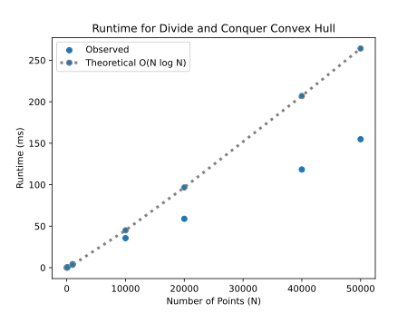
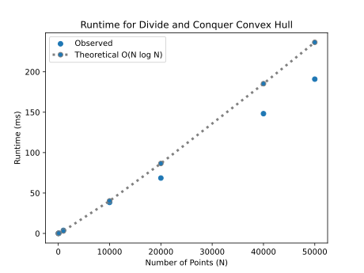
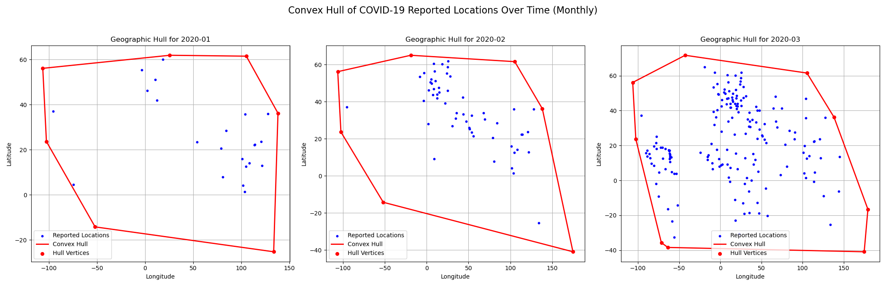
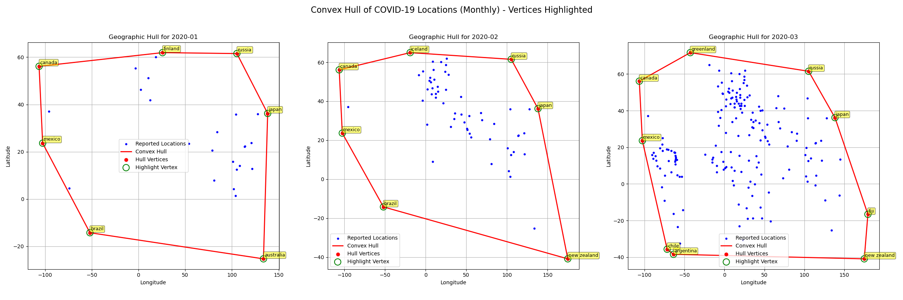

# Project Report - Convex Hull

## Baseline

### Design Discussion

*I talked Kyle Mak and Collin Verbanatz about the convex hull algorithm. we went through the homework and discussed how 
the divide and conquer and recursion. We talked about the base case set in the General Algorithm Guidance which was 
1,2 3. This is because we split the points all the way down and then call merge which in draw lines and start forming
the outer layer. We talked about how to merge two hulls by finding the left and right most point then finding the slope and
comparing them to other slopes moving counterclockwise and clock wise based on the hull.*

### Theoretical Analysis - Convex Hull Divide-and-Conquer

#### Time 

```python
def find_the_slope(point1: tuple[float, float], point2: tuple[float, float]) -> float:  # O(1) simple math
    if point2[0] == point1[0]:                                                          # O(1) check constant
        if point2[1] > point1[1]:                                                       # O(1) check constant
            return math.inf                                                             # O(1) set value
        else:                                                                           # O(1) else
            return -math.inf                                                            # O(1) return value
    if point2[1] == point1[1]:                                                          # O(1) check constant
        return 0.0                                                                      # O(1) return value
    return (point2[1] - point1[1]) / (point2[0] - point1[0])                            # O(1) simple math

def merge(left_hull: list[tuple[float, float]], right_hull: list[tuple[float, float]]) -> list[tuple[float, float]]: # O(n) final_list
    left_point = max(left_hull, key=lambda p: p[0])                                     # O(n) find max
    right_point = min(right_hull, key=lambda p: p[0])                                   # O(n) find the min
    left_index = left_hull.index(left_point)                                            # O(n) getting point
    right_index = right_hull.index(right_point)                                         # O(n) getting point
    len_left = len(left_hull)                                                           # O(1) getting length
    len_right = len(right_hull)                                                         # O(1) getting length
    
    while True:                                                                         # O(n) at worst n times
        move_left = False                                                               # O(1) set bool
        move_right = False                                                              # O(1) set bool
        current_slope = find_the_slope(left_point, right_point)                         # O(1) see above

        while True:
            next_left_index = (left_index + 1) % len_left                               # O(1) simple math
            next_left_point = left_hull[next_left_index]                                # O(1) getting point
            new_slope = find_the_slope(next_left_point, right_point)                    # O(1) simple math see above

            if new_slope > current_slope:                                               # O(1) compare constants
                left_point = next_left_point                                            # O(1) set constants
                left_index = next_left_index                                            # O(1) set constants
                current_slope = new_slope                                               # O(1) set constants 
                move_left = True                                                        # O(1) set bool 
            else:                                                                       # O(1)
                break                                                                   # O(1) end loop

        while True:                                                                     # O(k) runs constant times
            next_right_index = (right_index - 1 + len_right) % len_right                # O(1) small math
            next_right_point = right_hull[next_right_index]                             # O(1) constant

            new_slope = find_the_slope(left_point, next_right_point)                    # O(1) see above

            if new_slope < current_slope:                                               # O(1) check constant
                right_point = next_right_point                                          # O(1) set constants
                right_index = next_right_index                                          # O(1) set constants
                current_slope = new_slope                                               # O(1) set constants
                move_right = True                                                       # O(1) set bool 
            else:                                                                       
                break                                                                   # O(1) end while loop

        if not move_left and not move_right:                                            # O(1) check constants
            break                                                                       # O(1) end while loop 

    upper_left = left_point                                                             # O(1) setting constant
    upper_right = right_point                                                           # O(1) setting constant

    left_point = max(left_hull, key=lambda p: p[0])                                     # O(n) sort find a max
    right_point = min(right_hull, key=lambda p: p[0])                                   # O(n) look through all find max
    left_index = left_hull.index(left_point)                                            # O(n) find the point at index
    right_index = right_hull.index(right_point)                                         # O(n) find the point at index

    while True:                                                                         # O(k) worst case constant times
        move_left = False                                                               # O(1) set bool
        move_right = False                                                              # O(1) set bool

        current_slope = find_the_slope(left_point, right_point)                         # O(1) return simple math slope

        while True:                                                                     # O(n) runs n times
            prev_left_index = (left_index - 1 + len_left) % len_left                    # O(1) simple math
            prev_left_point = left_hull[prev_left_index]                                # O(1) pull point
            new_slope = find_the_slope(prev_left_point, right_point)                    # O(1) find point

            if new_slope < current_slope:                                               # O(1) compare 
                left_point = prev_left_point                                            # O(1) set constant
                left_index = prev_left_index                                            # O(1) set constant
                current_slope = new_slope                                               # O(1) set value
                move_left = True                                                        # O(1) set bool
            else:                                       
                break                                                                   # O(1) break loop 

        while True:                                                                     # O(n) runs n times
            next_right_index = (right_index + 1) % len_right                            # O(1) constant
            next_right_point = right_hull[next_right_index]                             # O(1) constant
            new_slope = find_the_slope(left_point, next_right_point)                    # O(1) constant

            if new_slope > current_slope:                                               # O(1) constant
                right_point = next_right_point                                          # O(1) constant
                right_index = next_right_index                                          # O(1) constant
                current_slope = new_slope                                               # O(1) constant
                move_right = True                                                       # O(1) constant
            else:                                                                       # O(1) constant
                break                                                                   # O(1) constant

        if not move_left and not move_right:                                            # O(1) constant
            break                                                                       # O(1) constant

    lower_left = left_point                                                             # O(1) constant
    lower_right = right_point                                                           # O(1) constant 
    final_hull = []                                                                     # O(1) constant
    temp_index = left_hull.index(upper_left)                                            # O(n) scan through the entire list
    final_hull.append(upper_left)                                                       # O(1) add to list
    while left_hull[temp_index] != lower_left:                                          # O(n) for the loop
        temp_index = (temp_index + 1) % len_left                                        # O(1) simple math
        final_hull.append(left_hull[temp_index])                                        # O(1) constant
        temp_index = right_hull.index(lower_right)                                      # O(n) scan through the entire list
    final_hull.append(lower_right)                                                      # O(1) add to list
    while right_hull[temp_index] != upper_right:                                        # O(n) for the loop
        temp_index = (temp_index + 1) % len_right                                       # O(1) simple math
        final_hull.append(right_hull[temp_index])                                       # O(1) add to list
        
    return final_hull                                                                   # O(1) return


def find_the_hull(sorted_points: list[tuple[float, float]]) -> list[tuple[float, float]]: #O(n log n)
    if len(sorted_points) == 1 or len(sorted_points) == 2:                              # O(1) check constant
        return sorted_points                                                            # O(1) return
        
    median: int = len(sorted_points) // 2                                               # O(1) simple math
    
    left_part = sorted_points[:median]                                                  # O(1) divide
    right_part = sorted_points[median:]                                                 # O(n) divide
    
    left_hull = find_the_hull(left_part)                                                # O(log n) divide 
    right_hull = find_the_hull(right_part)                                              # O(log n) divide
    return merge(left_hull, right_hull)                                                 # O(n) conquer


def compute_hull_dvcq(points: list[tuple[float, float]]) -> list[tuple[float, float]]:  # O(n log n)
    """Return the subset of provided points that define the convex hull"""
    
    points.sort(key=lambda p: p[0])                                                     # O(n log n) sort points
    final_hull: list[tuple[float, float]] = find_the_hull(points)                       # O(n log n) see above
    return final_hull                                                                   # O(1) return
```
*My theoretical is O(n log n) according to the master theorem a = 2, b = 2 such that T(n)=2T(n/2)+O(n) then when we put 
in log turns into this O(n log n).*
 
#### Space

```python
import math

def find_the_slope(point1: tuple[float, float], point2: tuple[float, float]) -> float:  # O(1) simple math
    if point2[0] == point1[0]:                                                          # O(1) Constant
        if point2[1] > point1[1]:                                                       # O(1) Constant
            return math.inf                                                             # O(1) Constant
        else:                                                                           # O(1) Constant
            return -math.inf                                                            # O(1) Constant
    if point2[1] == point1[1]:                                                          # O(1) Constant
        return 0.0                                                                      # O(1) Constant

    return (point2[1] - point1[1]) / (point2[0] - point1[0])                            # O(1) Constant


def merge(left_hull: list[tuple[float, float]], right_hull: list[tuple[float, float]]) -> list[tuple[float, float]]:
    left_point = max(left_hull, key=lambda p: p[0])                                     # O(1) Constant
    right_point = min(right_hull, key=lambda p: p[0])                                   # O(1) Constant
    left_index = left_hull.index(left_point)                                            # O(1) Constant
    right_index = right_hull.index(right_point)                                         # O(1) Constant
    len_left = len(left_hull)                                                           # O(1) Constant
    len_right = len(right_hull)                                                         # O(1) Constant

    while True:
        move_left = False                                                               # O(1) Constant
        move_right = False                                                              # O(1) Constant
        current_slope = find_the_slope(left_point, right_point)                         # O(1) Constant

        while True:
            next_left_index = (left_index + 1) % len_left                               # O(1) Constant
            next_left_point = left_hull[next_left_index]
            new_slope = find_the_slope(next_left_point, right_point)                    # O(1) Constant

            if new_slope > current_slope:                                               # O(1) Constant
                left_point = next_left_point                                            # O(1) Constant
                left_index = next_left_index                                            # O(1) Constant
                current_slope = new_slope                                               # O(1) Constant
                move_left = True                                                        # O(1) Constant
            else:                                                                       # O(1) Constant
                break                                                                   # O(1) Constant

        while True:
            next_right_index = (right_index - 1 + len_right) % len_right                # O(1) Constant
            next_right_point = right_hull[next_right_index]

            new_slope = find_the_slope(left_point, next_right_point)                    # O(1) Constant

            if new_slope < current_slope:                                               # O(1) Constant
                right_point = next_right_point                                          # O(1) Constant
                right_index = next_right_index                                          # O(1) Constant
                current_slope = new_slope                                               # O(1) Constant
                move_right = True                                                       # O(1) Constant
            else:                                                                       # O(1) Constant
                break                                                                   # O(1) Constant

        if not move_left and not move_right:                                            # O(1) Constant
            break                                                                       # O(1) Constant

    upper_left = left_point                                                             # O(1) Constant
    upper_right = right_point                                                           # O(1) Constant

    left_point = max(left_hull, key=lambda p: p[0])
    right_point = min(right_hull, key=lambda p: p[0])
    left_index = left_hull.index(left_point)
    right_index = right_hull.index(right_point)

    while True:
        move_left = False                                                               # O(1) Constant
        move_right = False                                                              # O(1) Constant

        current_slope = find_the_slope(left_point, right_point)                         # O(1) Constant

        while True:
            prev_left_index = (left_index - 1 + len_left) % len_left                    # O(1) Constant
            prev_left_point = left_hull[prev_left_index]
            new_slope = find_the_slope(prev_left_point, right_point)                    # O(1) Constant

            if new_slope < current_slope:                                               # O(1) Constant
                left_point = prev_left_point                                            # O(1) Constant
                left_index = prev_left_index                                            # O(1) Constant
                current_slope = new_slope                                               # O(1) Constant
                move_left = True                                                        # O(1) Constant
            else:                                                                       # O(1) Constant
                break                                                                   # O(1) Constant

        while True:
            next_right_index = (right_index + 1) % len_right                            # O(1) Constant
            next_right_point = right_hull[next_right_index]
            new_slope = find_the_slope(left_point, next_right_point)                    # O(1) Constant

            if new_slope > current_slope:                                               # O(1) Constant
                right_point = next_right_point                                          # O(1) Constant
                right_index = next_right_index                                          # O(1) Constant
                current_slope = new_slope                                               # O(1) Constant
                move_right = True                                                       # O(1) Constant
            else:                                                                       # O(1) Constant
                break                                                                   # O(1) Constant

        if not move_left and not move_right:                                            # O(1) Constant
            break                                                                       # O(1) Constant

    lower_left = left_point                                                             # O(1) Constant
    lower_right = right_point                                                           # O(1) Constant
    final_hull = []                                                                     # O(n) up to as big as the points
    
    temp_index = left_hull.index(upper_left)
    final_hull.append(upper_left)
    
    while left_hull[temp_index] != lower_left:
        temp_index = (temp_index + 1) % len_left                                        # O(1) Constant
        final_hull.append(left_hull[temp_index])
        
    temp_index = right_hull.index(lower_right)
    final_hull.append(lower_right)
    
    while right_hull[temp_index] != upper_right:
        temp_index = (temp_index + 1) % len_right                                        # O(1) Constant
        final_hull.append(right_hull[temp_index])
        
    return final_hull


def find_the_hull(sorted_points: list[tuple[float, float]]) -> list[tuple[float, float]]:
    if len(sorted_points) == 1 or len(sorted_points) == 2:                              # O(1) Constant
        return sorted_points
        
    median: int = len(sorted_points) // 2                                               # O(1) Constant
    
    left_part = sorted_points[:median]
    right_part = sorted_points[median:]
    
    left_hull = find_the_hull(left_part)
    right_hull = find_the_hull(right_part)
    
    return merge(left_hull, right_hull)


def compute_hull_dvcq(points: list[tuple[float, float]]) -> list[tuple[float, float]]:
    """Return the subset of provided points that define the convex hull"""
    
    points.sort(key=lambda p: p[0])                                                     # O(n) worst case for temporary storage
    
    final_hull: list[tuple[float, float]] = find_the_hull(points)                       # O(n) above final list
    
    return final_hull                                                                   # O(1) Constant
```
*My Space complexity is O(n) because of the final list in merge and sorting list which is the worst case for sorting the 
list of points.*

## Core

### Design Discussion

*My implementation initially failed the core tests due to an oversimplified recursive base case. I found that my logic 
for n <= 3 did not form a valid, counter-clockwise hull, which is a requirement for the merge step to function correctly. 
After adjusting the base case to properly handle three-point scenarios, the algorithm passed all core tests.*

### Empirical Data - Convex Hull Divide-and-Conquer

| N     | time (ms) |
|-------|-----------|
| 10    |     0.045 |
| 100   |     0.491 |
| 1000  |     4.249 |
| 10000 |    35.558 |
| 20000 |    58.881 |
| 40000 |   118.304 |
| 50000 |   154.797 |

### Comparison of Theoretical and Empirical Results

- Theoretical order of growth: *O(n log n)* 
- Empirical order of growth (if different from theoretical): 



*This graph shows that the algorithm's observed runtime closely follows the theoretical O(NlogN) performance prediction 
for smaller input sizes. However, as the input size increases past 20,000, the actual runtime begins to deviate and 
perform slightly worse than the theoretical model predicts. Overall, the plot confirms that an O(NlogN) model is a good, 
though not perfect, fit for this algorithm's behavior.*

## Stretch 1

### Design Discussion

*I talked to Kyle Mak and Collin Verbanatz about how I selected the Graham scan algorithm for the convex hull. This algorithm 
works by first finding an anchor point or the point with the lowest y value and then sorting the remaining points by the 
polar angle they make with this anchor. The algorithm then uses a stack to iteratively build the hull by ensuring every 
new point maintains a counter-clockwise turn. This method differs from the divide-and-conquer algorithm because divide and conquer
recursively splits the point set, computes the hulls of the two halves, and then merges those hulls together.*

### Chosen Convex Hull Implementation Description

*In order to implement the Graham scan the first step is get a guaranteed starting point that's definitely on the hull, 
we find our "anchor" by picking the point with the lowest y-coordinate. Next, we sort all the other points by the angle 
they make with this anchor. Then we use a clever cross-product check for this so we don't have to calculate any slow, 
actual angles. Lastly, we create a stack and add our anchor and the first point from our sorted list, which forms our 
initial "edge" of the hull. Then, we walk through the rest of the sorted points. For each new point, we check if it 
creates a right turn with the last two points on the stack. If it creates a right turn, we pop the last point off the 
stack because it must be inside the hull, and we keep popping until the path makes a left turn, which confirms the 
shape is still convex.*

### Empirical Data

| N     | time (ms) |
|-------|-----------|
| 10    |     0.039 |
| 100   |     0.280 |
| 1000  |     3.798 |
| 10000 |    38.348 |
| 20000 |    68.518 |
| 40000 |   148.208 |
| 50000 |   190.899 |



### Comparison of Chosen Algorithm with Divide-and-Conquer Convex Hull

#### Algorithmic Differences

*The two algorithms used different approaches to the same problem and arrive at the same time complexity. The Convex hull 
Divide and Conquer is a recursive algorithm. It worked by splitting the set of points in half then recursively finding 
the hull for each half and then stitching or merging the two resulting hulls together. The Graham Scan algorithm is an 
iterative algorithm because it builds the hull in one pass by sweeping around a single anchor point. Then it uses a 
stack to keep track of the points that are currently part of the hull. The initial step is different for both because the 
divide and conquer algorithm requires an initial sort by x-coordinate. This is crucial for dividing the set into a left
and right half. The graham scan requires finding an anchor point or the lowest y-coordinate and then sorting all other 
points by their polar angle relative to that anchor.*

#### Performance Differences

*For small inputs when it was less than 1000, the Graham Scan was slightly faster than convex hull divide and conquer
implementation. However, the larger inputs like greater than 10,000, the divide and conquer implementation is faster. 
The time complexity of both algorithms are O(nlogn) becuase for divide and conquer convex hull the initial sort is 
O(nlogn). Whereas Graham Scan initial step is Finding the anchor is O(n) then sorting by polar angle is O(nlogn).
The final stack-based scan is O(n) because since each point is pushed once and can only be popped once. The space 
complexity of both algorithms are O(n) because divide and conquer convex hull requires space for the recursion call 
stack which goes O(logn) deep and for storing the intermediate and final hulls created during the merge steps, which 
is O(n). The Graham Scan space complexity requires storing the sorted list of points O(n) and the stack, which in the 
worst case will be all n points are on the hull.*

## Stretch 2

### Design Discussion

*I talked with Kyle Mak and Collin Verbanatz about how we would implement stretch2 and use the Covid 19 country wise csv.
We are going to analyze the data based on the first months of the year. By sorting by the first 3 months we could create a 
dataframe focusing on the spread of the disease by location and graph it by month.*

## Graph



## Graph Analysis 

*The 3 graphs above are showing data for different month early in the covid-19 pandemic during January 2020, February 2020
and March 2020. Each graph shows blue dots which are reported locations by latitude and longitude. The latitude and longitude
creates a unique location where COVID-19 cases were reported during that specific month. The red polygon is a red line 
that connects the outermost blue dots and forms a polygon. This is the convex hull and it represents the smallest convex 
geographic area that contained all reported locations for that month. The red dots are the specific reported locations 
that define the corners or vertices of the convex hull polygon. From the 3 graphs, people can see number of blue dots 
increases significantly from January to March. This means that COVID-19 was spreading rapidly to new geographic locations. 
People can see that over the 3 months the red convex hull generally expanded meaning that the pandemic rapidly expanded.*



*The 3 graphs above show the data for different months and shows the geographic spread of reported COVID-19 locations 
for January, February, and March 2020 using convex hulls. From January to March, the number of reported locations increases
which can be seen wider reporting in there are cases in New Zealand which is further from Australia meaning that covid 19
spread within one month to New Zealand most like from Australia proving the rapid expansion of Covid-19.*

## Project Review

*In conclusion, I talked to Kyle and Collin about the project and all we accomplished. I implemented the divide-and-conquer 
algorithm to compute the convex hull of a list of points. Then I analyzed the theoretical time complexity of my code 
which was O(nlogn) and space complexity as O(n). I then graphed the results and proved the time and space complexity.
In stretch 1, I implemented the Graham Scan algorithm which has a similar time complexity as my divide and conquer convex hull
which was O(nlogn) but both algorithms have a different approach. One works through the list of points respectively splitting 
then merging while the other involves the polar angle sorting and a stack. Lastly I applied the divide-and-conquer 
algorithm to a real-world COVID-19 dataset. I visualized the geographic spread over time by plotting monthly convex hulls 
based on reported locations. The project taught me about the different convex hull algorithms and their application 
to analyze data.*

