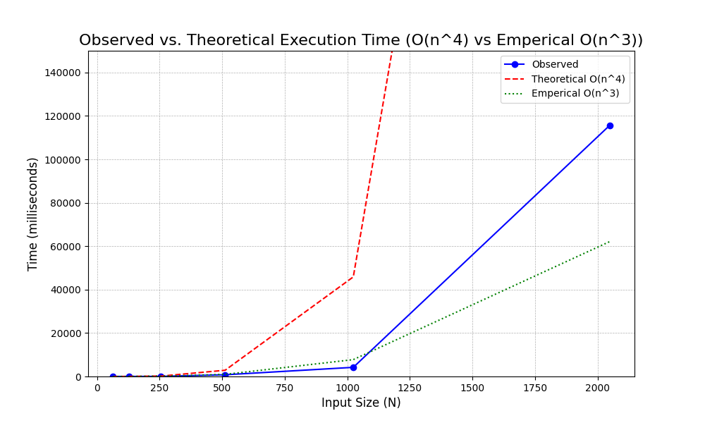

# Project Report - RSA and Primality Tests

## Baseline

### Design Experience

*I talked with Collin Verbanatz about Femat little theorem and modexp and generated large prime numbers and explained the math in my own words. 
We went over each math creating problems and doing them by hand and after understanding the code i wrote out this is sudo code for fermat:
    for i in k:
        if !((i^n) mod n ==1):
            return False
    return true then we started coding*

### Theoretical Analysis - Prime Number Generation

#### Time 

def mod_exp(x: int, y: int, N: int) -> int:         # O(n^3)
    if y == 0:                                      # O(1) return constant
        return 1                                    # O(1) return constant           
    z: int = mod_exp(x, y // 2, N)                  # O(n) recursion call
    if y % 2 == 0:                                  # O(1) mod call
        return (z ** 2) % N                         # O(n^2) multiplication call
    return x * (z ** 2) % N                         # O(n^2) multiplication call

def fermat(N: int, k: int) -> bool:                 # O(n^3)
    """
    Returns True if N is prime
    """
    for i in range(k):                              # O(n log(n)) go through k times
        r = random.randint(1, N - 1)                # O(1) Random number generator
        if mod_exp(r, N - 1, N) != 1:               # O(n^2 log(n)) recursive call
            return False
    return True                                     # O(1) 

def generate_large_prime(n_bits: int) -> int:       # O(n^4)
    """Generate a random prime number with the specified bit length"""
    while True:                                     # O(n)
        i = random.getrandbits(n_bits)              # O(1)
        if fermat(i, 20):                           # O(n^3)
            return i

*The time complexity is **O(n^4)***

#### Space

def mod_exp(x: int, y: int, N: int) -> int:         # O(n^2)
    if y == 0:                                      
        return 1                                           
    z: int = mod_exp(x, y // 2, N)                   
    if y % 2 == 0:                                  
        return (z ** 2) % N                         
    return x * (z ** 2) % N                         

def fermat(N: int, k: int) -> bool:                 # O(n^2)
    """
    Returns True if N is prime
    """
    for i in range(k):                             
        r = random.randint(1, N - 1)                
        if mod_exp(r, N - 1, N) != 1:               # O(n^2) 
            return False
    return True                                     # O(1) 

def generate_large_prime(n_bits: int) -> int:       # O(n^2)
    """Generate a random prime number with the specified bit length"""
    while True:                                     
        i = random.getrandbits(n_bits)              
        if fermat(i, 20):                           # O(n^2)
            return i
*My Space complexity is n^2*

### Empirical Data

| N    | time (ms)          |
|------|--------------------|
| 64   | 2.933979034423828  |
| 128  | 5.035877227783203  |
| 256  | 30.0748348236084   |
| 512  | 474.15828704833984 |
| 1024 | 2208.7411880493164 |
| 2048 | 31778.446197509766 |

### Comparison of Theoretical and Empirical Results

- Theoretical order of growth: *O(n^4)* 
- Measured constant of proportionality for theoretical order: 3.522606183166179e-08
- Empirical order of growth (if different from theoretical): O(n^3)
- Measured constant of proportionality for empirical order: 4.112573022870454e-06
- 

*The difference is that the theoretical grew fast exponential than my observed such that it grew past my graph's bounds by 1000 bits where as my empirical is closer to the observed. The Observed is n^3 growth and is closer to my observed.*

## Core

### Design Experience

*I talked to Collin Verbanatz and went through Euclid algorithm by doing problems by hand. The Euclid algorithm allows the receive to decrypt the message by creating a public key e and N and private key of d and N and using the greatest common denominator to find  ax + by = gcd(x,y) and ed=1 modN*

### Theoretical Analysis - Key Pair Generation

#### Time 

def extended_euclid(a: int, b: int) -> (int, int, int):                 #O(n^2)
    """
    The Extended Euclid algorithm returns x, y, d such that:            
    d = GCD(a, b)                                                       
    ax + by = d                                                         
    Note: a must be greater than b.
    """
    # base case
    if b == 0:                                                          # O(1)
        return a, 1, 0                                                  # O(1)
    d, x1, y1 = extended_euclid(b, a % b)                               # O(n^2)
    x = y1                                                              # O(1)
    y = x1 - (a // b) * y1                                              # O(n^2)
    return d, x, y                                                      # O(1)

def generate_key_pairs(n_bits) -> tuple[int, int, int]:                 # O(n^4)
    """
    Generate RSA public and private key pairs.
    Randomly creates a p and q (two large n-bit primes)
    Computes N = p*q
    Computes e and d such that e*d = 1 mod (p-1)(q-1)
    Return N, e, and d
    """
    p: int = generate_large_prime(n_bits)                                # O(n^4)
    q: int = generate_large_prime(n_bits)                                # O(n^4)
    while p == q:                                                        # O(1) 
        q = generate_large_prime(n_bits)                                 # O(n^4)
    N: int = p * q                                                       # O(n^2)
    r: int = (p - 1) * (q - 1)                                           # O(n^2)
    e = 0                                                                # O(1)
    d = 0                                                                # O(1)
    for i in primes:                                                     # O(n^2).
        gcd, x, y = extended_euclid(i, r)                                # O(n^2)
        if gcd == 1:                                                     # O(1)
            e = i                                                        # O(1)
            d = x                                                        # O(1)
            if d < 0:                                                    # O(1)
                d += r                                                   # O(n)
            break                                                        # O(1)
    return N, e, d                                                       # O(1)
*My time complexity is O(N^4)*

#### Space

def extended_euclid(a: int, b: int) -> (int, int, int):                 #O(n^2)
    """
    The Extended Euclid algorithm returns x, y, d such that:            
    d = GCD(a, b)                                                       
    ax + by = d                                                         
    Note: a must be greater than b.
    """
    # base case
    if b == 0:                                                         
        return a, 1, 0                                                  
    d, x1, y1 = extended_euclid(b, a % b)                              # O(n)  
    x = y1                                                              
    y = x1 - (a // b) * y1                                             # O(n)  
    return d, x, y                                                      

def generate_key_pairs(n_bits) -> tuple[int, int, int]:                 # O(n^2)
    """
    Generate RSA public and private key pairs.
    Randomly creates a p and q (two large n-bit primes)
    Computes N = p*q
    Computes e and d such that e*d = 1 mod (p-1)(q-1)
    Return N, e, and d
    """
    p: int = generate_large_prime(n_bits)                                # O(n^2)
    q: int = generate_large_prime(n_bits)                                # O(n^2)
    while p == q:                                                       
        q = generate_large_prime(n_bits)                                 
    N: int = p * q                                                     
    r: int = (p - 1) * (q - 1)                                          
    e = 0                                                               
    d = 0                                                               
    for i in primes:                                                    
        gcd, x, y = extended_euclid(i, r)                                # O(n^2)
        if gcd == 1:                                                   
            e = i                                                       
            d = x                                                       
            if d < 0:                                                   
                d += r                                                  
            break                                                       
    return N, e, d 
*My space complexity is O(n^2)*

### Empirical Data

| N    | time (ms)          |
|------|--------------------|
| 64   | 2.7136802673339844 |
| 128  | 15.226125717163086 |
| 256  | 42.862892150878906 |
| 512  | 782.4079990386963  |
| 1024 | 4206.789016723633  |
| 2048 | 115630.6209564209  |

### Comparison of Theoretical and Empirical Results

- Theoretical order of growth: *O(n^4)* 
- Measured constant of proportionality for theoretical order: 4.170565142874149e-08
- Empirical order of growth (if different from theoretical): O(n^3)
- Measured constant of proportionality for empirical order: 7.229254343303164e-06
- 

*Fill me in*

## Stretch 1

### Design Experience

*Fill me in*

### Theoretical Analysis - Encrypt and Decrypt

#### Time 

*Fill me in*

#### Space

*Fill me in*

### Empirical Data

#### Encryption

| N    | time (ms) |
|------|-----------|
| 64   |           |
| 128  |           |
| 256  |           |
| 512  |           |
| 1024 |           |
| 2048 |           |

#### Decryption

| N    | time (ms) |
|------|-----------|
| 64   |           |
| 128  |           |
| 256  |           |
| 512  |           |
| 1024 |           |
| 2048 |           |

### Comparison of Theoretical and Empirical Results

#### Encryption

- Theoretical order of growth: *copy from section above* 
- Measured constant of proportionality for theoretical order: 
- Empirical order of growth (if different from theoretical): 
- Measured constant of proportionality for empirical order: 

*I talked to Collin Verbanatz and went through Euclid algorithm by doing problems by hand. The Euclid algorithm allows the receive to decrypt the message by creating a public key e and N and private key of d and N and using the greatest common denominator to find  ax + by = gcd(x,y) and ed=1 modN*

#### Decryption

- Theoretical order of growth: *copy from section above* 
- Measured constant of proportionality for theoretical order: 
- Empirical order of growth (if different from theoretical): 
- Measured constant of proportionality for empirical order: 

*Fill me in*

### Encrypting and Decrypting With A Classmate

*Fill me in*

## Stretch 2

### Design Experience

*Fill me in*

### Discussion: Probabilistic Natures of Fermat and Miller Rabin 

*Fill me in*

## Project Review

*Fill me in*

