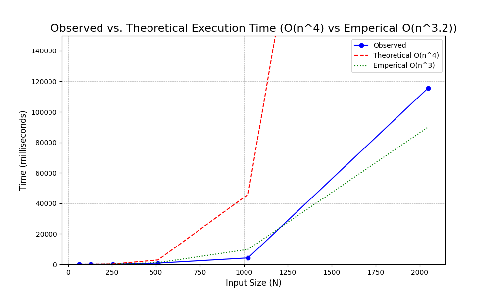
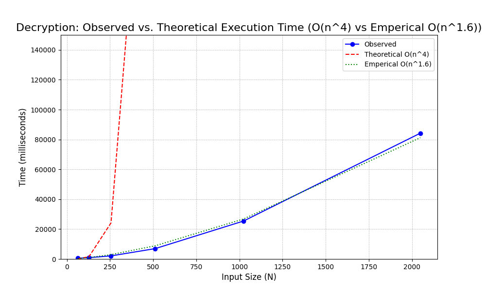
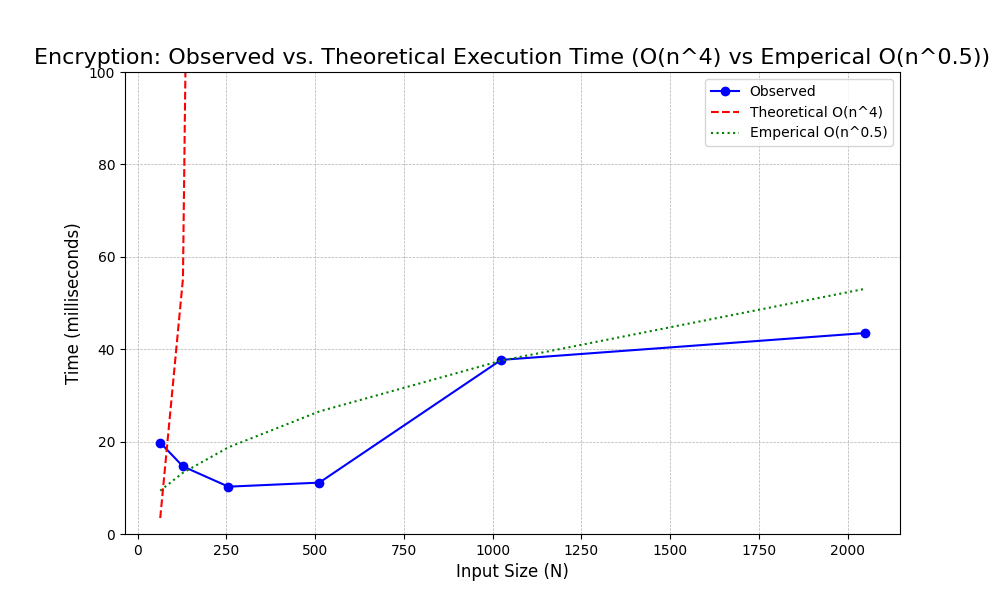

# Project Report - RSA and Primality Tests

## Baseline

### Design Experience

*I talked with Collin Verbanatz about Femat little theorem and modexp and generated large prime numbers and explained the math in my own words. 
We went over each math creating problems and doing them by hand and after understanding the code i wrote out this is sudo code for fermat:
    for i in k:
        if !((i^n) mod n ==1):
            return False
    return true then we started coding*

### Theoretical Analysis - Prime Number Generation

#### Time 

def mod_exp(x: int, y: int, N: int) -> int:         # O(n^3)
    if y == 0:                                      # O(1) return constant
        return 1                                    # O(1) return constant           
    z: int = mod_exp(x, y // 2, N)                  # O(n) recursion call
    if y % 2 == 0:                                  # O(1) mod call
        return (z ** 2) % N                         # O(n^2) multiplication call
    return x * (z ** 2) % N                         # O(n^2) multiplication call

def fermat(N: int, k: int) -> bool:                 # O(n^3)
    """
    Returns True if N is prime
    """
    for i in range(k):                              # O(n log(n)) go through k times
        r = random.randint(1, N - 1)                # O(1) Random number generator
        if mod_exp(r, N - 1, N) != 1:               # O(n^2 log(n)) recursive call
            return False
    return True                                     # O(1) 

def generate_large_prime(n_bits: int) -> int:       # O(n^4)
    """Generate a random prime number with the specified bit length"""
    while True:                                     # O(n)
        i = random.getrandbits(n_bits)              # O(1)
        if fermat(i, 20):                           # O(n^3)
            return i

*The time complexity is **O(n^4)***

#### Space

def mod_exp(x: int, y: int, N: int) -> int:         # O(n)
    if y == 0:                                      
        return 1                                           
    z: int = mod_exp(x, y // 2, N)                   
    if y % 2 == 0:                                  
        return (z ** 2) % N                         
    return x * (z ** 2) % N                         

def fermat(N: int, k: int) -> bool:                 # O(n)
    """
    Returns True if N is prime
    """
    for i in range(k):                             
        r = random.randint(1, N - 1)                
        if mod_exp(r, N - 1, N) != 1:               # O(n) 
            return False
    return True                                     # O(1) 

def generate_large_prime(n_bits: int) -> int:       # O(n)
    """Generate a random prime number with the specified bit length"""
    while True:                                     
        i = random.getrandbits(n_bits)              
        if fermat(i, 20):                           # O(n)
            return i
*My Space complexity is n*

### Empirical Data

| N    | time (ms)          |
|------|--------------------|
| 64   | 2.933979034423828  |
| 128  | 5.035877227783203  |
| 256  | 30.0748348236084   |
| 512  | 474.15828704833984 |
| 1024 | 2208.7411880493164 |
| 2048 | 31778.446197509766 |

### Comparison of Theoretical and Empirical Results

- Theoretical order of growth: *O(n^4)* 
- Measured constant of proportionality for theoretical order: 3.522606183166179e-08
- Empirical order of growth (if different from theoretical): O(n^3)
- Measured constant of proportionality for empirical order: 4.112573022870454e-06
- 

*The difference is that the theoretical grew fast exponential than my observed such that it grew past my graph's bounds by 1000 bits where as my empirical is closer to the observed. The Observed is n^3 growth and is closer to my observed.*

## Core

### Design Experience

*I talked to Collin Verbanatz and went through Euclid algorithm by doing problems by hand. The Euclid algorithm allows the receive to decrypt the message by creating a public key e and N and private key of d and N and using the greatest common denominator to find  ax + by = gcd(x,y) and ed=1 modN*

### Theoretical Analysis - Key Pair Generation

#### Time 

def extended_euclid(a: int, b: int) -> (int, int, int):                 #O(n^2)
    """
    The Extended Euclid algorithm returns x, y, d such that:            
    d = GCD(a, b)                                                       
    ax + by = d                                                         
    Note: a must be greater than b.
    """
    # base case
    if b == 0:                                                          # O(1)
        return a, 1, 0                                                  # O(1)
    d, x1, y1 = extended_euclid(b, a % b)                               # O(n^2)
    x = y1                                                              # O(1)
    y = x1 - (a // b) * y1                                              # O(n^2)
    return d, x, y                                                      # O(1)

def generate_key_pairs(n_bits) -> tuple[int, int, int]:                 # O(n^4)
    """
    Generate RSA public and private key pairs.
    Randomly creates a p and q (two large n-bit primes)
    Computes N = p*q
    Computes e and d such that e*d = 1 mod (p-1)(q-1)
    Return N, e, and d
    """
    p: int = generate_large_prime(n_bits)                                # O(n^4)
    q: int = generate_large_prime(n_bits)                                # O(n^4)
    while p == q:                                                        # O(1) 
        q = generate_large_prime(n_bits)                                 # O(n^4)
    N: int = p * q                                                       # O(n^2)
    r: int = (p - 1) * (q - 1)                                           # O(n^2)
    e = 0                                                                # O(1)
    d = 0                                                                # O(1)
    for i in primes:                                                     # O(n^2).
        gcd, x, y = extended_euclid(i, r)                                # O(n^2)
        if gcd == 1:                                                     # O(1)
            e = i                                                        # O(1)
            d = x                                                        # O(1)
            if d < 0:                                                    # O(1)
                d += r                                                   # O(n)
            break                                                        # O(1)
    return N, e, d                                                       # O(1)
*My time complexity is O(N^4)*

#### Space

def extended_euclid(a: int, b: int) -> (int, int, int):                 #O(n)
    """
    The Extended Euclid algorithm returns x, y, d such that:            
    d = GCD(a, b)                                                       
    ax + by = d                                                         
    Note: a must be greater than b.
    """
    # base case
    if b == 0:                                                         
        return a, 1, 0                                                  
    d, x1, y1 = extended_euclid(b, a % b)                              # O(n)  
    x = y1                                                              
    y = x1 - (a // b) * y1                                             # O(n)  
    return d, x, y                                                      

def generate_key_pairs(n_bits) -> tuple[int, int, int]:                 # O(n)
    """
    Generate RSA public and private key pairs.
    Randomly creates a p and q (two large n-bit primes)
    Computes N = p*q
    Computes e and d such that e*d = 1 mod (p-1)(q-1)
    Return N, e, and d
    """
    p: int = generate_large_prime(n_bits)                                # O(n)
    q: int = generate_large_prime(n_bits)                                # O(n)
    while p == q:                                                       
        q = generate_large_prime(n_bits)                                 
    N: int = p * q                                                     
    r: int = (p - 1) * (q - 1)                                          
    e = 0                                                               
    d = 0                                                               
    for i in primes:                                                    
        gcd, x, y = extended_euclid(i, r)                                # O(n)
        if gcd == 1:                                                   
            e = i                                                       
            d = x                                                       
            if d < 0:                                                   
                d += r                                                  
            break                                                       
    return N, e, d 
*My space complexity is O(n)*

### Empirical Data

| N    | time (ms)          |
|------|--------------------|
| 64   | 2.7136802673339844 |
| 128  | 15.226125717163086 |
| 256  | 42.862892150878906 |
| 512  | 782.4079990386963  |
| 1024 | 4206.789016723633  |
| 2048 | 115630.6209564209  |

### Comparison of Theoretical and Empirical Results

- Theoretical order of growth: *O(n^4)* 
- Measured constant of proportionality for theoretical order: 4.170565142874149e-08
- Empirical order of growth (if different from theoretical): O(n^3.2)
- Measured constant of proportionality for empirical order: 2.2805072655421002e-06

*My theoretical growth O(n^4) curve grew faster and exceeds the bounds of my observed data, which indicating that the actual execution time does not grow as 
fast. In contrast, the empirical O(n^3.2) curve appears to be a much closer fit to my measured execution times, which suggests that the observed growth is 
closer to a O(n^3.2) with respect to the input size (N). This is the biggest difference that while O(n^4) represents an upper bound, the practical performance 
of my code is closer to O(n^3.2).*

## Stretch 1

### Design Experience

*I talked to Collin Verbanatz and we looked through the encrypt and decrypt files python script. The key generation process involves finding two large prime numbers,
p and q, to compute the modulus N and quotient r and a public exponent e is selected from a list of primes, and the private exponent d is calculated as its modular inverse
using the extended_euclid function. These keys are then used to encrypt or decrypt files by breaking the data into numerical chunks and applying modular exponentiation (c=me(modN) or m=cd(modN)).
The core tools you've implemented are the primality tests for finding p and q, the extended_euclid algorithm for finding d, and the mod_exp function which is central to both encryption and decryption.*

### Theoretical Analysis - Encrypt and Decrypt

#### Time 

def read_key(key_file: Path) -> Tuple[int, int, int, int]: #O(1)
    """
    Returns: (n_bytes, plain_bytes, N, exponent)
    n_bytes    = modulus size in bytes (for ciphertext chunking)
    plain_bytes= safe plaintext block size (< N) to avoid m >= N
    """
    N_str, exponent_str = key_file.read_text().splitlines()
    N = int(N_str)
    exponent = int(exponent_str)
    n_bytes = (N.bit_length() + 7) // 8
    plain_bytes = (N.bit_length() - 1) // 8  # ensure m < N
    if plain_bytes <= 0:
        raise ValueError("Modulus too small.")
    return n_bytes, plain_bytes, N, exponent

def chunks(b: bytes, size: int) -> Iterable[bytes]: #O(K)
    for i in range(0, len(b), size):
        yield b[i:i + size]

def decide_mode(input_len: int, n_bytes: int) -> Literal["encrypt", "decrypt"]: #O(1)
    # Heuristic: ciphertext length must be a multiple of n_bytes
    return "decrypt" if input_len % n_bytes == 0 else "encrypt"

def add_len_header_and_pad(plain: bytes, plain_bytes: int) -> bytes: #O(L)
    header = len(plain).to_bytes(HeaderSize, "big")
    data = header + plain
    rem = len(data) % plain_bytes
    if rem:
        data += b"\x00" * (plain_bytes - rem)
    return data

def strip_len_header_and_unpad(decrypted: bytes) -> bytes: #O(L)
    if len(decrypted) < HeaderSize:
        raise ValueError("Decrypted data too short for header.")
    L = int.from_bytes(decrypted[:HeaderSize], "big")
    body = decrypted[HeaderSize:HeaderSize + L]
    if len(body) != L:
        raise ValueError("Decrypted length header mismatch.")
    return body

def transform( #O(n^4)
    data: bytes,
    N: int,
    exponent: int,
    in_chunk_bytes: int,
    out_chunk_bytes: int,
) -> bytes:
    out = []
    for block in chunks(data, in_chunk_bytes):  #O(n)
        if len(block) != in_chunk_bytes:
            raise ValueError("Input not aligned to chunk size.")
        x = int.from_bytes(block, "big")
        y = mod_exp(x, exponent, N)             #O(n^3)
        out.append(y.to_bytes(out_chunk_bytes, "big"))
    return b"".join(out)

def main(key_file: Path, message_file: Path, output_file: Path): #O(n^4)
    """
    Encrypt or decrypt `message_file` and write the result in `output_file`.

    Heuristic:
      - If input length is multiple of modulus-bytes: treat as ciphertext (decrypt).
      - Otherwise: treat as plaintext (encrypt).
    """
    n_bytes, plain_bytes, N, exponent = read_key(key_file)
    input_bytes = message_file.read_bytes()

    mode = decide_mode(len(input_bytes), n_bytes)

    start = time()

    if mode == "encrypt":
        prepared = add_len_header_and_pad(input_bytes, plain_bytes)
        # plaintext blocks -> ciphertext blocks
        result = transform(       #O(n^4)
            prepared, N, exponent, in_chunk_bytes=plain_bytes, out_chunk_bytes=n_bytes
        )
    else:
        # ciphertext blocks -> plaintext blocks
        decrypted_blocks = transform(
            input_bytes, N, exponent, in_chunk_bytes=n_bytes, out_chunk_bytes=plain_bytes
        )
        result = strip_len_header_and_unpad(decrypted_blocks)

    print(f"{mode} in {time() - start:.6f} seconds")
    output_file.write_bytes(result)

#### Space

def read_key(key_file: Path) -> Tuple[int, int, int, int]: #O(n) - size of the key file
    """
    Returns: (n_bytes, plain_bytes, N, exponent)
    n_bytes    = modulus size in bytes (for ciphertext chunking)
    plain_bytes= safe plaintext block size (< N) to avoid m >= N
    """
    N_str, exponent_str = key_file.read_text().splitlines()
    N = int(N_str)
    exponent = int(exponent_str)
    n_bytes = (N.bit_length() + 7) // 8
    plain_bytes = (N.bit_length() - 1) // 8  # ensure m < N
    if plain_bytes <= 0:
        raise ValueError("Modulus too small.")
    return n_bytes, plain_bytes, N, exponent

def chunks(b: bytes, size: int) -> Iterable[bytes]: #O(1) for loops constant overhead gest less and less
    for i in range(0, len(b), size):
        yield b[i:i + size]

def decide_mode(input_len: int, n_bytes: int) -> Literal["encrypt", "decrypt"]: #O(1) - single modulo operation
    # Heuristic: ciphertext length must be a multiple of n_bytes
    return "decrypt" if input_len % n_bytes == 0 else "encrypt"

def add_len_header_and_pad(plain: bytes, plain_bytes: int) -> bytes: #O(n)  creates new object
    header = len(plain).to_bytes(HeaderSize, "big")
    data = header + plain
    rem = len(data) % plain_bytes
    if rem:
        data += b"\x00" * (plain_bytes - rem)
    return data

def strip_len_header_and_unpad(decrypted: bytes) -> bytes: # O(n) - creates a new object
    if len(decrypted) < HeaderSize:
        raise ValueError("Decrypted data too short for header.")
    L = int.from_bytes(decrypted[:HeaderSize], "big")
    body = decrypted[HeaderSize:HeaderSize + L]
    if len(body) != L:
        raise ValueError("Decrypted length header mismatch.")
    return body

def transform( #O(n)  - reclursion is log(n)
    data: bytes,
    N: int,
    exponent: int,
    in_chunk_bytes: int,
    out_chunk_bytes: int,
) -> bytes:
    out = []
    for block in chunks(data, in_chunk_bytes):  
        if len(block) != in_chunk_bytes:
            raise ValueError("Input not aligned to chunk size.")
        x = int.from_bytes(block, "big")
        y = mod_exp(x, exponent, N)             
        out.append(y.to_bytes(out_chunk_bytes, "big"))
    return b"".join(out)

def main(key_file: Path, message_file: Path, output_file: Path): #O(n) 
    """
    Encrypt or decrypt `message_file` and write the result in `output_file`.

    Heuristic:
      - If input length is multiple of modulus-bytes: treat as ciphertext (decrypt).
      - Otherwise: treat as plaintext (encrypt).
    """
    n_bytes, plain_bytes, N, exponent = read_key(key_file)
    input_bytes = message_file.read_bytes()

    mode = decide_mode(len(input_bytes), n_bytes)

    start = time()

    if mode == "encrypt":
        prepared = add_len_header_and_pad(input_bytes, plain_bytes)
        # plaintext blocks -> ciphertext blocks
        result = transform(       #O(n^4)
            prepared, N, exponent, in_chunk_bytes=plain_bytes, out_chunk_bytes=n_bytes
        )
    else:
        # ciphertext blocks -> plaintext blocks
        decrypted_blocks = transform(
            input_bytes, N, exponent, in_chunk_bytes=n_bytes, out_chunk_bytes=plain_bytes
        )
        result = strip_len_header_and_unpad(decrypted_blocks)

    print(f"{mode} in {time() - start:.6f} seconds")
    output_file.write_bytes(result)

*My Space Complexity is O(n)*

### Empirical Data

#### Encryption

| N    | time (ms) |
|------|-----------|
| 64   | 19.772053 |
| 128  | 14.626026 |
| 256  | 10.246038 |
| 512  | 11.120081 |
| 1024 | 37.688017 |
| 2048 | 43.494225 |

#### Decryption

| N    | time (ms)    |
|------|--------------|
| 64   | 499.404907   |
| 128  | 904.505253   |
| 256  | 2073.962927  |
| 512  | 6951.248884  |
| 1024 | 25420.079708 |
| 2048 | 84205.304861 |

### Comparison of Theoretical and Empirical Results

#### Encryption

- Theoretical order of growth: *O(n^4)* 
- Measured constant of proportionality for theoretical order: Encryption is 2.0593e-07 Decryption is 5.6247e-06
- Empirical order of growth (if different from theoretical): Encryption is O(n^0.5) Decryption is O(n^1.5)
- Measured constant of proportionality for empirical order: 
- 

- 
*I talked to Collin Verbanatz and went through Euclid algorithm by doing problems by hand. The Euclid algorithm allows the receive to decrypt the message by creating a public key e and N and private key of d and N and using the greatest common denominator to find  ax + by = gcd(x,y) and ed=1 modN*

#### Decryption

- Theoretical order of growth: *copy from section above* 
- Measured constant of proportionality for theoretical order: 
- Empirical order of growth (if different from theoretical): 
- Measured constant of proportionality for empirical order: 

*Fill me in*

### Encrypting and Decrypting With A Classmate

*Fill me in*

## Stretch 2

### Design Experience

*Fill me in*

### Discussion: Probabilistic Natures of Fermat and Miller Rabin 

*Fill me in*

## Project Review

*Fill me in*

